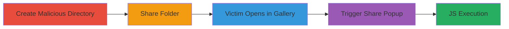

---
tags:
  - xss
  - stored-xss
  - nextcloud
  - gallery-app
type: attack_chain
tools: []
tactics:
  - '[[Execution]]'
verified: false
platforms:
  - Web
submitted: true
complexity: low
created_at: '2023-10-01T00:00:00Z'
procedures:
  - '[[procedures/Create-Malicious-Directory-in-Nextcloud]]'
  - '[[procedures/Share-Malicious-Folder-with-Victim]]'
  - '[[procedures/Victim-Opens-Shared-Folder-in-Gallery-View]]'
  - '[[procedures/Trigger-XSS-via-Share-Popup]]'
step_count: 4
techniques:
  - '[[JavaScript]]'
updated_at: '2025-12-13T23:52:20.814Z'
description: >-
  Multi-stage attack exploiting a stored XSS vulnerability in Nextcloud's
  Gallery app by creating a folder with a malicious name, sharing it, and
  triggering execution when the victim views it in Gallery mode and opens the
  Share popup.
skill_level: low
impact_level: medium
id: b8fd8df7-9640-458c-ba53-6a1ea0d9d076
validated: true
mitre_tactics:
  - '[[Execution]]'
mitre_techniques:
  - '[[JavaScript]]'
---
# Stored XSS in Nextcloud Gallery App via Malicious Directory Name

Multi-stage attack chain demonstrating a stored XSS vulnerability in Nextcloud's Gallery app, where a malicious directory name executes JavaScript in the victim's browser upon interacting with the Share popup in Gallery view. This exploit relies on a regression in the app's migration that left directory names unsanitized, affecting browsers without strong CSP like older Internet Explorer versions. An authenticated attacker can target admins or other users by sharing the malicious folder.

## Chain Metrics Dashboard

| Metric | Value |
|--------|-------|
| Chain Status | Unverified |
| Total Steps | 4 |
| Execution Time | ~5 minutes |
| Skill Level | Low |
| Complexity | Low |
| Impact Level | Medium |

## Attack Flow Visualization

## Prerequisites & Requirements

### Required Tools

- Web browser (e.g., for authenticated access to Nextcloud)

### Target Environment

- Nextcloud instance with Gallery app enabled
- Authenticated user access
- Victim with access to shared folders

### Initial Access Requirements

- Valid Nextcloud credentials for attacker
- No special network access beyond standard web
- Victim must be another Nextcloud user

## Detailed Attack Procedures

### Step 1: Create Malicious Directory
procedure: [[procedures/Create-Malicious-Directory-in-Nextcloud]]

**Objective**: Create a directory with an unsanitized HTML/JS payload in its name to store the XSS.

**Instructions**: Log in to Nextcloud as an authenticated user. Navigate to the file manager and create a new folder. Use a name containing the payload, such as ``. Save the folder.

**Expected Output**: Folder created successfully with the malicious name visible in the file list.

**Success Indicators**:
- Folder appears in user's directory listing
- Name displays the HTML/JS without immediate execution

### Step 2: Share Malicious Folder
procedure: [[procedures/Share-Malicious-Folder-with-Victim]]

**Objective**: Share the folder with the intended victim to deliver the stored payload.

**Instructions**: In the Nextcloud file manager, select the malicious folder. Click the Share icon and enter the victim's username or email. Set permissions to view and confirm the share.

**Expected Output**: Share confirmation message; victim receives notification or link.

**Success Indicators**:
- Share link or invitation sent to victim
- Folder accessible to victim via their account

### Step 3: Victim Opens Shared Folder in Gallery View
procedure: [[procedures/Victim-Opens-Shared-Folder-in-Gallery-View]]

**Objective**: Have the victim access the folder and switch to Gallery view, rendering the malicious name.

**Instructions**: Victim logs in to Nextcloud, navigates to shared folders, opens the malicious one, and selects Gallery view from the display options.

**Expected Output**: Folder contents displayed in thumbnail Gallery mode; directory name shown.

**Success Indicators**:
- Gallery view loads without errors
- Malicious name visible but not yet executed

### Step 4: Trigger XSS via Share Popup
procedure: [[procedures/Trigger-XSS-via-Share-Popup]]

**Objective**: Execute the stored XSS by opening the Share popup in Gallery view.

**Instructions**: In Gallery view, victim clicks the Share icon on the folder. The popup renders the unsanitized directory name, triggering the JS payload.

**Expected Output**: Alert box or JS execution in the browser (e.g., alert(1)).

**Success Indicators**:
- JavaScript executes in victim's browser
- Potential for further payload like cookie theft if extended

## Attack Chain Summary

### Key Achievements

1. Stored malicious payload in directory name without detection
2. Delivered payload via legitimate sharing feature
3. Achieved JS execution in victim's context, limited to non-CSP browsers
4. Demonstrated potential for targeting higher-privilege users like admins

## Technique & Tactic Coverage

### MITRE ATT&CK Techniques

- [[JavaScript]]

### MITRE ATT&CK Tactics

- [[Execution]]

---
*Last updated: 2023-10-01T00:00:00Z*
