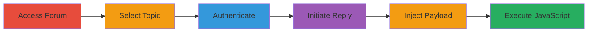

---
tags:
  - xss
  - stored-xss
  - discourse
  - nextcloud
  - forum
type: attack_chain
tools: []
tactics:
  - '[[Execution]]'
commands: []
platforms:
  - Web
complexity: low
procedures:
  - '[[procedures/Access-and-Authenticate-to-Nextcloud-Forum]]'
  - '[[procedures/Exploiting-Stored-XSS-in-Discourse-Reply]]'
step_count: 6
techniques:
  - '[[JavaScript]]'
description: >-
  Multi-stage exploitation of a stored XSS vulnerability in the comment reply
  box of the Nextcloud help forum, powered by Discourse, allowing arbitrary
  JavaScript execution to steal cookies before login enforcement.
skill_level: beginner
impact_level: high
id: 75663097-fea4-4e40-9eb7-a8a8ff4c1c04
created_at: '2025-12-14T03:15:26.498Z'
updated_at: '2025-12-14T03:15:26.498Z'
verified: false
validated: true
submitted: true
mitre_tactics:
  - '[[Execution]]'
mitre_techniques:
  - '[[JavaScript]]'
---
# Stored XSS in Nextcloud Help Forum via Discourse Reply Box

## Overview

This attack chain exploits a stored Cross-Site Scripting (XSS) vulnerability in the reply box of the Nextcloud help forum at https://help.nextcloud.com/, which uses Discourse software. The vulnerability allows unauthenticated users to inject and execute arbitrary JavaScript, such as stealing document cookies via an alert, even as a login prompt appears. Initially attributed to an outdated Akismet plugin (version 2.5.0-3.1.4), the Nextcloud team confirmed no Akismet usage, pinpointing the issue to Discourse's HTML input handling. The payload executes immediately upon submission attempt, enabling session hijacking, defacement, or other client-side attacks affecting all forum visitors.

## Chain Metrics Dashboard

| Metric | Value |
|--------|-------|
| Chain Status | Unverified |
| Total Steps | 6 |
| Execution Time | ~5 minutes |
| Skill Level | Beginner |
| Complexity | Low |
| Impact Level | High |

## Attack Flow Visualization

## Prerequisites & Requirements

### Required Tools

- Web browser (e.g., Chrome, Firefox)

### Target Environment

- Web platform
- Discourse forum software
- Accessible via https://help.nextcloud.com/

### Initial Access Requirements

- Internet access
- No prior credentials needed for initial navigation, but account creation/login required for reply

## Detailed Attack Procedures

### Step 1: Navigate to Forum
procedure: [[procedures/Access-and-Authenticate-to-Nextcloud-Forum]]

**Objective**: Gain access to the vulnerable Nextcloud help forum.

**Instructions**: Open a web browser and navigate to the forum URL.

**Expected Output**: Forum homepage loads, displaying topics.

**Success Indicators**:
- Forum interface visible
- No access restrictions encountered

### Step 2: Select Forum Topic
procedure: [[procedures/Access-and-Authenticate-to-Nextcloud-Forum]]

**Objective**: Choose a topic to target for reply injection.

**Instructions**: Click on any existing topic, such as 'Welcome to the Nextcloud forums'.

**Expected Output**: Topic page loads with reply options.

**Success Indicators**:
- Topic content displayed
- Reply button available

### Step 3: Authenticate to Forum
procedure: [[procedures/Access-and-Authenticate-to-Nextcloud-Forum]]

**Objective**: Create or log in to an account to enable reply functionality.

**Instructions**: Use the sign-in or sign-up feature to authenticate.

**Expected Output**: User session established.

**Success Indicators**:
- Account logged in
- Personalized forum view

### Step 4: Initiate Reply
procedure: [[procedures/Exploiting-Stored-XSS-in-Discourse-Reply]]

**Objective**: Open the reply box for payload injection.

**Instructions**: Click the 'Reply' button on the selected topic.

**Expected Output**: Reply input field appears.

**Success Indicators**:
- Textarea or editor box open
- Ready for input

### Step 5: Inject XSS Payload
procedure: [[procedures/Exploiting-Stored-XSS-in-Discourse-Reply]]

**Objective**: Submit a crafted HTML payload to trigger stored XSS.

**Instructions**: Paste the following payload into the reply box: `:-) <abbr title='\" ' class=''>x</abbr></a>` (note: adjust for any editor formatting; the core is the <abbr> tag with script in class attribute).

**Expected Output**: Payload entered without immediate sanitization.

**Success Indicators**:
- Payload visible in input field
- No parsing errors

### Step 6: Observe Payload Execution
procedure: [[procedures/Exploiting-Stored-XSS-in-Discourse-Reply]]

**Objective**: Trigger and verify JavaScript execution.

**Instructions**: Attempt to submit the reply.

**Expected Output**: A login prompt appears ('You need to be logged in to do that.'), but an alert pops up displaying document.cookie contents.

**Success Indicators**:
- Alert box with cookie data
- JavaScript execution confirmed despite login block

## Attack Chain Summary

### Key Achievements

1. Successful injection of stored XSS payload in Discourse reply box
2. Arbitrary JavaScript execution stealing session cookies
3. Demonstration of unauthenticated impact on forum visitors

## Technique & Tactic Coverage

### MITRE ATT&CK Techniques

- [[JavaScript]]

### MITRE ATT&CK Tactics

- [[Execution]]

---
*Last updated: 2023-10-01*
