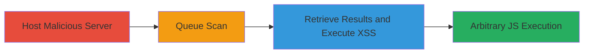

---
tags:
  - xss
  - stored-xss
  - nextcloud
  - javascript
  - web-vulnerability
type: attack_chain
tools: []
tactics:
  - '[[Execution]]'
  - '[[Collection]]'
verified: false
platforms:
  - Web
submitted: true
complexity: medium
created_at: '2023-10-01T00:00:00Z'
procedures:
  - '[[procedures/Host-Malicious-status-php-with-XSS-in-Directory-Path]]'
  - '[[procedures/Queue-Malicious-URL-for-Nextcloud-Scan]]'
  - '[[procedures/Retrieve-Scan-Results-to-Trigger-XSS]]'
step_count: 3
techniques:
  - '[[JavaScript]]'
  - '[[Exploit Public-Facing Application]]'
updated_at: '2025-12-14T03:15:41.798Z'
description: >-
  A multi-stage attack exploiting a stored XSS vulnerability in the Nextcloud
  scan engine by embedding JavaScript in a URL path, leading to arbitrary code
  execution when viewing scan results.
skill_level: intermediate
impact_level: high
id: eba74d5a-6171-43f2-8334-ecdb74301d4a
validated: true
mitre_tactics:
  - '[[Execution]]'
  - '[[Collection]]'
mitre_techniques:
  - '[[JavaScript]]'
  - '[[Exploit Public-Facing Application]]'
---
# Stored XSS in Nextcloud Scan Engine via Malicious URL Path

Multi-stage attack chain demonstrating a complete attack workflow exploiting a stored XSS in the Nextcloud scan engine on scan.nextcloud.com. The attack involves crafting a malicious URL with JavaScript embedded in the path, queuing it for scanning, and triggering execution when results are viewed, allowing arbitrary JavaScript in the site's context for potential session hijacking or data theft.

## Chain Metrics Dashboard

| Metric | Value |
|--------|-------|
| Chain Status | Unverified |
| Total Steps | 3 |
| Execution Time | ~5 minutes |
| Skill Level | Intermediate |
| Complexity | Medium |
| Impact Level | High |

## Attack Flow Visualization



## Prerequisites & Requirements

### Required Tools

- Web server (e.g., Apache or Nginx) for hosting status.php
- curl or similar for API interactions

### Target Environment

- Web platform
- Access to https://scan.nextcloud.com
- No authentication required for public scan queue

### Initial Access Requirements

- Public internet access
- Ability to host a web server
- No prior credentials needed

## Detailed Attack Procedures

### Step 1: Host Malicious Server
procedure: [[procedures/Host-Malicious-status-php-with-XSS-in-Directory-Path]]

**Objective**: Set up a server hosting a status.php file in a directory path that embeds a JavaScript payload, making the URL reflect the XSS when scanned.

**Instructions**: Create a directory with the XSS payload in its name and symlink the status.php file into it. For example, use [[commands/mkdir-heh-script-alert-1]] to create the directory:

```bash
mkdir 'heh<script>alert(1)'`
```

Then create the symlink with [[commands/ln-status-php-symlink]]:

```bash
ln -s ../status.php heh\\<script>alert(1)/
```

Ensure status.php returns valid scan data in JSON format mimicking Nextcloud's expected response.

**Expected Output**: Malicious URL like http://attacker-server.com/heh<script>alert(1)/status.php is accessible and returns JSON.

**Success Indicators**:
- Directory and symlink created without errors
- URL loads and executes no JS yet (payload is in path)

### Step 2: Queue Scan
procedure: [[procedures/Queue-Malicious-URL-for-Nextcloud-Scan]]

**Objective**: Submit the malicious URL to the Nextcloud scan queue API to initiate scanning and store the URL in their system.

**Instructions**: Use curl to POST the URL to the queue endpoint twice to obtain a UUID. Example POST request:

```bash
curl -X POST https://scan.nextcloud.com/api/queue -d 'url=http://attacker-server.com/heh<script>alert(1)/status.php'
```

Repeat for a second scan if needed to get a valid UUID.

**Expected Output**: JSON response with a UUID for the queued scan.

**Success Indicators**:
- HTTP 200 response with UUID
- Scan queued successfully

### Step 3: Retrieve Results and Execute XSS
procedure: [[procedures/Retrieve-Scan-Results-to-Trigger-XSS]]

**Objective**: Fetch the scan results, which insert the unescaped URL into the DOM via innerHTML, triggering the XSS payload.

**Instructions**: GET the results using the UUID:

```bash
curl https://scan.nextcloud.com/api/result/<UUID>
```

Then view the results page in a browser: https://scan.nextcloud.com/results/<UUID>. The data.url field will execute the script.

**Expected Output**: Alert box pops up with '1' on the results page load.

**Success Indicators**:
- JavaScript alert executes
- DOM inspection shows unescaped HTML in the URL display

## Attack Chain Summary

### Key Achievements

1. Successfully embedded XSS payload in a URL path without direct input sanitization.
2. Stored the malicious URL in Nextcloud's scan results via their API.
3. Achieved arbitrary JavaScript execution in the scan.nextcloud.com context, enabling potential data theft or impersonation.

## Technique & Tactic Coverage

### MITRE ATT&CK Techniques

- [[JavaScript]]
- [[Exploit Public-Facing Application]]

### MITRE ATT&CK Tactics

- [[Execution]]
- [[Collection]]

---

*Last updated: 2023-10-01T00:00:00Z*
