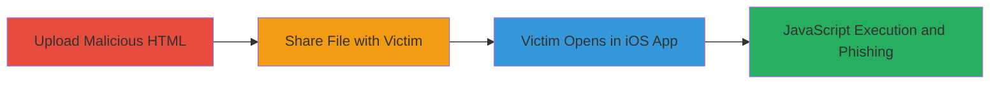

# Stored XSS in Nextcloud iOS App via Malicious HTML Upload

Multi-stage attack chain demonstrating a complete attack workflow exploiting a stored XSS vulnerability in the Nextcloud iOS app. An attacker uploads an HTML file containing a JavaScript payload, shares it with a victim, and achieves arbitrary JavaScript execution when the victim opens the file in the iOS app. This differs from web and Android clients, which do not render HTML executably. The attack enables popups, phishing forms for credential theft, and other client-side exploits in the victim's context.

## Chain Metrics Dashboard

| Metric | Value |
|--------|-------|
| Chain Status | Unverified |
| Total Steps | 3 |
| Execution Time | ~5 minutes |
| Skill Level | Intermediate |
| Complexity | Medium |
| Impact Level | High |

## Attack Flow Visualization



## Prerequisites & Requirements

### Required Tools

- None (uses built-in Nextcloud upload and sharing features)

### Target Environment

- Nextcloud server with file storage and sharing enabled
- Nextcloud iOS app installed on victim's device (version vulnerable to HTML rendering without sanitization)
- Attacker access to Nextcloud account for uploading files
- No specific ports required; operates over standard HTTPS

### Initial Access Requirements

- Valid Nextcloud user credentials for attacker
- Network access to Nextcloud instance (web or app)
- Victim must have the iOS app and open the shared file

## Detailed Attack Procedures

### Step 1: Upload Malicious HTML
procedure: [[procedures/Upload-Malicious-HTML-to-Nextcloud]]

**Objective**: Upload an HTML file containing an embedded JavaScript payload to the Nextcloud server, where it is stored without sanitization.

**Instructions**: Create an HTML file with a payload, such as an anchor tag linking to a data URL that base64-encodes a script. For example, use a text editor to craft the file:

```html
<a href="data:text/html;base64,PHNjcmlwdD5hbGVydCgiWFNTIik8L3NjcmlwdD4=">Click for hack</a>
```

This decodes to `<script>alert("XSS")</script>`. Then, log in to Nextcloud web interface or app, navigate to the file upload section, and upload the file. Verify the upload by checking the file list.

**Expected Output**: File appears in Nextcloud storage with no errors.

**Success Indicators**:
- File uploaded successfully
- File metadata shows it as an HTML document

### Step 2: Share the Malicious File
procedure: [[procedures/Share-Malicious-File-in-Nextcloud]]

**Objective**: Distribute the malicious file to the victim using Nextcloud's sharing mechanism to lure them into opening it.

**Instructions**: In the Nextcloud interface, select the uploaded HTML file, choose the sharing option, and generate a share link or directly share with the victim's Nextcloud account. Set permissions to allow viewing/downloading. Send the share link via email, chat, or other means, disguising it as a legitimate document (e.g., "Review this report.html").

**Expected Output**: Share confirmation and link generated; victim receives notification.

**Success Indicators**:
- Share link active
- Victim accesses the shared file listing

### Step 3: Trigger XSS Execution
procedure: [[procedures/Trigger-XSS-in-Nextcloud-iOS-App]]

**Objective**: Cause the victim to execute the JavaScript payload by opening the file in the vulnerable iOS app.

**Instructions**: The victim must click on the shared file within the Nextcloud iOS app. The app's file viewer renders the HTML without blocking script execution, unlike web or Android versions. Upon opening, the payload triggers, e.g., displaying an alert or loading a fake login form to capture credentials.

**Expected Output**: JavaScript executes in the app's context, such as an alert popup or form submission to attacker-controlled server.

**Success Indicators**:
- Alert or phishing form appears on victim's device
- Credentials or data exfiltrated if payload includes collection logic

## Attack Chain Summary

### Key Achievements

1. Successful upload of unsanitized HTML to Nextcloud
2. Delivery of malicious file to victim via sharing
3. Arbitrary JavaScript execution in iOS app context, enabling phishing and data theft

## Technique & Tactic Coverage

### MITRE ATT&CK Techniques

- [[JavaScript]]

### MITRE ATT&CK Tactics

- [[Execution]]
- [[Collection]]

---
*Last updated: 2023-10-01T00:00:00Z*
