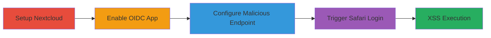

---
tags:
  - xss
  - stored-xss
  - nextcloud
  - oidc
  - safari
type: attack_chain
tools:
  - '[[tools/Docker]]'
  - '[[tools/Safari]]'
tactics:
  - '[[Initial Access]]'
  - '[[Execution]]'
verified: false
platforms:
  - Web
  - Docker
submitted: true
complexity: medium
created_at: '2023-10-01T00:00:00Z'
procedures:
  - '[[procedures/Set-Up-Nextcloud-Instance-with-Docker]]'
  - '[[procedures/Enable-user_oidc-Module]]'
  - '[[procedures/Configure-Malicious-Discovery-Endpoint]]'
  - '[[procedures/Trigger-XSS-via-Safari-Login]]'
step_count: 4
techniques:
  - '[[Exploit Public-Facing Application]]'
  - '[[JavaScript]]'
updated_at: '2025-12-14T00:11:09.346Z'
description: >-
  A multi-stage attack exploiting a stored XSS vulnerability in Nextcloud's
  user_oidc app by injecting a payload through a malicious OpenID Connect
  discovery endpoint, triggered only in Safari browsers due to unencoded meta
  refresh tags.
skill_level: intermediate
impact_level: medium
id: 6b250980-1381-4bc2-9903-c858634b6cb1
validated: true
mitre_tactics:
  - '[[Initial Access]]'
  - '[[Execution]]'
mitre_techniques:
  - '[[Exploit Public-Facing Application]]'
  - '[[JavaScript]]'
---
# Stored XSS in Nextcloud user_oidc via Malicious OpenID Connect Discovery Endpoint - Safari Only

Multi-stage attack chain demonstrating a stored XSS vulnerability in Nextcloud's user_oidc app, exploited by controlling a malicious OpenID Connect discovery endpoint to inject JavaScript payloads into the authorization_endpoint field. The payload is reflected without encoding in a Safari-specific meta refresh redirect during login, leading to XSS execution limited by CSP.

## Chain Metrics Dashboard

| Metric | Value |
|--------|-------|
| Chain Status | Unverified |
| Total Steps | 4 |
| Execution Time | ~15 minutes |
| Skill Level | Intermediate |
| Complexity | Medium |
| Impact Level | Medium |

## Attack Flow Visualization



## Prerequisites & Requirements

### Required Tools

- [[tools/Docker]]
- [[tools/Safari]]

### Target Environment

- Nextcloud instance running on Docker
- Ports 8081 (host) and 80 (container)
- Web browser: Safari for triggering

### Initial Access Requirements

- Local network access to host the Nextcloud instance
- Administrative access to Nextcloud settings
- Control over a web server to host the malicious discovery endpoint (e.g., https://lhq.at/poc_jkhfdasgfdaskjlfadskhfdas.php)

## Detailed Attack Procedures

### Step 1: Set Up Nextcloud Instance
procedure: [[procedures/Set-Up-Nextcloud-Instance-with-Docker]]

**Objective**: Deploy a local Nextcloud environment to reproduce the vulnerability.

**Instructions**: Use [[commands/docker-run-nextcloud]] to start the container:

```bash
docker run -p 8081:80 nextcloud:latest
```

Access the instance at http://localhost:8081 to complete initial setup if needed.

**Expected Output**: Nextcloud running and accessible at http://localhost:8081.

**Success Indicators**:
- Container starts without errors
- Web interface loads successfully

### Step 2: Enable user_oidc Module
procedure: [[procedures/Enable-user_oidc-Module]]

**Objective**: Activate the OpenID Connect authentication app required for the exploit.

**Instructions**: Log in as admin, navigate to Apps > Active apps, search for 'user_oidc', and enable it. No commands required; use the web interface.

**Expected Output**: user_oidc app listed as enabled in settings.

**Success Indicators**:
- App activation confirmation
- OIDC settings appear in admin panel

### Step 3: Configure Malicious Discovery Endpoint
procedure: [[procedures/Configure-Malicious-Discovery-Endpoint]]

**Objective**: Set up the user_oidc provider with a controlled discovery endpoint that injects the XSS payload.

**Instructions**: In Nextcloud admin settings > user_oidc, add a new provider with arbitrary client_id and client_secret. Set discovery endpoint to https://lhq.at/poc_jkhfdasgfdaskjlfadskhfdas.php, which returns JSON with 'authorization_endpoint' containing the payload: "'\\\" http-equiv=><svg\\/onload=alert(document.domain)>". Save the configuration.

**Expected Output**: Provider configured without errors.

**Success Indicators**:
- Settings saved successfully
- Discovery endpoint fetched (visible in logs or network tab)

### Step 4: Trigger XSS via Safari Login
procedure: [[procedures/Trigger-XSS-via-Safari-Login]]

**Objective**: Initiate login in Safari to trigger the unencoded meta refresh and execute the XSS payload.

**Instructions**: Open Safari and navigate to http://localhost:8081/login. Select the OIDC provider. Observe the meta refresh tag in the response: <meta http-equiv="refresh" content="0; url='" http-equiv=><svg/onload=alert(document.domain)>?client_id=..." />. The alert should fire, but further actions are blocked by CSP.

**Expected Output**: JavaScript alert pops up showing document.domain.

**Success Indicators**:
- Alert execution on login page
- Payload reflected in HTML source

## Attack Chain Summary

### Key Achievements

1. Successful setup and configuration of vulnerable Nextcloud OIDC integration
2. Injection of XSS payload via controlled discovery endpoint
3. Triggering of stored XSS in Safari-specific redirect, demonstrating JavaScript execution

## Technique & Tactic Coverage

### MITRE ATT&CK Techniques

- [[Exploit Public-Facing Application]]
- [[JavaScript]]

### MITRE ATT&CK Tactics

- [[Initial Access]]
- [[Execution]]

---

*Last updated: 2023-10-01T00:00:00Z*
