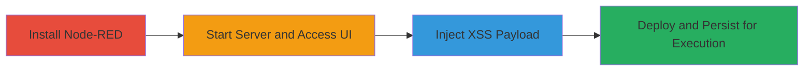

---
tags:
  - xss
  - stored-xss
  - node-red
  - javascript-execution
  - web-vulnerability
type: attack_chain
tools:
  - '[[tools/npm]]'
  - '[[tools/node]]'
  - '[[tools/Firefox]]'
  - '[[tools/Chromium]]'
tactics:
  - '[[Execution]]'
  - '[[Collection]]'
verified: false
platforms:
  - Web
  - Node.js
submitted: true
complexity: medium
created_at: '2023-10-01T00:00:00Z'
procedures:
  - '[[procedures/Install-Node-RED-for-XSS-Exploitation]]'
  - '[[procedures/Start-Node-RED-Server]]'
  - '[[procedures/Inject-XSS-into-Node-Name]]'
  - '[[procedures/Deploy-and-Persist-XSS-Payload]]'
step_count: 4
techniques:
  - '[[JavaScript]]'
  - '[[Exploit Public-Facing Application]]'
updated_at: '2025-12-14T03:16:20.452Z'
description: >-
  A multi-stage attack exploiting a stored XSS vulnerability in Node-RED 0.18.4
  to inject and persist malicious JavaScript payloads in node and flow names,
  leading to execution in all users' browsers.
skill_level: intermediate
impact_level: high
id: 6c0973f6-7e19-480b-8c4c-1d6c02dd8f7b
validated: true
mitre_tactics:
  - '[[Execution]]'
  - '[[Collection]]'
mitre_techniques:
  - '[[JavaScript]]'
  - '[[Exploit Public-Facing Application]]'
---
# Stored XSS in Node-RED Node and Flow Names for Arbitrary JavaScript Execution

Multi-stage attack chain demonstrating exploitation of a stored XSS vulnerability in Node-RED version 0.18.4, where unsanitized user input in node and flow names is rendered as HTML, allowing persistent JavaScript execution across all users accessing the dashboard.

## Chain Metrics Dashboard

| Metric | Value |
|--------|-------|
| Chain Status | Unverified |
| Total Steps | 4 |
| Execution Time | ~5 minutes |
| Skill Level | Intermediate |
| Complexity | Medium |
| Impact Level | High |

## Attack Flow Visualization



## Prerequisites & Requirements

### Required Tools

- [[tools/npm]]
- [[tools/node]]
- [[tools/Firefox]]
- [[tools/Chromium]]

### Target Environment

- Node.js runtime installed
- Port 1880 available
- Local network access to http://localhost:1880

### Initial Access Requirements

- Administrative privileges for global npm installation
- No prior credentials needed; local setup

## Detailed Attack Procedures

### Step 1: Install Node-RED
procedure: [[procedures/Install-Node-RED-for-XSS-Exploitation]]

**Objective**: Set up the vulnerable Node-RED environment to reproduce the stored XSS.

**Instructions**: Use [[commands/sudo-npm-install-node-red]] to install Node-RED globally with the unsafe-perm flag:

```bash
sudo npm install -g --unsafe-perm node-red
```

**Expected Output**: Installation logs ending with a success message for node-red v0.18.4.

**Success Indicators**:
- Node-RED binary available in PATH
- No permission errors during install

### Step 2: Start Server and Access UI
procedure: [[procedures/Start-Node-RED-Server]]

**Objective**: Launch the Node-RED server and navigate to the web interface for payload injection.

**Instructions**: Execute [[commands/node-red-start-server]] to start the server:

```bash
node-red
```

Then open [[tools/Firefox]] or [[tools/Chromium]] and navigate to http://localhost:1880.

**Expected Output**: Server message: 'Server now running at http://127.0.0.1:1880/'. Browser loads the Node-RED editor UI.

**Success Indicators**:
- Server listening on port 1880
- Web UI accessible without errors

### Step 3: Inject XSS Payload
procedure: [[procedures/Inject-XSS-into-Node-Name]]

**Objective**: Insert a malicious script into a node name to trigger immediate XSS execution.

**Instructions**: In the UI, drag a node (e.g., inject node) from the palette to the workspace. Double-click to edit, enter `<script>alert('xss')</script>` in the 'name' field, and click 'done'.

**Expected Output**: Alert box pops up with 'xss' in the attacker's browser.

**Success Indicators**:
- JavaScript alert executes immediately
- Payload renders without sanitization

### Step 4: Deploy and Persist XSS Payload
procedure: [[procedures/Deploy-and-Persist-XSS-Payload]]

**Objective**: Save the flow to make the XSS persistent, affecting all subsequent users.

**Instructions**: Click the 'deploy' button in the UI to save the flow. For alternative, create a new flow with the payload in the name field and deploy.

**Expected Output**: Flow deploys successfully; accessing the flow tab triggers the alert for any user.

**Success Indicators**:
- Payload persists after restart
- XSS executes in new browser sessions

## Attack Chain Summary

### Key Achievements

1. Successful installation and setup of vulnerable Node-RED 0.18.4
2. Injection and immediate execution of XSS payload in node/flow names
3. Persistence of payload via deployment, enabling broad impact on users

## Technique & Tactic Coverage

### MITRE ATT&CK Techniques

- [[JavaScript]]
- [[Exploit Public-Facing Application]]

### MITRE ATT&CK Tactics

- [[Execution]]
- [[Collection]]

---

*Last updated: 2023-10-01T00:00:00Z*
