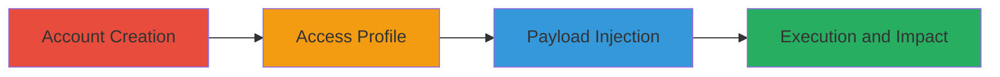

# Stored XSS in Oberlo Profile Name Field for JavaScript Execution and Session Hijacking

Multi-stage attack chain demonstrating a complete stored XSS exploitation workflow in the Oberlo application, allowing attackers to inject malicious JavaScript into a user's profile name, which executes for any viewer of that profile.

## Chain Metrics Dashboard

| Metric | Value |
|--------|-------|
| Chain Status | Unverified |
| Total Steps | 4 |
| Execution Time | ~5 minutes |
| Skill Level | Beginner |
| Complexity | Low |
| Impact Level | High |

## Attack Flow Visualization

## Prerequisites & Requirements

### Required Tools

- Web browser (e.g., Chrome, Firefox)

### Target Environment

- Oberlo web application (https://app.oberlo.com)
- No specific services or ports required beyond standard HTTPS (443)
- Internet access to the Oberlo platform

### Initial Access Requirements

- No prior credentials needed; attack begins with free account registration
- Attacker must be able to create an account on Oberlo
- Victim must view the attacker's profile page

## Detailed Attack Procedures

### Step 1: Account Creation
procedure: [[procedures/Create-Oberlo-Account]]

**Objective**: Establish a user account on the Oberlo platform to access profile editing features.

**Instructions**: Register a new account using valid email and password. This provides the necessary authentication to modify the profile.

**Expected Output**: Successful login and dashboard access.

**Success Indicators**:
- Confirmation email received
- Redirect to Oberlo dashboard

### Step 2: Access Profile Settings
procedure: [[procedures/Access-Oberlo-Profile-Settings]]

**Objective**: Navigate to the profile editing interface where the vulnerable name field is located.

**Instructions**: From the dashboard, click on settings and select the account profile section to reach the editable form.

**Expected Output**: Profile settings page loads with form fields visible.

**Success Indicators**:
- URL matches https://app.oberlo.com/settings/account/profile
- Name field is editable

### Step 3: Payload Injection
procedure: [[procedures/Inject-XSS-Payload-into-Profile-Name]]

**Objective**: Inject a malicious JavaScript payload into the name field to store and later execute it.

**Instructions**: Enter the payload `">` into the Name field and save the profile.

**Expected Output**: Profile saves without errors; payload is stored.

**Success Indicators**:
- No validation errors on save
- Profile updates successfully

### Step 4: Verify Execution
procedure: [[procedures/Verify-XSS-Payload-Execution]]

**Objective**: Confirm the payload executes in the browser context when the profile is viewed.

**Instructions**: View the profile page (e.g., by logging out and accessing via another account or incognito). The alert should trigger, demonstrating execution.

**Expected Output**: JavaScript alert box appears showing the domain.

**Success Indicators**:
- Alert executes on page load
- No sanitization blocks the script

## Attack Chain Summary

### Key Achievements

1. Successful account creation and profile access
2. Injection of unsanitized JavaScript payload
3. Execution of payload leading to arbitrary code in victim browsers
4. Potential for session hijacking or data exfiltration

## Technique & Tactic Coverage

### MITRE ATT&CK Techniques

- [[Exploit Public-Facing Application]]
- [[JavaScript]]

### MITRE ATT&CK Tactics

- [[Execution]]
- [[Collection]]

---
*Last updated: 2023-10-01T00:00:00Z*
