---
tags:
  - xss
  - stored-xss
  - input-validation-bypass
  - web-vulnerability
type: attack_chain
tools: []
tactics:
  - '[[Execution]]'
commands: []
platforms:
  - Web
complexity: medium
procedures:
  - '[[procedures/Create-Operation-Wallet]]'
  - '[[procedures/Open-Wallet-Settings]]'
  - '[[procedures/Initiate-New-API-Key]]'
  - '[[procedures/Bypass-Client-Side-Length-Restriction]]'
  - '[[procedures/Inject-Malicious-Payload-into-Key-Name]]'
  - '[[procedures/Generate-Key-to-Store-Payload]]'
  - '[[procedures/Trigger-XSS-by-Reopening-Settings]]'
  - '[[procedures/Share-Wallet-for-Cross-User-Impact]]'
step_count: 8
techniques:
  - '[[JavaScript]]'
description: >-
  A multi-stage attack exploiting a stored XSS vulnerability in the operator
  wallet's API key name field by bypassing client-side length restrictions,
  leading to arbitrary JavaScript execution in the victim's browser.
skill_level: intermediate
impact_level: high
id: 42c3e8ce-67a9-4dc0-962d-c838e3f41e2d
created_at: '2025-12-14T17:32:02.007Z'
updated_at: '2025-12-14T17:32:02.007Z'
verified: false
validated: true
submitted: true
mitre_tactics:
  - '[[Execution]]'
mitre_techniques:
  - '[[JavaScript]]'
---
# Stored XSS in Operator Wallet API Key Name via Client-Side Length Bypass

Multi-stage attack chain demonstrating a complete attack workflow exploiting a stored XSS in the API key name field of the operator wallet feature.

## Chain Metrics Dashboard

| Metric | Value |
|--------|-------|
| Chain Status | Unverified |
| Total Steps | 8 |
| Execution Time | ~5 minutes |
| Skill Level | Intermediate |
| Complexity | Medium |
| Impact Level | High |

## Attack Flow Visualization

```mermaid
graph LR
    A[Create Wallet] --> B[Open Settings]
    B --> C[Initiate New Key]
    C --> D[Bypass Length Restriction]
    D --> E[Inject Payload]
    E --> F[Generate Key]
    F --> G[Reopen Settings]
    G --> H[Trigger XSS]
    H --> I[Share Wallet]

    style A fill:#e74c3c
    style B fill:#f39c12
    style C fill:#f39c12
    style D fill:#3498db
    style E fill:#3498db
    style F fill:#3498db
    style G fill:#27ae60
    style H fill:#27ae60
    style I fill:#27ae60
```

## Prerequisites & Requirements

### Required Tools

- Browser developer tools (e.g., Chrome DevTools)

### Target Environment

- Web application with operator wallet feature
- No specific ports or services required beyond standard HTTPS access

### Initial Access Requirements

- Authenticated access to the application as an operator user
- Ability to create and manage wallets
- No prior network position needed; standard user session suffices

## Detailed Attack Procedures

### Step 1: Create Operation Wallet
procedure: [[procedures/Create-Operation-Wallet]]

**Objective**: Gain access to the wallet creation feature to set up the target for exploitation.

**Instructions**: Log in to the application and navigate to the operator wallet section to create a new wallet.

**Expected Output**: A new operation wallet is created and accessible.

**Success Indicators**:
- Wallet creation confirmation
- Wallet listed in the user interface

### Step 2: Open Wallet Settings
procedure: [[procedures/Open-Wallet-Settings]]

**Objective**: Access the settings page where API keys can be managed.

**Instructions**: Select the created wallet and open its settings page.

**Expected Output**: Wallet settings interface loads, showing options for API key management.

**Success Indicators**:
- Settings page visible
- API key section available

### Step 3: Initiate New API Key
procedure: [[procedures/Initiate-New-API-Key]]

**Objective**: Start the process of creating a new API key to target the vulnerable input field.

**Instructions**: Click the 'New key' button in the wallet settings.

**Expected Output**: Form for new API key creation appears, including the name input field.

**Success Indicators**:
- New key form displayed
- Name input field present with maxlength=30 attribute

### Step 4: Bypass Client-Side Length Restriction
procedure: [[procedures/Bypass-Client-Side-Length-Restriction]]

**Objective**: Remove the client-side length limit to allow injection of longer payloads.

**Instructions**: Use browser developer tools to inspect the name input element and remove the maxlength=30 attribute from the HTML.

**Expected Output**: Input field accepts input longer than 30 characters without restriction.

**Success Indicators**:
- Attribute removed successfully
- Longer input accepted

### Step 5: Inject Malicious Payload into Key Name
procedure: [[procedures/Inject-Malicious-Payload-into-Key-Name]]

**Objective**: Insert an HTML/JS payload into the key name field to exploit the lack of sanitization.

**Instructions**: Enter a payload like '<a href="example.com">asdf</a>' into the name field.

**Expected Output**: Payload entered without errors.

**Success Indicators**:
- Payload visible in the input field
- Length exceeds 30 characters

### Step 6: Generate Key to Store Payload
procedure: [[procedures/Generate-Key-to-Store-Payload]]

**Objective**: Submit the form to store the unsanitized payload on the server.

**Instructions**: Click 'Generate Key' to create the API key.

**Expected Output**: API key generated, and payload stored in the backend without validation.

**Success Indicators**:
- Key creation success message
- Key listed in settings with payload in name

### Step 7: Trigger XSS by Reopening Settings
procedure: [[procedures/Trigger-XSS-by-Reopening-Settings]]

**Objective**: Reflect the stored payload to execute the XSS in the browser.

**Instructions**: Close and reopen the wallet settings page.

**Expected Output**: Payload rendered unsanitized, triggering HTML/JS execution (e.g., link creation or alert if JS payload used).

**Success Indicators**:
- Malicious HTML executed
- Arbitrary JS runs in victim context

### Step 8: Share Wallet for Cross-User Impact
procedure: [[procedures/Share-Wallet-for-Cross-User-Impact]]

**Objective**: Propagate the XSS to other users if wallet sharing is enabled.

**Instructions**: Share the wallet with other users and have them view the settings.

**Expected Output**: Other users' browsers execute the payload upon viewing settings.

**Success Indicators**:
- Shared users affected
- XSS triggers in multiple sessions (noting partial server-side mitigation)

## Attack Chain Summary

### Key Achievements

1. Bypassed client-side restrictions to inject oversized payloads
2. Stored unsanitized HTML/JS in the API key name
3. Achieved arbitrary code execution in the browser context
4. Demonstrated potential for cross-user impact via sharing

## Technique & Tactic Coverage

### MITRE ATT&CK Techniques

- [[JavaScript]]

### MITRE ATT&CK Tactics

- [[Execution]]

---
*Last updated: 2023-10-01*
