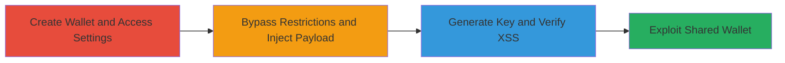

---
tags:
  - xss
  - stored-xss
  - web-vulnerability
  - api-key-injection
type: attack_chain
tools:
  - '[[tools/Browser-Developer-Tools]]'
tactics:
  - '[[Initial Access]]'
  - '[[Execution]]'
verified: false
platforms:
  - Web
submitted: true
complexity: medium
created_at: '2023-10-01T00:00:00Z'
procedures:
  - '[[procedures/Create-Operator-Wallet-and-Navigate-to-API-Key-Settings]]'
  - '[[procedures/Bypass-Client-Side-Restrictions-and-Inject-XSS-Payload]]'
  - '[[procedures/Generate-Key-and-Verify-Stored-XSS]]'
  - '[[procedures/Exploit-Shared-Wallet-for-Cross-User-XSS]]'
step_count: 4
techniques:
  - '[[Exploit Public-Facing Application]]'
  - '[[JavaScript]]'
updated_at: '2025-12-14T03:15:53.046Z'
description: >-
  A multi-stage attack exploiting a stored XSS vulnerability in the operator
  wallet's API key name field by bypassing client-side maxlength restrictions,
  injecting HTML payloads, and demonstrating potential cross-user impact if
  wallets are shared.
skill_level: intermediate
impact_level: high
id: df8161a4-73bf-4627-b121-325c8914b46d
validated: true
mitre_tactics:
  - '[[Initial Access]]'
  - '[[Execution]]'
mitre_techniques:
  - '[[Exploit Public-Facing Application]]'
  - '[[JavaScript]]'
---
# Stored XSS in Operator Wallet API Key Name via Client-Side Length Bypass

Multi-stage attack chain demonstrating a complete workflow for exploiting a stored XSS vulnerability in the operator wallet feature of a web application, where HTML tags can be injected into API key names after bypassing client-side restrictions, leading to rendered HTML execution upon viewing wallet settings.

## Chain Metrics Dashboard

| Metric | Value |
|--------|-------|
| Chain Status | Unverified |
| Total Steps | 4 |
| Execution Time | ~5 minutes |
| Skill Level | Intermediate |
| Complexity | Medium |
| Impact Level | High |

## Attack Flow Visualization

## Prerequisites & Requirements

### Required Tools

- [[tools/Browser-Developer-Tools]]

### Target Environment

- Web application with operator wallet feature
- Access to authenticated user session for wallet creation
- No specific ports or services beyond standard HTTPS

### Initial Access Requirements

- Valid user credentials for the application
- Browser access to the web interface
- No prior network position needed beyond standard user access

## Detailed Attack Procedures

### Step 1: Create Wallet and Access API Key Settings
procedure: [[procedures/Create-Operator-Wallet-and-Navigate-to-API-Key-Settings]]

**Objective**: Set up the target wallet and navigate to the API key creation interface to prepare for payload injection.

**Instructions**: Log in to the application, access the operator wallet creation feature, create a new wallet, open its settings, and initiate new API key creation. This positions the attacker at the vulnerable input field.

**Expected Output**: API key creation form visible with name input field.

**Success Indicators**:
- Wallet successfully created
- New key form loaded without errors

### Step 2: Bypass Client-Side Restrictions and Inject Payload
procedure: [[procedures/Bypass-Client-Side-Restrictions-and-Inject-XSS-Payload]]

**Objective**: Circumvent the client-side maxlength=30 restriction on the API key name field to allow injection of an HTML payload.

**Instructions**: Use [[tools/Browser-Developer-Tools]] to inspect and modify the input field's HTML attribute, removing the maxlength restriction. Then, enter a proof-of-concept HTML payload such as `<a href="example.com">asdf</a>` into the name field.

**Expected Output**: Payload entered without truncation.

**Success Indicators**:
- Input field accepts input longer than 30 characters
- Payload visible in the form

### Step 3: Generate Key and Verify Stored XSS
procedure: [[procedures/Generate-Key-and-Verify-Stored-XSS]]

**Objective**: Submit the payload to store it server-side and confirm XSS execution by re-accessing the settings page.

**Instructions**: Submit the form by pressing 'Generate Key'. Then, reopen the wallet settings to view the list of keys. The injected HTML should render as executable (e.g., a clickable link) rather than escaped text, confirming stored XSS.

**Expected Output**: Injected HTML renders as a functional link in the settings page.

**Success Indicators**:
- API key generated successfully
- HTML payload executes visually in settings view

### Step 4: Exploit Shared Wallet for Cross-User XSS
procedure: [[procedures/Exploit-Shared-Wallet-for-Cross-User-XSS]]

**Objective**: Leverage wallet sharing (if available) to execute the XSS in other users' browsers, potentially enabling phishing or session hijacking.

**Instructions**: Share the wallet with another user account. Have the recipient view the wallet settings, where the payload executes. Note that server-side filters may block direct JavaScript; advanced payloads or bypasses would be needed for full exploitation.

**Expected Output**: XSS triggers in the victim's browser context upon viewing settings.

**Success Indicators**:
- Wallet shared successfully
- Payload renders/executes for the other user

## Attack Chain Summary

### Key Achievements

1. Bypassed client-side input validation to inject arbitrary HTML into API key names
2. Demonstrated stored XSS execution for the wallet owner
3. Highlighted potential for cross-user impact via shared wallets, enabling further attacks like data theft

## Technique & Tactic Coverage

### MITRE ATT&CK Techniques

- [[Exploit Public-Facing Application]]
- [[JavaScript]]

### MITRE ATT&CK Tactics

- [[Initial Access]]
- [[Execution]]

---
*Last updated: 2023-10-01T00:00:00Z*
