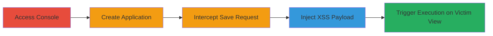

---
tags:
  - xss
  - stored-xss
  - ping-identity
  - web-vulnerability
type: attack_chain
tools:
  - '[[tools/Burp-Suite]]'
tactics:
  - '[[Execution]]'
verified: false
platforms:
  - Web
submitted: true
complexity: medium
created_at: '2023-10-01T00:00:00Z'
procedures:
  - '[[procedures/Access-PingOne-Console-and-Create-Application]]'
  - '[[procedures/Intercept-and-Inject-XSS-Payload-in-Home-Page-URL]]'
step_count: 5
techniques:
  - '[[JavaScript]]'
updated_at: '2025-12-13T23:52:24.112Z'
description: >-
  A multi-step attack exploiting a stored XSS vulnerability in the Ping Identity
  console's Application List page by injecting a malicious script into the Home
  Page URL field, leading to arbitrary JavaScript execution in victims' browsers
  upon viewing or editing the application.
skill_level: intermediate
impact_level: high
id: 8a385d08-5377-440e-b2c0-5480473acb3f
validated: true
mitre_tactics:
  - '[[Execution]]'
mitre_techniques:
  - '[[JavaScript]]'
---
# Stored XSS in Ping Identity Console via Malicious Home Page URL

Multi-stage attack chain demonstrating a complete attack workflow exploiting a stored XSS vulnerability in the Connections module of the Ping Identity console.

## Chain Metrics Dashboard

| Metric | Value |
|--------|-------|
| Chain Status | Unverified |
| Total Steps | 5 |
| Execution Time | ~10 minutes |
| Skill Level | Intermediate |
| Complexity | Medium |
| Impact Level | High |

## Attack Flow Visualization

## Prerequisites & Requirements

### Required Tools

- [[tools/Burp-Suite]]

### Target Environment

- Web platform
- PingOne Console service
- Access to staging or production environment (e.g., https://console-staging.pingone.com/)
- No specific ports required beyond standard HTTPS (443)

### Initial Access Requirements

- Valid credentials for the Ping Identity console (attacker must have authenticated access to create applications)
- Network access to the console URL
- Proxy tool configured to intercept traffic from the browser

## Detailed Attack Procedures

### Step 1: Access Console and Navigate to Applications
procedure: [[procedures/Access-PingOne-Console-and-Create-Application]]

**Objective**: Gain access to the PingOne console and navigate to the Applications section to prepare for application creation.

**Instructions**: Log in to the console using valid credentials and proceed to the Connections module.

**Expected Output**: Successful login and visibility of the Applications list.

**Success Indicators**:
- Dashboard loads without errors
- Connections / Applications menu is accessible

### Step 2: Create New Application
procedure: [[procedures/Access-PingOne-Console-and-Create-Application]]

**Objective**: Add a new application entry to set up the vulnerable Home Page URL field.

**Instructions**: Select the Native App type, enter a name (e.g., "Test App"), and proceed without changing defaults.

**Expected Output**: New application created and listed in the Application List page.

**Success Indicators**:
- Application appears in the list
- Edit options are available

### Step 3: Return to Application List
procedure: [[procedures/Access-PingOne-Console-and-Create-Application]]

**Objective**: View the newly created application in the list to confirm visibility.

**Instructions**: Navigate back to the Application List page after creation.

**Expected Output**: The app is visible in the list with edit icon.

**Success Indicators**:
- App entry displayed
- No immediate errors on page load

### Step 4: Add Home Page URL and Intercept Request
procedure: [[procedures/Intercept-and-Inject-XSS-Payload-in-Home-Page-URL]]

**Objective**: Enter a placeholder URL in the application settings and capture the save request using a proxy.

**Instructions**: In the application edit view, input a benign Home Page URL (e.g., "https://example.com") and submit the save. Ensure the proxy (e.g., Burp Suite) is intercepting the request.

**Expected Output**: Intercepted POST or PUT request to save the application settings.

**Success Indicators**:
- Request body contains the URL parameter
- Proxy halts the request for modification

### Step 5: Inject XSS Payload and Forward
procedure: [[procedures/Intercept-and-Inject-XSS-Payload-in-Home-Page-URL]]

**Objective**: Modify the intercepted request to include a malicious XSS payload, then forward it to store the injection.

**Instructions**: Replace the URL parameter with a payload like "https://0-a.nl/ <svg/onload=alert(document.domain)>" and forward the request. Verify the application saves successfully.

**Expected Output**: Application updates without errors; payload stored in the database.

**Success Indicators**:
- Save completes
- When another user (or self in different session) views/edits the app, alert pops up executing the script

## Attack Chain Summary

### Key Achievements

1. Successful injection of stored XSS payload into the Home Page URL field without detection.
2. Arbitrary JavaScript execution in victims' browsers upon interacting with the Application List edit view.
3. Potential for session hijacking, data exfiltration, or impersonation as the victim user.

## Technique & Tactic Coverage

### MITRE ATT&CK Techniques

- [[JavaScript]]

### MITRE ATT&CK Tactics

- [[Execution]]

---
*Last updated: 2023-10-01T00:00:00Z*
