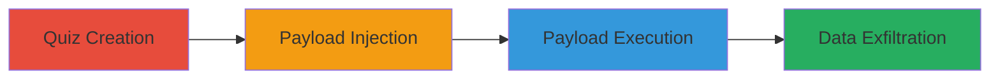

# Stored XSS in Polldaddy Quiz Media Embed for Client-Side JavaScript Execution

Multi-stage attack chain demonstrating a complete stored XSS workflow in Polldaddy's quiz feature, allowing attackers to inject malicious JavaScript that executes in the browsers of quiz viewers, potentially stealing cookies, session tokens, or enabling other client-side attacks.

## Chain Metrics Dashboard

| Metric | Value |
|--------|-------|
| Chain Status | Unverified |
| Total Steps | 3 |
| Execution Time | ~5 minutes |
| Skill Level | Intermediate |
| Complexity | Medium |
| Impact Level | High |

## Attack Flow Visualization

## Prerequisites & Requirements

### Required Tools

- Web browser (e.g., Chrome, Firefox)
- Access to a Polldaddy account (free tier sufficient)

### Target Environment

- Polldaddy web platform
- No specific services/ports required beyond standard HTTPS (443)
- Internet access for quiz sharing

### Initial Access Requirements

- Valid Polldaddy user account
- No elevated privileges needed
- Ability to create and share quizzes publicly

## Detailed Attack Procedures

### Step 1: Quiz Creation
procedure: [[procedures/Create-Polldaddy-Multiple-Choice-Quiz]]

**Objective**: Set up a new multiple-choice quiz on Polldaddy to serve as the vector for storing the XSS payload.

**Instructions**: Log in to Polldaddy and navigate to the quiz creation interface. Select multiple-choice question type and configure basic quiz settings, such as title and questions, without adding media yet.

**Expected Output**: A draft quiz ready for media embed configuration.

**Success Indicators**:
- Quiz creation interface loads successfully
- Basic quiz structure (questions) is saved

### Step 2: Payload Injection
procedure: [[procedures/Insert-XSS-Payload-in-Media-Embed]]

**Objective**: Inject a malicious JavaScript payload into the Media Embed section, formatted to evade sanitization by mimicking a shortcode.

**Instructions**: In the quiz editor, locate the Media Embed section for a question. Input the payload formatted as a shortcode: `[&lt;img src=&quot;http://url.to.file.which/not.exist&quot; onerror=alert(\&quot;Hello!\&quot;);&gt;]`. Save the quiz to store the payload.

**Expected Output**: Quiz saves without errors, with the payload embedded in the Media section.

**Success Indicators**:
- No validation errors during save
- Payload appears in the quiz preview (though not executed yet)

### Step 3: Payload Execution
procedure: [[procedures/Trigger-Stored-XSS-via-Quiz-Share-Link]]

**Objective**: Share the quiz link and access it to trigger the stored XSS payload in the viewer's browser.

**Instructions**: Generate a shareable link for the quiz from the Polldaddy dashboard. Open the link in a browser (ideally a test victim's session). The onerror handler in the injected img tag will execute the JavaScript, such as displaying an alert or performing data theft.

**Expected Output**: JavaScript execution, e.g., alert box pops up or console logs the payload action.

**Success Indicators**:
- Alert or scripted action triggers on page load
- Browser developer tools show script execution from the quiz content

## Attack Chain Summary

### Key Achievements

1. Successful storage of XSS payload in Polldaddy quiz without detection
2. Evasion of sanitization via shortcode mimicry
3. Arbitrary JavaScript execution in victim browsers, enabling cookie theft or session hijacking

## Technique & Tactic Coverage

### MITRE ATT&CK Techniques

- [[JavaScript]]

### MITRE ATT&CK Tactics

- [[Execution]]
- [[Collection]]

---
*Last updated: 2023-10-01T00:00:00Z*
