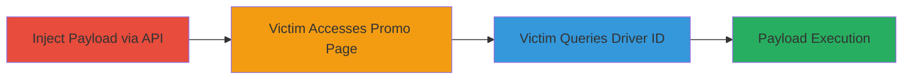

# Stored XSS in PromoCodes API Leading to Arbitrary JavaScript Execution

Multi-stage attack chain demonstrating a complete stored XSS workflow in the inDrive PromoCodes system, where an attacker injects a payload via the API and triggers it through user interaction on the promo page, leading to arbitrary JavaScript execution in the victim's browser.

## Chain Metrics Dashboard

| Metric | Value |
|--------|-------|
| Chain Status | Unverified |
| Total Steps | 3 |
| Execution Time | ~5 minutes |
| Skill Level | Intermediate |
| Complexity | Medium |
| Impact Level | High |

## Attack Flow Visualization



## Prerequisites & Requirements

### Required Tools

- [[commands/inject-xss-payload-promocodes]]

### Target Environment

- Web platform
- Access to https://id.indrive.com/api/spreadsheet/promocodes (API endpoint)
- Valid driver ID (can be enumerated)

### Initial Access Requirements

- No authentication required for the API endpoint
- Network access to inDrive domains
- No prior access needed beyond public internet

## Detailed Attack Procedures

### Step 1: Inject XSS Payload
procedure: [[procedures/Inject-and-Trigger-Stored-XSS-via-ActivationDate]]

**Objective**: Store a malicious JavaScript payload in the activationDate parameter associated with a targeted driver ID via the API.

**Instructions**: Use [[commands/inject-xss-payload-promocodes]] to send a POST request with the payload:

```bash
curl -X POST https://id.indrive.com/api/spreadsheet/promocodes \
  -H "Content-Type: application/json" \
  -H "Origin: https://promo.indrive.com" \
  -H "Referer: https://promo.indrive.com/" \
  -d '{"id":"4","activationDate":"<script>alert(1)</script>"}'
```

Enumerate valid driver IDs if needed by testing sequential values (e.g., 1-100) to target multiple users.

**Expected Output**: HTTP 200 response indicating successful storage of the payload.

**Success Indicators**:
- API returns success (e.g., 200 OK)
- Payload is stored without sanitization errors

### Step 2: Victim Navigates to Promo Page
procedure: [[procedures/Inject-and-Trigger-Stored-XSS-via-ActivationDate]]

**Objective**: Position the victim to interact with the promo page where the payload can be retrieved.

**Instructions**: Direct the victim to visit the promo page. No direct command needed; this is social engineering or waiting for natural access.

**Expected Output**: Victim loads https://promo.indrive.com/promocodes successfully.

**Success Indicators**:
- Victim accesses the page
- Page loads without errors

### Step 3: Victim Inputs Driver ID and Submits
procedure: [[procedures/Inject-and-Trigger-Stored-XSS-via-ActivationDate]]

**Objective**: Trigger the stored payload by having the victim query the targeted driver ID, causing reflection and execution.

**Instructions**: Instruct or trick the victim to enter the targeted driver ID (e.g., 4) and click 'Проверить ID' on the form. The backend retrieves the unsanitized activationDate, reflects it, and executes the JavaScript.

**Expected Output**: Alert box or arbitrary JS execution in the victim's browser (e.g., alert(1) pops up).

**Success Indicators**:
- JavaScript executes (e.g., alert triggers)
- Potential session theft or phishing payload runs

## Attack Chain Summary

### Key Achievements

1. Successful injection of stored XSS payload via API without authentication.
2. Triggering of payload through standard user interaction on the promo page.
3. Achievement of arbitrary JS execution, enabling session hijacking, phishing, or infinite promo code reuse by renewing every 24 hours.

## Technique & Tactic Coverage

### MITRE ATT&CK Techniques

- [[JavaScript]]

### MITRE ATT&CK Tactics

- [[Execution]]
- [[Collection]]

---
*Last updated: 2023-10-01T00:00:00Z*
