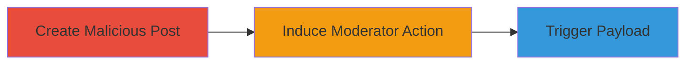

---
tags:
  - xss
  - stored-xss
  - web-vulnerability
  - pii-theft
type: attack_chain
tools: []
tactics:
  - '[[Initial Access]]'
  - '[[Execution]]'
  - '[[Collection]]'
commands: []
platforms:
  - Web
complexity: medium
procedures:
  - '[[procedures/Create-Post-with-XSS-Payload]]'
  - '[[procedures/Induce-Moderator-Action-on-Malicious-Post]]'
  - '[[procedures/Trigger-XSS-Payload-via-Mod-Logs]]'
step_count: 3
techniques:
  - '[[JavaScript]]'
  - '[[Exploit Public-Facing Application]]'
description: >-
  Exploitation of stored XSS in Reddit's mod logs to execute JavaScript and
  steal moderator PII
skill_level: intermediate
impact_level: high
id: 3daadc8d-a69d-424f-a10b-319f9ad1b9b9
created_at: '2025-12-13T23:56:20.316Z'
updated_at: '2025-12-13T23:56:20.316Z'
verified: false
validated: true
submitted: true
mitre_tactics:
  - '[[Initial Access]]'
  - '[[Execution]]'
  - '[[Collection]]'
mitre_techniques:
  - '[[JavaScript]]'
  - '[[Exploit Public-Facing Application]]'
---
# Stored XSS in Reddit Moderation Logs for PII Theft

Multi-stage attack chain demonstrating exploitation of a stored XSS vulnerability in Reddit's moderation features to execute arbitrary JavaScript and steal personal information from moderators.

## Chain Metrics Dashboard

| Metric | Value |
|--------|-------|
| Chain Status | Unverified |
| Total Steps | 3 |
| Execution Time | ~5 minutes |
| Skill Level | Intermediate |
| Complexity | Medium |
| Impact Level | High |

## Attack Flow Visualization

## Prerequisites & Requirements

### Required Tools

- None (web browser access to Reddit)

### Target Environment

- Web platform: Reddit
- Required services/ports: Reddit moderation features (mod notes, mod log)
- Network access requirements: Internet access to Reddit

### Initial Access Requirements

- Credential requirements: Valid Reddit account
- Network position: External access
- Prior access needed: Ability to post in a subreddit with active moderators

## Detailed Attack Procedures

### Step 1: Create Post with XSS Payload
procedure: [[procedures/Create-Post-with-XSS-Payload]]

**Objective**: Introduce a malicious XSS payload into a Reddit post title that will be stored unsanitized in mod logs.

**Instructions**: Log into Reddit and create a new post in a targeted subreddit. Set the post title to include an XSS payload, such as '' or more sophisticated JavaScript to steal PII like email addresses. Ensure the payload uses injectable content like script tags that are not escaped.

**Expected Output**: A new post visible in the subreddit with the malicious title.

**Success Indicators**:
- Post successfully created and visible
- Title contains the unescaped XSS payload

### Step 2: Induce Moderator Action on Malicious Post
procedure: [[procedures/Induce-Moderator-Action-on-Malicious-Post]]

**Objective**: Prompt a subreddit moderator to interact with the post, causing the malicious title to be logged without sanitization.

**Instructions**: Wait for or encourage a moderator to remove or sticky the post. This action logs the post title in the mod notes and logs without proper escaping, storing the XSS payload.

**Expected Output**: Moderator performs removal or stickying, logging the payload.

**Success Indicators**:
- Post is removed or stickied by moderator
- Log entry created with unsanitized title

### Step 3: Trigger XSS Payload via Mod Logs
procedure: [[procedures/Trigger-XSS-Payload-via-Mod-Logs]]

**Objective**: Have the moderator view the mod notes or logs to execute the stored XSS payload in their browser.

**Instructions**: The payload triggers automatically when the moderator views the user's mod notes directly, hovers over the user's profile and clicks the mod log, or checks recent mod actions. This executes arbitrary JavaScript, potentially stealing PII such as email addresses.

**Expected Output**: JavaScript execution in the moderator's browser, leading to PII exfiltration.

**Success Indicators**:
- Payload executes upon viewing logs
- Stolen data (e.g., email) is accessible to the attacker via the payload's logic

## Attack Chain Summary

### Key Achievements

1. Successful injection of XSS payload into Reddit mod logs
2. Execution of arbitrary JavaScript in moderator's context
3. Theft of personal information from high-privilege users

## Technique & Tactic Coverage

### MITRE ATT&CK Techniques

- [[JavaScript]]
- [[Exploit Public-Facing Application]]

### MITRE ATT&CK Tactics

- [[Initial Access]]
- [[Execution]]
- [[Collection]]

*Last updated: 2023-10-01*
