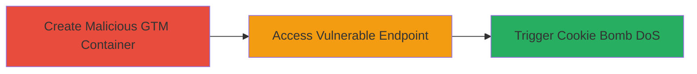

---
tags:
  - xss
  - dos
  - cookie-bomb
  - reddit
type: attack_chain
tools:
  - '[[tools/Google-Tag-Manager]]'
tactics:
  - '[[Execution]]'
  - '[[Impact]]'
verified: false
platforms:
  - Web
submitted: true
complexity: medium
created_at: '2023-10-01T12:00:00Z'
procedures:
  - '[[procedures/Create-Malicious-GTM-Container-with-XSS-Payload]]'
  - '[[procedures/Access-Redditmedia-GTM-Jail-Endpoint]]'
  - '[[procedures/Trigger-DoS-on-Reddit-com-via-Cookie-Overflow]]'
step_count: 3
techniques:
  - '[[Exploit Public-Facing Application]]'
  - '[[JavaScript]]'
  - '[[Endpoint Denial of Service]]'
updated_at: '2025-12-14T03:16:37.509Z'
description: >-
  A multi-stage attack exploiting stored XSS in the redditmedia.com GTM jail
  endpoint to execute JavaScript payloads hosted in Google Tag Manager,
  resulting in a cookie bomb that causes denial of service for media loading on
  reddit.com.
skill_level: intermediate
impact_level: high
id: 4d976339-1e75-4e7e-85dd-ebef8a50d6a5
validated: true
mitre_tactics:
  - '[[Execution]]'
  - '[[Impact]]'
mitre_techniques:
  - '[[Exploit Public-Facing Application]]'
  - '[[JavaScript]]'
  - '[[Endpoint Denial of Service]]'
---
# Stored XSS in Redditmedia GTM Jail Leading to Cookie Bomb DoS

Multi-stage attack chain demonstrating a complete attack workflow exploiting a stored XSS vulnerability in the redditmedia.com/gtm/jail endpoint to load and execute arbitrary HTML from a Google Tag Manager container, enabling JavaScript execution that sets thousands of large cookies to cause denial of service for media loading on reddit.com.

## Chain Metrics Dashboard

| Metric | Value |
|--------|-------|
| Chain Status | Unverified |
| Total Steps | 3 |
| Execution Time | ~5 minutes |
| Skill Level | Intermediate |
| Complexity | Medium |
| Impact Level | High |

## Attack Flow Visualization

## Prerequisites & Requirements

### Required Tools

- [[tools/Google-Tag-Manager]]

### Target Environment

- Web platform
- Access to redditmedia.com and reddit.com
- No specific ports required; browser-based

### Initial Access Requirements

- Public access to redditmedia.com/gtm/jail endpoint
- Ability to create a Google Tag Manager account
- No credentials needed for the target

## Detailed Attack Procedures

### Step 1: Create Malicious GTM Container
procedure: [[procedures/Create-Malicious-GTM-Container-with-XSS-Payload]]

**Objective**: Set up a Google Tag Manager container hosting an XSS payload, such as an img tag with onerror handler to execute JavaScript like a cookie bomb.

**Instructions**: Log in to Google Tag Manager, create a new container, and add an HTML tag with the payload. For a basic XSS test, use '<html></html>'. For the cookie bomb, use HTML with multiple img tags setting large cookies for .redditmedia.com, e.g., '' repeated thousands of times.

**Expected Output**: A GTM container ID (e.g., GTM-MS246QG) that serves the malicious HTML.

**Success Indicators**:
- Container created successfully
- Preview mode shows the HTML loading without errors

### Step 2: Access Vulnerable Endpoint
procedure: [[procedures/Access-Redditmedia-GTM-Jail-Endpoint]]

**Objective**: Trigger the stored XSS by accessing the /gtm/jail endpoint with the malicious GTM ID, causing the browser to fetch and execute the arbitrary HTML.

**Instructions**: In a browser, navigate to https://redditmedia.com/gtm/jail?id=GTM-MS246QG&cb=aa. The endpoint will load the GTM container's HTML, executing the onerror payloads to set cookies.

**Expected Output**: JavaScript execution in the redditmedia.com context, such as alert popup for basic XSS or thousands of cookies set for the bomb.

**Success Indicators**:
- Payload executes (alert fires or cookies are set)
- Browser developer tools show cookie creation

### Step 3: Trigger DoS on Reddit.com
procedure: [[procedures/Trigger-DoS-on-Reddit-com-via-Cookie-Overflow]]

**Objective**: Navigate to reddit.com to cause media resources from redditmedia.com to fail loading due to cookie overflow, resulting in user-specific denial of service.

**Instructions**: After accessing the vulnerable endpoint and setting cookies, open https://reddit.com/. Any media requests to redditmedia.com will include the oversized cookies, causing failures.

**Expected Output**: Reddit.com loads but media (images/videos) from redditmedia.com subdomain fail to display or load slowly.

**Success Indicators**:
- Media elements broken or missing on reddit.com
- Network tab shows 4xx/5xx errors for redditmedia.com requests due to cookie size

## Attack Chain Summary

### Key Achievements

1. Successful execution of arbitrary JavaScript in redditmedia.com context via unsanitized GTM HTML loading
2. Setting of thousands of large cookies to overflow browser limits for .redditmedia.com
3. User-specific DoS on reddit.com media loading, preventing normal functionality

## Technique & Tactic Coverage

### MITRE ATT&CK Techniques

- [[Exploit Public-Facing Application]]
- [[JavaScript]]
- [[Endpoint Denial of Service]]

### MITRE ATT&CK Tactics

- [[Execution]]
- [[Impact]]

---

*Last updated: 2023-10-01T12:00:00Z*
