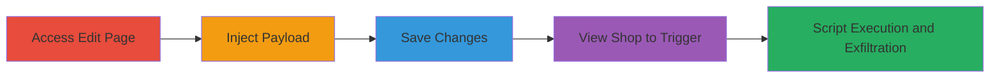

---
tags:
  - xss
  - stored-xss
  - javascript
  - session-theft
  - reverb
type: attack_chain
tools: []
tactics:
  - '[[Initial Access]]'
  - '[[Execution]]'
  - '[[Collection]]'
verified: false
platforms:
  - Web
submitted: true
complexity: low
created_at: '2023-10-01T00:00:00Z'
procedures:
  - '[[procedures/Access-Reverb-LP-Shop-Edit-Page]]'
  - '[[procedures/Inject-XSS-Payload-into-Shop-Name]]'
  - '[[procedures/Save-Malicious-Shop-Name-Changes]]'
  - '[[procedures/Trigger-Stored-XSS-by-Viewing-Shop-Listings]]'
step_count: 4
techniques:
  - '[[Exploit Public-Facing Application]]'
  - '[[JavaScript]]'
  - '[[Steal Web Session Cookie]]'
updated_at: '2025-12-14T03:46:31.373Z'
description: >-
  A multi-step attack exploiting a stored XSS vulnerability in the Reverb LP
  shop name field to inject and execute malicious JavaScript, enabling session
  cookie theft from viewing users.
skill_level: intermediate
impact_level: high
id: d52fe544-103a-4b27-9eff-2f542de10d9f
validated: true
mitre_tactics:
  - '[[Initial Access]]'
  - '[[Execution]]'
  - '[[Collection]]'
mitre_techniques:
  - '[[Exploit Public-Facing Application]]'
  - '[[JavaScript]]'
  - '[[Steal Web Session Cookie]]'
---
# Stored XSS in Reverb LP Shop Name for Session Cookie Theft

Multi-stage attack chain demonstrating a complete stored XSS exploit on Reverb's LP shop feature, allowing attackers to inject malicious JavaScript that executes in the browsers of users viewing the shop's listings page. The vulnerability stems from unsanitized input in the shop name field, enabling persistent script execution that can steal session cookies or perform other client-side attacks.

## Chain Metrics Dashboard

| Metric | Value |
|--------|-------|
| Chain Status | Unverified |
| Total Steps | 4 |
| Execution Time | ~5 minutes |
| Skill Level | Intermediate |
| Complexity | Low |
| Impact Level | High |

## Attack Flow Visualization

## Prerequisites & Requirements

### Required Tools

- Web browser (e.g., Chrome with developer tools for payload testing)

### Target Environment

- Reverb.com platform (web application)
- Attacker must have a Reverb account with an LP shop configured

### Initial Access Requirements

- Valid Reverb user credentials with shop editing privileges
- No special network access beyond internet connectivity
- Prior access to create or edit an LP shop

## Detailed Attack Procedures

### Step 1: Access Shop Edit Page
procedure: [[procedures/Access-Reverb-LP-Shop-Edit-Page]]

**Objective**: Navigate to the shop name editing interface to prepare for payload injection.

**Instructions**: Log in to your Reverb account and directly access the LP shop edit URL. Use a browser to visit the page and verify the shop name input field is available.

**Expected Output**: The edit interface loads, displaying the current shop name field.

**Success Indicators**:
- Edit page accessible without errors
- Shop name input field visible and editable

### Step 2: Inject XSS Payload
procedure: [[procedures/Inject-XSS-Payload-into-Shop-Name]]

**Objective**: Enter a malicious JavaScript payload into the shop name field to bypass sanitization and store executable code.

**Instructions**: In the shop name input field, replace the existing name with a crafted payload that closes any surrounding HTML tags and injects a script. For testing, use: `lll"></script>`. For production exploitation, replace the alert with code to exfiltrate cookies, e.g., `lll"></script>`.

**Expected Output**: Payload entered without immediate errors; field accepts the input including script tags.

**Success Indicators**:
- Payload saved temporarily in the form
- No client-side validation blocks the script injection

### Step 3: Save Changes
procedure: [[procedures/Save-Malicious-Shop-Name-Changes]]

**Objective**: Persist the injected payload to the server, storing the malicious shop name for rendering on public pages.

**Instructions**: Submit the edit form by clicking the save button. Monitor for any server-side errors; the unsanitized input should be accepted and stored.

**Expected Output**: Confirmation message indicating changes saved; shop name updated on the backend.

**Success Indicators**:
- Form submission succeeds
- No sanitization errors returned from server

### Step 4: Trigger Stored XSS
procedure: [[procedures/Trigger-Stored-XSS-by-Viewing-Shop-Listings]]

**Objective**: Render the shop listings page to execute the stored script in the viewer's browser context.

**Instructions**: In another browser session (or incognito) or share the shop URL with a victim, navigate to the listings page, e.g., `https://lp.reverb.com/shops/{your-shop-slug}/listings`. The shop name will be rendered unsafely, executing the injected script.

**Expected Output**: Alert pops up (for test payload) or network request to attacker's server with stolen cookies.

**Success Indicators**:
- Script executes (e.g., alert fires)
- Cookies exfiltrated to attacker's controlled endpoint

## Attack Chain Summary

### Key Achievements

1. Successful injection and storage of XSS payload in shop name without sanitization.
2. Persistent execution of JavaScript on shop listings page views.
3. Potential for session hijacking via cookie theft, impacting any user viewing the shop.

## Technique & Tactic Coverage

### MITRE ATT&CK Techniques

- [[Exploit Public-Facing Application]]
- [[JavaScript]]
- [[Steal Web Session Cookie]]

### MITRE ATT&CK Tactics

- [[Initial Access]]
- [[Execution]]
- [[Collection]]

---
*Last updated: 2023-10-01T00:00:00Z*
