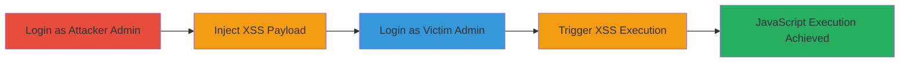

---
tags:
  - xss
  - stored-xss
  - web-vulnerability
  - javascript-execution
type: attack_chain
tools:
  - '[[tools/Firefox]]'
tactics:
  - '[[Execution]]'
  - '[[Collection]]'
verified: false
platforms:
  - Web
submitted: true
complexity: medium
created_at: '2023-10-01T00:00:00Z'
procedures:
  - '[[procedures/Inject-Malicious-Payload-into-Admin-Email-Field]]'
  - '[[procedures/Trigger-Stored-XSS-on-Admin-Access-Page]]'
step_count: 4
techniques:
  - '[[JavaScript]]'
updated_at: '2025-12-14T03:46:31.578Z'
description: >-
  A multi-step attack exploiting a stored XSS vulnerability in Revive Adserver's
  admin email field to execute arbitrary JavaScript in other admins' browsers,
  enabling session hijacking or data theft.
skill_level: intermediate
impact_level: high
id: 7efc9c1f-411b-4080-88d4-11fcc345b8e5
validated: true
mitre_tactics:
  - '[[Execution]]'
  - '[[Collection]]'
mitre_techniques:
  - '[[JavaScript]]'
---
# Stored XSS in Revive Adserver Admin Email Field for Admin JavaScript Execution

Multi-stage attack chain demonstrating a complete attack workflow exploiting a stored XSS vulnerability in Revive Adserver.

## Chain Metrics Dashboard

| Metric | Value |
|--------|-------|
| Chain Status | Unverified |
| Total Steps | 4 |
| Execution Time | ~5 minutes |
| Skill Level | Intermediate |
| Complexity | Medium |
| Impact Level | High |

## Attack Flow Visualization

## Prerequisites & Requirements

### Required Tools

- [[tools/Firefox]]

### Target Environment

- Web platform running Revive Adserver
- Administrative access to the application
- No specific ports or services beyond standard HTTP/HTTPS

### Initial Access Requirements

- Valid admin credentials for at least two accounts (attacker and victim)
- Direct network access to the Revive Adserver instance
- No prior access needed beyond login

## Detailed Attack Procedures

### Step 1: Login as Attacker Admin
procedure: [[procedures/Inject-Malicious-Payload-into-Admin-Email-Field]]

**Objective**: Gain access to the admin preferences section to prepare for payload injection.

**Instructions**: Open [[tools/Firefox]] and navigate to the Revive Adserver login page. Enter credentials for the attacker admin account (e.g., admin1) and log in. Then, navigate to the Preferences > Change E-mail section.

**Expected Output**: Successful login and access to the email change form.

**Success Indicators**:
- Dashboard loads without errors
- Preferences menu is accessible

### Step 2: Inject XSS Payload
procedure: [[procedures/Inject-Malicious-Payload-into-Admin-Email-Field]]

**Objective**: Store a malicious JavaScript payload in the email field without sanitization.

**Instructions**: In the Email address field, enter a payload such as `admin1@example.com`. Provide the current password if prompted, then submit the form to save the changes. Log out after saving.

**Expected Output**: Form submission succeeds without validation errors, and the payload is stored in the backend.

**Success Indicators**:
- No error messages on submission
- Logout completes successfully

### Step 3: Login as Victim Admin
procedure: [[procedures/Trigger-Stored-XSS-on-Admin-Access-Page]]

**Objective**: Access the application from a different admin account to set up for payload execution.

**Instructions**: Using [[tools/Firefox]], log in with victim admin credentials (e.g., admin2). Ensure a clean session without prior exposure.

**Expected Output**: Successful login to the victim admin dashboard.

**Success Indicators**:
- Victim dashboard loads
- No immediate alerts or anomalies

### Step 4: Trigger Stored XSS
procedure: [[procedures/Trigger-Stored-XSS-on-Admin-Access-Page]]

**Objective**: Load the page that renders the stored payload, executing the JavaScript in the victim's browser.

**Instructions**: Navigate to Inventory > Admin Access page. The unsanitized email field from the attacker admin will be displayed, triggering the JavaScript payload.

**Expected Output**: An alert box pops up with 'xss', confirming execution. In a real attack, this could be replaced with malicious code for session theft.

**Success Indicators**:
- JavaScript alert or equivalent execution occurs
- Browser console shows script evaluation

## Attack Chain Summary

### Key Achievements

1. Persistent storage of arbitrary JavaScript via admin email field
2. Execution in other admins' browsers without further interaction
3. Potential for session hijacking, keylogging, or phishing attacks

## Technique & Tactic Coverage

### MITRE ATT&CK Techniques

- [[JavaScript]]

### MITRE ATT&CK Tactics

- [[Execution]]
- [[Collection]]

---

*Last updated: 2023-10-01T00:00:00Z*
