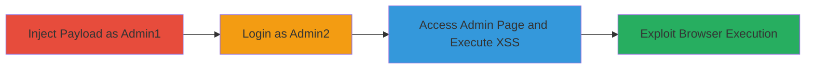

---
tags:
  - xss
  - stored-xss
  - web
  - revive-adserver
  - admin-exploitation
type: attack_chain
tools:
  - '[[tools/Firefox]]'
tactics:
  - '[[Execution]]'
verified: false
platforms:
  - Web
submitted: true
complexity: medium
created_at: '2024-10-01T00:00:00Z'
procedures:
  - '[[procedures/Inject-XSS-Payload-into-Admin-Email-Field]]'
  - '[[procedures/Login-as-Secondary-Admin-Account]]'
  - '[[procedures/Trigger-XSS-on-Admin-Access-Page]]'
step_count: 3
techniques:
  - '[[JavaScript]]'
updated_at: '2025-12-14T17:29:10.233Z'
description: >-
  A multi-step attack exploiting a stored XSS vulnerability in the Revive
  Adserver admin preferences email field to inject and execute malicious
  JavaScript in other admins' browsers.
skill_level: intermediate
impact_level: high
id: 07b4a559-5270-42cb-b5bb-ec6fd7a6539c
validated: true
mitre_tactics:
  - '[[Execution]]'
mitre_techniques:
  - '[[JavaScript]]'
---
# Stored XSS in Revive Adserver Admin Email Field for Cross-Admin Script Execution

Multi-stage attack chain demonstrating exploitation of a stored XSS vulnerability in Revive Adserver to inject persistent JavaScript that executes when other admins view the Admin Access page, potentially enabling session hijacking, phishing, or further exploitation.

## Chain Metrics Dashboard

| Metric | Value |
|--------|-------|
| Chain Status | Unverified |
| Total Steps | 3 |
| Execution Time | ~5 minutes |
| Skill Level | Intermediate |
| Complexity | Medium |
| Impact Level | High |

## Attack Flow Visualization

## Prerequisites & Requirements

### Required Tools

- [[tools/Firefox]]

### Target Environment

- Web platform running Revive Adserver
- Admin access to the application
- No specific ports or services beyond standard HTTP/HTTPS

### Initial Access Requirements

- Valid admin credentials for at least two accounts
- Direct access to the Revive Adserver web interface
- No prior network compromise needed, but assumes authenticated session

## Detailed Attack Procedures

### Step 1: Inject XSS Payload
procedure: [[procedures/Inject-XSS-Payload-into-Admin-Email-Field]]

**Objective**: Inject a malicious JavaScript payload into the email field of admin preferences to store it persistently in the database.

**Instructions**: Log in as the first admin and navigate to the preferences section to modify the email field with the XSS payload.

**Expected Output**: Preferences saved successfully without errors, payload stored.

**Success Indicators**:
- No validation errors on save
- Logout confirms session closure

### Step 2: Login as Secondary Admin
procedure: [[procedures/Login-as-Secondary-Admin-Account]]

**Objective**: Establish a session with a different admin account to simulate viewing the stored data.

**Instructions**: Use the second admin's credentials to authenticate into the Revive Adserver interface.

**Expected Output**: Successful login and access to the admin dashboard.

**Success Indicators**:
- Dashboard loads without issues
- Session active for navigation

### Step 3: Trigger XSS Execution
procedure: [[procedures/Trigger-XSS-on-Admin-Access-Page]]

**Objective**: Navigate to the page that displays the injected email, causing the XSS payload to execute in the browser.

**Instructions**: From the secondary admin session, go to Inventory > Admin Access to view the list, triggering the script.

**Expected Output**: Alert box or other JavaScript execution visible in the browser.

**Success Indicators**:
- JavaScript alert pops up
- Console logs confirm payload execution

## Attack Chain Summary

### Key Achievements

1. Persistent storage of malicious script via unsanitized email input
2. Cross-admin execution without direct interaction
3. Potential for advanced attacks like BeEF integration or keylogging

## Technique & Tactic Coverage

### MITRE ATT&CK Techniques

- [[JavaScript]]

### MITRE ATT&CK Tactics

- [[Execution]]

---
*Last updated: 2024-10-01T00:00:00Z*
