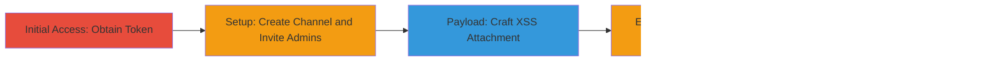

---
tags:
  - xss
  - stored-xss
  - rocket-chat
  - cookie-theft
  - privilege-escalation
  - rce
type: attack_chain
tools:
  - '[[tools/curl]]'
tactics:
  - '[[Execution]]'
  - '[[Collection]]'
commands:
  - '[[commands/curl-post-malicious-message-to-rocket-chat]]'
platforms:
  - Web
  - Electron
complexity: medium
procedures:
  - '[[procedures/Obtain-Personal-Access-Token]]'
  - '[[procedures/Create-Test-Channel]]'
  - '[[procedures/Invite-Administrators-to-Channel]]'
  - '[[procedures/Craft-Malicious-XSS-Payload]]'
  - '[[procedures/Post-Malicious-Message-via-API]]'
step_count: 5
techniques:
  - '[[JavaScript]]'
description: >-
  A multi-stage attack exploiting a stored XSS vulnerability in Rocket.Chat's
  message attachment fields to steal admin cookies, escalate privileges, and
  potentially achieve RCE.
skill_level: intermediate
impact_level: high
id: e94ad85f-54b8-4fe2-91c1-c2ab18d78cdb
created_at: '2025-12-14T03:47:13.133Z'
updated_at: '2025-12-14T03:47:13.133Z'
verified: false
validated: true
submitted: true
mitre_tactics:
  - '[[Execution]]'
  - '[[Collection]]'
mitre_techniques:
  - '[[JavaScript]]'
---
# Stored XSS in Rocket.Chat Attachments Leading to Cookie Theft and Privilege Escalation

## Overview

This attack chain exploits a stored Cross-Site Scripting (XSS) vulnerability in Rocket.Chat's message attachment fields. User-provided HTML in the 'value' field of attachments is rendered unsanitized if no custom renderer is set, allowing arbitrary JavaScript execution when viewed. The chain involves obtaining API access, setting up a test channel, luring admins, crafting a payload with an  onerror handler to steal cookies, and posting it via the REST API. Impacts include cookie theft for privilege escalation, message leakage, deletion/editing, server restarts, and RCE in the Electron client. The vulnerability is wormable, enabling propagation to other users.

## Chain Metrics Dashboard

| Metric | Value |
|--------|-------|
| Chain Status | Unverified |
| Total Steps | 5 |
| Execution Time | ~10 minutes |
| Skill Level | Intermediate |
| Complexity | Medium |
| Impact Level | High |

## Attack Flow Visualization



## Prerequisites & Requirements

### Required Tools

- [[tools/curl]]

### Target Environment

- Rocket.Chat server (Web or Electron client)
- Authenticated access to the API
- No specific ports required beyond standard HTTPS (443)

### Initial Access Requirements

- Valid user account on Rocket.Chat
- Ability to generate a Personal Access Token
- Network access to the Rocket.Chat server API

## Detailed Attack Procedures

### Step 1: Obtain Access Token
procedure: [[procedures/Obtain-Personal-Access-Token]]

**Objective**: Gain authenticated API access to post messages.

**Instructions**: Log in to Rocket.Chat and generate a Personal Access Token via user settings or admin panel.

**Expected Output**: A token string for use in API headers.

**Success Indicators**:
- Token generated successfully
- API authentication test passes

### Step 2: Create Test Channel
procedure: [[procedures/Create-Test-Channel]]

**Objective**: Establish a channel for delivering the payload.

**Instructions**: Use the Rocket.Chat interface or API to create a new channel named '#cookies'.

**Expected Output**: Channel created and accessible.

**Success Indicators**:
- Channel exists in the server
- User can post to it

### Step 3: Invite Administrators
procedure: [[procedures/Invite-Administrators-to-Channel]]

**Objective**: Lure admin users to view the malicious message.

**Instructions**: Add admin users to the '#cookies' channel, e.g., by messaging about 'yummy cookies' to entice views.

**Expected Output**: Admins joined to the channel.

**Success Indicators**:
- Admins listed as channel members
- Admins begin viewing channel messages

### Step 4: Craft Malicious Payload
procedure: [[procedures/Craft-Malicious-XSS-Payload]]

**Objective**: Prepare the JSON payload with XSS in the attachment.

**Instructions**: Create a JSON file 'cookiesplz.json' with a message containing an attachment where 'value' includes ''.

**Expected Output**: Valid JSON file ready for API submission. Example payload structure:

```json
{
  "channel": "#cookies",
  "text": "Check out these cookies!",
  "attachments": [{
    "fields": [{
      "type": "custom",
      "value": ""
    }]
  }]
}
```

**Success Indicators**:
- JSON validates without errors
- XSS payload embedded correctly

### Step 5: Post Malicious Message
procedure: [[procedures/Post-Malicious-Message-via-API]]

**Objective**: Inject the stored XSS payload into the channel for admin viewing.

**Instructions**: Use [[commands/curl-post-malicious-message-to-rocket-chat]] to send the payload:

```bash
curl -H "X-Auth-Token: <Token>" -H "X-User-Id: <user Id>" -H "Content-type:application/json" https://<server>/api/v1/chat.postMessage -d @cookiesplz.json
```

When admins view the message, the XSS triggers, alerting document.cookie.

**Expected Output**: JSON response {"success": true}, with XSS executing on viewers.

**Success Indicators**:
- Message posted successfully
- Alert pops up with cookies when viewed
- Potential for further exploitation like session hijacking

## Attack Chain Summary

### Key Achievements

1. Authenticated API access obtained for payload delivery
2. Malicious stored XSS injected via unsanitized attachment fields
3. Admin cookies stolen, enabling privilege escalation
4. Potential for message manipulation, server restarts, or RCE in Electron
5. Wormable propagation to other users on the server

## Technique & Tactic Coverage

### MITRE ATT&CK Techniques

- [[JavaScript]]

### MITRE ATT&CK Tactics

- [[Execution]]
- [[Collection]]

*Last updated: 2023-10-01T00:00:00Z*
