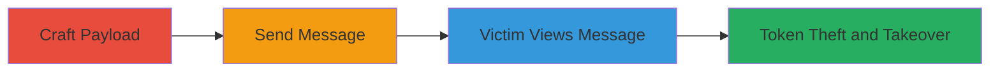

---

# Stored XSS in Rocket.Chat Leading to Account Takeover via Token Theft

Multi-stage attack chain demonstrating a complete attack workflow exploiting a stored XSS vulnerability in Rocket.Chat.

## Chain Metrics Dashboard

| Metric | Value |
|--------|-------|
| Chain Status | Unverified |
| Total Steps | 4 |
| Execution Time | ~5 minutes |
| Skill Level | Intermediate |
| Complexity | Medium |
| Impact Level | High |

## Attack Flow Visualization



## Prerequisites & Requirements

### Required Tools

- Browser developer tools for payload crafting
- Access to a Rocket.Chat instance (authenticated user)

### Target Environment

- Rocket.Chat server (Node.js/Meteor-based)
- Web browser for victim interaction
- Desktop client (Electron) for potential RCE
- Services: WebSocket (SockJS) on wss://host/sockjs/

### Initial Access Requirements

- Valid user account in the target Rocket.Chat workspace
- Ability to send messages in a channel
- Victim must view the malicious message

## Detailed Attack Procedures

### Step 1: Craft Malicious XSS Payload
procedure: [[procedures/Craft-Malicious-XSS-Payload-for-Rocket-Chat]]

**Objective**: Create a payload that exploits the interaction between Markdown inline code and AutoLinker to break out of HTML attributes and inject executable JavaScript.

**Instructions**: Use browser developer tools or a text editor to construct the payload. Example payload:

```text
https://a?p=[ ](https:// style=animation-duration:1s;animation-name:blink;animation-iteration-count:2 onanimationiteration=Array.prototype[Symbol.hasInstance]=eval,'alert\x28\x27XSS\x27\x29;'instanceof[] target=_blank data-x=`.)
```

This payload tricks the parsers into generating malformed <a> tags with malicious attributes like onanimationiteration.

**Expected Output**: A string payload ready to be sent as a message.

**Success Indicators**:
- Payload parses without errors in a test environment
- HTML output shows injected attributes

### Step 2: Send Stored XSS Message in Rocket.Chat
procedure: [[procedures/Send-Stored-XSS-Message-in-Rocket-Chat]]

**Objective**: Inject the payload into a chat channel where it will be stored and parsed server-side.

**Instructions**: Log in to the Rocket.Chat instance and navigate to a target channel. Paste and send the crafted payload as a message.

**Expected Output**: Message appears in the chat history, stored on the server.

**Success Indicators**:
- Message is successfully sent and visible to other users
- No immediate sanitization errors

### Step 3: Trigger XSS Execution on Victim View
procedure: [[procedures/Trigger-XSS-Execution-on-Victim-View]]

**Objective**: Cause the victim to load the message, triggering browser-side JavaScript execution.

**Instructions**: Lure the victim (e.g., via social engineering) to view the channel containing the malicious message. Upon rendering, the browser executes the injected code, such as loading an external script from sectex.dev/files/cswsh.js.

**Expected Output**: JavaScript executes, e.g., alert('XSS') or external script loads.

**Success Indicators**:
- Victim's browser runs the payload (observable via network requests)
- External script resources fetched

### Step 4: Steal Token and Perform Account Takeover via WebSocket
procedure: [[procedures/Steal-Token-and-Perform-Account-Takeover-via-WebSocket]]

**Objective**: Use the executed script to exfiltrate the victim's login token and authenticate via WebSocket to hijack the account.

**Instructions**: The injected script retrieves the token with localStorage.getItem('Meteor.loginToken'), then connects to the WebSocket endpoint (wss://host/sockjs/111/evilwss/websocket). Authenticate using the resume token and call methods like insertOrUpdateUser to assign admin roles to the attacker's user ID or change passwords.

**Expected Output**: Attacker gains control over the victim's account, e.g., role changes confirmed in the UI.

**Success Indicators**:
- Token successfully exfiltrated to attacker-controlled server
- WebSocket connection established and methods executed
- Account actions (e.g., password change) performed

## Attack Chain Summary

### Key Achievements

1. Successful injection of stored XSS payload bypassing parser sanitization
2. Execution of arbitrary JavaScript in victim's browser context
3. Theft of session tokens enabling persistent account access
4. Full takeover including privilege escalation to admin roles

## Technique & Tactic Coverage

### MITRE ATT&CK Techniques

- [[JavaScript]]
- [[Steal Web Session Cookie]]
- [[Valid Accounts]]

### MITRE ATT&CK Tactics

- [[Execution]]
- [[Credential Access]]
- [[Lateral Movement]]

---

*Last updated: 2023-10-01T00:00:00Z*
