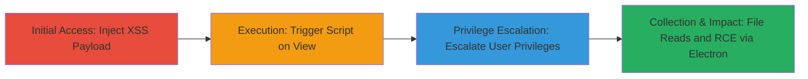

# Stored XSS in Rocket.Chat Messages Leading to Privilege Escalation and RCE

Multi-stage attack chain demonstrating exploitation of a persistent stored XSS vulnerability in Rocket.Chat, where nested markdown tags in messages allow arbitrary JavaScript injection. When users view the infected messages, the script executes, enabling privilege escalation across all users, arbitrary file reads from the victim's system, and remote code execution via the Electron desktop app. This affects versions prior to 3.11, 3.10.5, 3.9.7, and 3.8.8.

## Chain Metrics Dashboard

| Metric | Value |
|--------|-------|
| Chain Status | Unverified |
| Total Steps | 3 |
| Execution Time | ~5 minutes |
| Skill Level | Intermediate |
| Complexity | Medium |
| Impact Level | High |

## Attack Flow Visualization

## Prerequisites & Requirements

### Required Tools

- Browser with developer tools (e.g., Chrome DevTools)
- Access to Rocket.Chat instance (user account)

### Target Environment

- Rocket.Chat versions < 3.11, < 3.10.5, < 3.9.7, or < 3.8.8
- Web platform for injection and viewing
- Electron desktop app for RCE exploitation
- Node.js backend

### Initial Access Requirements

- Valid user account in Rocket.Chat (no admin privileges needed initially)
- Ability to send messages in a channel
- Victim users viewing the channel (for trigger)
- Local network access if targeting Electron app

## Detailed Attack Procedures

### Step 1: Inject Malicious Payload
procedure: [[procedures/Inject-Stored-XSS-Payload-in-Rocket-Chat-Messages]]

**Objective**: Deliver a persistent XSS payload via nested markdown tags in a message to store malicious JavaScript that executes on render.

**Instructions**: Log in to Rocket.Chat as a user, navigate to a channel, and send a message exploiting improper sanitization of nested markdown. Use a payload like nested bold/italic tags to inject `<script>` or `onerror` handlers.

**Expected Output**: Message appears rendered in the channel without visible errors, but source shows injected script.

**Success Indicators**:
- Message posted successfully
- Inspecting message HTML reveals unsanitized JavaScript

### Step 2: Trigger Execution and Escalate Privileges
procedure: [[procedures/Execute-JavaScript-for-Privilege-Escalation]]

**Objective**: When a victim views the message, execute the injected JavaScript to manipulate the application's state and escalate privileges for all users.

**Instructions**: Ensure a victim (or self in another session) views the channel. The script runs on message render, targeting Rocket.Chat's client-side logic to modify user roles or session tokens.

**Expected Output**: Console logs or UI changes indicating script execution; user roles updated in the app.

**Success Indicators**:
- JavaScript executes in victim's browser (check console)
- Privilege escalation confirmed (e.g., admin access gained)

### Step 3: Perform File Reads and Achieve RCE
procedure: [[procedures/Exploit-XSS-for-File-Reads-and-RCE-via-Electron]]

**Objective**: Leverage escalated privileges to read arbitrary files from the victim's system and execute remote code through the Electron app's Node.js integration.

**Instructions**: With elevated access, use the XSS script to invoke Electron APIs (e.g., `fs.readFile`) for file reads or `child_process` for RCE. Target local files or spawn processes.

**Expected Output**: File contents exfiltrated via network requests or console; new processes spawned on victim machine.

**Success Indicators**:
- Arbitrary files read (e.g., sensitive configs)
- RCE confirmed (e.g., reverse shell or command output)

## Attack Chain Summary

### Key Achievements

1. Persistent XSS injection via markdown sanitization flaw
2. Universal privilege escalation affecting all viewing users
3. Arbitrary file reads and full RCE on Electron clients

## Technique & Tactic Coverage

### MITRE ATT&CK Techniques

- [[Exploit Public-Facing Application]]
- [[JavaScript]]
- [[Exploitation for Privilege Escalation]]
- [[Data from Local System]]

### MITRE ATT&CK Tactics

- [[Initial Access]]
- [[Execution]]
- [[Privilege Escalation]]
- [[Collection]]

---
*Last updated: 2023-10-01T00:00:00Z*
