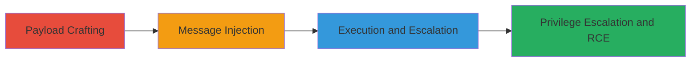

---
id: ac-rocket-chat-xss-chain
name: Stored XSS in Rocket.Chat Messages via Nested Markdown Leading to Privilege Escalation and RCE
type: attack_chain
description: A multi-stage attack exploiting a persistent XSS vulnerability in Rocket.Chat by injecting JavaScript through nested markdown tags in messages, resulting in arbitrary JS execution, privilege escalation for all users, arbitrary file reads, and remote code execution on the Electron desktop app.
verified: false
submitted: false
step_count: 3
created_at: 2023-10-01T00:00:00Z
updated_at: 2023-10-01T00:00:00Z
procedures: [[procedures/Craft-XSS-Payload-for-Nested-Markdown]], [[procedures/Inject-XSS-into-Rocket-Chat-Message]], [[procedures/Execute-XSS-for-Privilege-Escalation-and-RCE]]
techniques: [[JavaScript]]
tactics: [[Execution]], [[Privilege Escalation]]
tags: xss, stored-xss, rocket-chat, privilege-escalation, rce, electron
platforms: Web, Electron
tools: []
---

# Stored XSS in Rocket.Chat Messages via Nested Markdown Leading to Privilege Escalation and RCE

Multi-stage attack chain demonstrating a complete attack workflow exploiting a persistent XSS in Rocket.Chat.

## Chain Metrics Dashboard

| Metric | Value |
|--------|-------|
| Chain Status | Unverified |
| Total Steps | 3 |
| Execution Time | ~5 minutes |
| Skill Level | Intermediate |
| Complexity | Medium |
| Impact Level | High |

## Attack Flow Visualization

## Prerequisites & Requirements

### Required Tools

- Browser with developer tools (e.g., Chrome DevTools)

### Target Environment

- Rocket.Chat web application
- Rocket.Chat Electron desktop app
- Access to send messages in a channel

### Initial Access Requirements

- Valid user account in Rocket.Chat
- Ability to send messages (no admin privileges needed initially)
- Network access to the Rocket.Chat instance

## Detailed Attack Procedures

### Step 1: Payload Crafting
procedure: [[procedures/Craft-XSS-Payload-for-Nested-Markdown]]

**Objective**: Create a JavaScript payload that bypasses markdown sanitization using nested tags to inject executable script.

**Instructions**: Develop a payload exploiting improper sanitization of nested markdown, such as embedding **` or more advanced for escalation: `****` to enumerate users.

**Expected Output**: A string payload ready for injection that renders as executable JS when viewed.

**Success Indicators**:
- Payload syntax validated in a local markdown renderer
- No immediate sanitization errors

### Step 2: Message Injection
procedure: [[procedures/Inject-XSS-into-Rocket-Chat-Message]]

**Objective**: Send the crafted payload as a message in any Rocket.Chat channel to store the malicious content persistently.

**Instructions**: Log into Rocket.Chat, navigate to a channel, and paste the payload into the message input field. Submit the message. The nested markdown will be rendered without proper sanitization, storing the XSS.

**Expected Output**: Message appears in the channel with the markdown rendered, but JS not yet executed until viewed by a target.

**Success Indicators**:
- Message sent successfully without errors
- Payload visible in message history

### Step 3: Execution and Escalation
procedure: [[procedures/Execute-XSS-for-Privilege-Escalation-and-RCE]]

**Objective**: Trigger JS execution upon message view, leading to privilege escalation, file reads, and RCE on Electron app.

**Instructions**: Have a target user (or self) view the message. The JS executes in the browser context. For escalation, use JS to manipulate session tokens or API calls, e.g., `document.cookie` to steal sessions or `window.require('child_process').exec()` in Electron for RCE. In Electron, exploit Node.js integration for file reads like `fs.readFileSync('/etc/passwd')`.

**Expected Output**: Alert or console log confirming execution; escalated access or file contents leaked.

**Success Indicators**:
- JS executes (e.g., alert pops or network requests made)
- Privileges escalated (e.g., admin actions possible)
- Files read or RCE shell obtained

## Attack Chain Summary

### Key Achievements

1. Persistent storage of XSS payload in any message via nested markdown.
2. Arbitrary JS execution for all viewing users, enabling session hijacking and priv esc.
3. RCE on Electron app through Node.js access, allowing file leaks and system compromise.

## Technique & Tactic Coverage

### MITRE ATT&CK Techniques

- [[JavaScript]]

### MITRE ATT&CK Tactics

- [[Execution]]
- [[Privilege Escalation]]

---
*Last updated: 2023-10-01T00:00:00Z*
