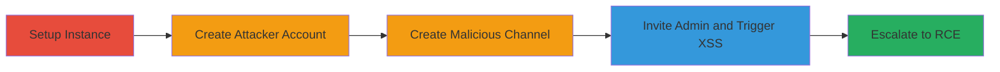

---

# Stored XSS in Rocket.Chat Room Creation Leading to Admin Takeover and RCE

Multi-stage attack chain demonstrating a complete attack workflow exploiting a validation bypass and stored XSS in Rocket.Chat version 3.12.1, leading to admin session hijacking and remote code execution.

## Chain Metrics Dashboard

| Metric | Value |
|--------|-------|
| Chain Status | Unverified |
| Total Steps | 5 |
| Execution Time | ~15 minutes |
| Skill Level | Intermediate |
| Complexity | Medium |
| Impact Level | High |

## Attack Flow Visualization



## Prerequisites & Requirements

### Required Tools

- [[tools/Git]]
- [[tools/Docker-Compose]]
- [[tools/Browser-Developer-Tools]]

### Target Environment

- Rocket.Chat version 3.12.1 running on Linux with MongoDB
- Exposed web interface on port 3000
- Default admin credentials post-setup

### Initial Access Requirements

- Local network access to the target instance
- No prior credentials needed beyond standard user registration
- Admin account exists after initial setup

## Detailed Attack Procedures

### Step 1: Setup Vulnerable Instance
procedure: [[procedures/Setup-Vulnerable-Rocket-Chat-Instance]]

**Objective**: Deploy a vulnerable Rocket.Chat 3.12.1 instance for exploitation testing.

**Instructions**: Clone the repository using [[commands/git-clone-rocket-chat]], navigate with [[commands/cd-rocket-chat]], checkout the tag with [[commands/git-checkout-3-12-1]], and start services with [[commands/docker-compose-up-detached]].

```bash
git clone git@github.com:RocketChat/Rocket.Chat.git
cd Rocket.Chat
git checkout tags/3.12.1
docker-compose up -d
```

Access the web interface at http://localhost:3000 and complete the initial admin setup.

**Expected Output**: Rocket.Chat instance running with admin user created.

**Success Indicators**:
- Services started without errors
- Web interface accessible and setup completed

### Step 2: Create Attacker Account
procedure: [[procedures/Create-Attacker-Account-in-Rocket-Chat]]

**Objective**: Register a non-admin user to initiate the attack.

**Instructions**: Use the registration form in the Rocket.Chat UI at http://localhost:3000 to create a user with username 'attacker' and password 'attacker'.

**Expected Output**: Attacker account created and login successful.

**Success Indicators**:
- User dashboard accessible after login
- No admin privileges assigned

### Step 3: Create Malicious Channel
procedure: [[procedures/Create-Channel-with-Stored-XSS-Payload]]

**Objective**: Exploit validation bypass to store an XSS payload in a channel name.

**Instructions**: Log in as attacker, open browser developer tools, and execute [[commands/meteor-call-create-channel-xss]] in the console.

```javascript
Meteor.call('createChannel', 'valid-name', [], false, {}, { name: 'edit me ' })
```

**Expected Output**: Channel created with the payload stored in the database.

**Success Indicators**:
- Channel appears in the user's channel list
- Payload not sanitized in backend storage

### Step 4: Invite Admin and Trigger XSS
procedure: [[procedures/Invite-Admin-and-Trigger-XSS]]

**Objective**: Lure the admin into triggering the stored XSS payload.

**Instructions**: Invite the admin to the channel via UI, log out and log in as admin, then edit the channel name (e.g., change 'me' to 'you') and save settings.

**Expected Output**: XSS payload executes, alerting the site's origin in a dialog.

**Success Indicators**:
- Alert box appears with origin
- Admin session potentially hijackable with advanced payload

### Step 5: Escalate to RCE
procedure: [[procedures/Achieve-RCE-via-Admin-Webhook]]

**Objective**: Use stolen admin privileges to create a malicious webhook for remote code execution.

**Instructions**: With admin access from XSS, navigate to admin settings and create an incoming webhook configured to execute arbitrary server-side scripts.

**Expected Output**: Webhook deployed, allowing RCE commands via HTTP requests.

**Success Indicators**:
- Webhook active and responding
- Server commands executable remotely

## Attack Chain Summary

### Key Achievements

1. Bypassed room name validation to store XSS payload
2. Achieved admin account takeover via user interaction
3. Gained full server control through RCE

## Technique & Tactic Coverage

### MITRE ATT&CK Techniques

- [[Exploit Public-Facing Application]]
- [[JavaScript]]

### MITRE ATT&CK Tactics

- [[Initial Access]]
- [[Execution]]
- [[Privilege Escalation]]

---

*Last updated: 2023-10-01T00:00:00Z*
