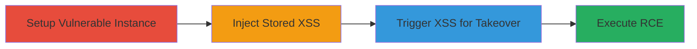

# Stored XSS in Rocket.Chat Room Name Leading to Admin Takeover and RCE

Multi-stage attack chain demonstrating a complete attack workflow exploiting stored XSS in Rocket.Chat 3.12.1 to bypass room name validation, inject payloads, trigger execution on admin users, and escalate to server-side RCE via webhooks.

## Chain Metrics Dashboard

| Metric | Value |
|--------|-------|
| Chain Status | Unverified |
| Total Steps | 4 |
| Execution Time | ~30 minutes |
| Skill Level | Intermediate |
| Complexity | Medium |
| Impact Level | High |

## Attack Flow Visualization



## Prerequisites & Requirements

### Required Tools

- [[tools/Git]]
- [[tools/Docker-Compose]]
- [[tools/Browser-Developer-Tools]]

### Target Environment

- Rocket.Chat version 3.12.1 running on a web platform
- Exposed on port 3000
- Connected database service (e.g., MongoDB)
- Tech stack: JavaScript, Meteor, toastr library

### Initial Access Requirements

- Access to create non-admin users
- Ability to invite admins to channels
- Admin credentials for simulation (or social engineering to trick admin into editing)
- Local network access to the instance

## Detailed Attack Procedures

### Step 1: Setup Vulnerable Instance
procedure: [[procedures/Setup-Rocket-Chat-Vulnerable-Instance]]

**Objective**: Deploy a reproducible Rocket.Chat 3.12.1 instance to simulate the vulnerable environment.

**Instructions**: Clone the repository using [[commands/git-clone-rocket-chat]]:

```bash
git clone git@github.com:RocketChat/Rocket.Chat.git
```

Navigate with [[commands/cd-rocket-chat]]:

```bash
cd Rocket.Chat
```

Checkout the vulnerable version using [[commands/git-checkout-rocket-chat-3-12-1]]:

```bash
git checkout tags/3.12.1
```

Start services with [[commands/docker-compose-up-detached]]:

```bash
docker-compose up -d
```

Configure defaults as needed.

**Expected Output**: Rocket.Chat instance running at http://localhost:3000 with default settings.

**Success Indicators**:
- Services started without errors
- Web interface accessible on port 3000

### Step 2: Inject Stored XSS Payload
procedure: [[procedures/Create-Attacker-Account-and-Inject-XSS]]

**Objective**: Create an attacker account, log in, and inject an XSS payload into a channel's room name via validation bypass.

**Instructions**: Create a non-admin user 'attacker' via the interface. Log in as attacker. Open browser dev tools and execute [[commands/meteor-call-create-channel-xss]] to create the channel:

```javascript
Meteor.call('createChannel', 'valid-name', [], false, {}, { name: 'edit me ' })
```

Invite the admin to the channel using the app's invite feature.

**Expected Output**: Channel created with stored XSS payload in the database, admin invited.

**Success Indicators**:
- Channel appears in user's list
- Admin receives invite and joins

### Step 3: Trigger XSS for Admin Takeover
procedure: [[procedures/Trigger-XSS-for-Admin-Takeover]]

**Objective**: Switch to admin session, edit the channel title to trigger validation error, and execute the XSS payload for JavaScript execution and session theft.

**Instructions**: Log out and log in as admin. Navigate to the channel settings and edit the title (e.g., change 'me' to 'you'). Click save to invoke the rooms.saveRoomSettings endpoint.

**Expected Output**: Error message displayed via toastr with unescaped payload, triggering alert (e.g., showing http://localhost:3000) and potential JS execution for account takeover.

**Success Indicators**:
- Alert popup executes
- Attacker gains admin session via stolen cookies or keylogging

### Step 4: Achieve RCE
procedure: [[procedures/Achieve-RCE-via-Admin-Webhook]]

**Objective**: Use stolen admin privileges to create an incoming webhook with malicious script for server-side code execution.

**Instructions**: With admin access, navigate to administration > Integrations > Incoming Webhooks. Create a new webhook with a script payload (e.g., executing system commands via Meteor methods or shell access).

**Expected Output**: Webhook created and triggered, resulting in arbitrary command execution on the server, exposing database and connected systems.

**Success Indicators**:
- Commands execute on server (e.g., file creation or network calls)
- Full instance control achieved

## Attack Chain Summary

### Key Achievements

1. Bypassed room name validation to store XSS payload
2. Tricked admin into triggering XSS for account takeover
3. Escalated to RCE via admin webhook, granting server control

## Technique & Tactic Coverage

### MITRE ATT&CK Techniques

- [[JavaScript]]
- [[Exploit Public-Facing Application]]
- [[PowerShell]]

### MITRE ATT&CK Tactics

- [[Initial Access]]
- [[Execution]]
- [[Privilege Escalation]]
- [[Lateral Movement]]

---
*Last updated: 2023-10-01T00:00:00Z*
