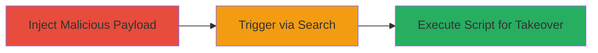

---
tags:
  - xss
  - stored-xss
  - rocket-chat
  - markdown-injection
type: attack_chain
tools: []
tactics:
  - '[[Execution]]'
commands: []
platforms:
  - Web
complexity: low
procedures:
  - '[[procedures/Inject-Malicious-Markdown-in-Rocket-Chat-Search-Messages]]'
step_count: 1
techniques:
  - '[[JavaScript]]'
description: >-
  Exploits a stored XSS vulnerability in Rocket.Chat's Search Messages feature
  via markdown parsing flaws, allowing malicious script injection on servers
  without CSP, enabling account takeover.
skill_level: intermediate
impact_level: high
id: 895bb362-2c6c-40c3-90bd-3dcebf4b231d
created_at: '2025-12-14T03:15:53.458Z'
updated_at: '2025-12-14T03:15:53.458Z'
verified: false
validated: true
submitted: true
mitre_tactics:
  - '[[Execution]]'
mitre_techniques:
  - '[[JavaScript]]'
---
# Stored XSS in Rocket.Chat Search Messages Leading to Account Takeover

Multi-stage attack chain demonstrating a complete attack workflow.

## Chain Metrics Dashboard

| Metric | Value |
|--------|-------|
| Chain Status | Unverified |
| Total Steps | 1 |
| Execution Time | ~5 minutes |
| Skill Level | Intermediate |
| Complexity | Low |
| Impact Level | High |

## Attack Flow Visualization

## Prerequisites & Requirements

### Required Tools

- Web browser (e.g., Chrome Developer Tools for payload testing)

### Target Environment

- Rocket.Chat server (version vulnerable to CVE or similar, pre-2022 patches)
- Web platform access
- Disabled Content Security Policy (CSP)

### Initial Access Requirements

- Valid user account on the Rocket.Chat instance
- Ability to send messages in channels
- No prior elevated privileges needed

## Detailed Attack Procedures

### Step 1: Inject and Trigger XSS Payload
procedure: [[procedures/Inject-Malicious-Markdown-in-Rocket-Chat-Search-Messages]]

**Objective**: Insert a malicious script payload into search messages via markdown parsing flaw to store and execute XSS on search, leading to potential account takeover.

**Instructions**: Log in to the Rocket.Chat instance as a user. Navigate to a channel and compose a message using markdown that exploits the parsing issue by inserting HTML tags, such as an image tag with an onerror handler. Send the message to store it. Then, use the 'Search Messages' feature to query for the injected content, triggering the payload execution in the browser of any user viewing the search results.

Example payload injection in message: `")` or more advanced `` embedded via markdown bypass.

**Expected Output**: Upon searching for the message, the script executes, displaying an alert or sending data to attacker-controlled server.

**Success Indicators**:
- Payload executes without errors (e.g., alert pops or network request to attacker server)
- Victim user's session cookie or data exfiltrated, enabling takeover

## Attack Chain Summary

### Key Achievements

1. Successful injection of stored XSS payload via markdown in Search Messages
2. Triggering of payload on search without CSP blocking
3. Potential account takeover through session hijacking or credential theft

## Technique & Tactic Coverage

### MITRE ATT&CK Techniques

- [[JavaScript]]

### MITRE ATT&CK Tactics

- [[Execution]]

---
*Last updated: 2023-10-01*
