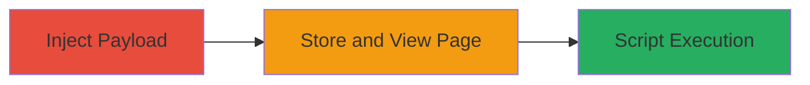

---
tags:
  - xss
  - stored-xss
  - rocket-chat
  - javascript
  - web-vulnerability
type: attack_chain
tools: []
tactics:
  - '[[Initial Access]]'
  - '[[Execution]]'
verified: false
platforms:
  - Web
submitted: true
complexity: low
created_at: '2024-01-01T00:00:00Z'
procedures:
  - '[[procedures/Inject-Malicious-Payload-into-Rocket-Chat-Setup-Wizard]]'
  - '[[procedures/Trigger-Stored-XSS-by-Viewing-Affected-Page]]'
step_count: 2
techniques:
  - '[[Exploit Public-Facing Application]]'
  - '[[JavaScript]]'
updated_at: '2025-12-14T03:16:20.310Z'
description: >-
  A multi-step attack exploiting a stored XSS vulnerability in Rocket.Chat's
  setup wizard to inject and execute malicious JavaScript in victims' browsers.
skill_level: basic
impact_level: high
id: ec03434d-fc34-4289-b4a6-4609aa877776
validated: true
mitre_tactics:
  - '[[Initial Access]]'
  - '[[Execution]]'
mitre_techniques:
  - '[[Exploit Public-Facing Application]]'
  - '[[JavaScript]]'
---
# Stored XSS in Rocket.Chat Setup Wizard for Arbitrary Script Execution

Multi-stage attack chain demonstrating a complete attack workflow exploiting a stored cross-site scripting (XSS) vulnerability in Rocket.Chat's setup wizard. An attacker injects malicious JavaScript into input fields like the instance title during setup. The input is stored without sanitization and executed in the browsers of users who view the wizard or affected pages, enabling session hijacking, site defacement, content insertion, user redirection, or malware delivery.

## Chain Metrics Dashboard

| Metric | Value |
|--------|-------|
| Chain Status | Unverified |
| Total Steps | 2 |
| Execution Time | ~1 minute |
| Skill Level | Basic |
| Complexity | Low |
| Impact Level | High |

## Attack Flow Visualization

## Prerequisites & Requirements

### Required Tools

- Web browser (e.g., Chrome with developer tools)

### Target Environment

- Rocket.Chat instance in setup wizard phase
- Web platform accessible via HTTP/HTTPS
- No specific ports beyond standard web (80/443)

### Initial Access Requirements

- Access to the Rocket.Chat setup wizard (e.g., as an administrator or during initial installation)
- No prior credentials needed beyond setup access
- Network access to the target web application

## Detailed Attack Procedures

### Step 1: Inject Malicious Payload
procedure: [[procedures/Inject-Malicious-Payload-into-Rocket-Chat-Setup-Wizard]]

**Objective**: Insert executable JavaScript into vulnerable input fields in the setup wizard to store malicious code for later execution.

**Instructions**: Navigate to the Rocket.Chat setup wizard in a web browser. Locate input fields such as the instance title. Enter a payload like an HTML image tag with an onerror JavaScript handler, for example: ``. Submit the form to save the input.

**Expected Output**: The payload is accepted and stored without error, visible in the wizard interface.

**Success Indicators**:
- Payload input is not sanitized or rejected
- Confirmation of save via UI feedback or page reload

### Step 2: Trigger Stored XSS by Viewing Affected Page
procedure: [[procedures/Trigger-Stored-XSS-by-Viewing-Affected-Page]]

**Objective**: Load the affected page to render and execute the stored malicious script in the victim's browser.

**Instructions**: Have a victim (or use another browser session) access the setup wizard or any page displaying the stored input, such as the instance title. The browser will parse and execute the injected JavaScript automatically.

**Expected Output**: Execution of the script, e.g., an alert prompt or console log confirming XSS, as shown in vulnerability screenshots.

**Success Indicators**:
- Script executes (e.g., alert box appears or onerror triggers)
- Victim's browser runs arbitrary code, potentially leading to session theft or defacement

## Attack Chain Summary

### Key Achievements

1. Successful injection of unsanitized JavaScript into setup wizard fields
2. Persistent storage allowing execution on page views by other users
3. Demonstration of high-impact effects like session hijacking or malware delivery

## Technique & Tactic Coverage

### MITRE ATT&CK Techniques

- [[Exploit Public-Facing Application]]
- [[JavaScript]]

### MITRE ATT&CK Tactics

- [[Initial Access]]
- [[Execution]]

---
*Last updated: 2024-01-01T00:00:00Z*
