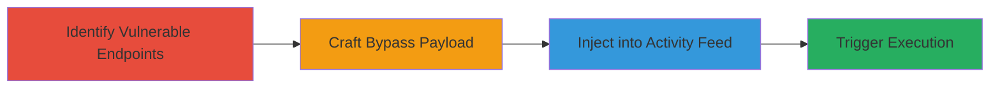

---
tags:
  - xss
  - stored-xss
  - bypass
  - javascript-injection
  - session-hijacking
type: attack_chain
tools: []
tactics:
  - '[[Execution]]'
  - '[[Collection]]'
commands: []
platforms:
  - Web
complexity: medium
procedures:
  - '[[procedures/Identify-Vulnerable-Profile-and-Crew-Feed-Endpoints]]'
  - '[[procedures/Craft-XSS-Payload-with-Obscure-Characters]]'
  - '[[procedures/Inject-Payload-into-Activity-Feed-Messages]]'
  - '[[procedures/Trigger-and-Demonstrate-XSS-Execution]]'
step_count: 4
techniques:
  - '[[JavaScript]]'
description: >-
  A multi-stage attack exploiting a Stored XSS vulnerability in Rockstar Games'
  Profile and Crew Feed endpoints by bypassing HTML entity sanitization with
  obscure characters, leading to JavaScript execution and potential session
  hijacking.
skill_level: intermediate
impact_level: high
id: db9df32c-b58b-4b63-ab23-ebe03bc4d8a5
created_at: '2025-12-13T23:52:39.423Z'
updated_at: '2025-12-13T23:52:39.423Z'
verified: false
validated: true
submitted: true
mitre_tactics:
  - '[[Execution]]'
  - '[[Collection]]'
mitre_techniques:
  - '[[JavaScript]]'
---
# Stored XSS in Rockstar Games Profile Activity Feed via Obscure Character Bypass

Multi-stage attack chain demonstrating a complete Stored XSS workflow in Rockstar Games' platform.

## Chain Metrics Dashboard

| Metric | Value |
|--------|-------|
| Chain Status | Unverified |
| Total Steps | 4 |
| Execution Time | ~10 minutes |
| Skill Level | Intermediate |
| Complexity | Medium |
| Impact Level | High |

## Attack Flow Visualization

## Prerequisites & Requirements

### Required Tools

- Browser developer tools for payload testing
- Web proxy like Burp Suite (optional for interception)

### Target Environment

- Web platform (Rockstar Games social features)
- Access to user account for message submission
- No specific ports; operates over HTTPS

### Initial Access Requirements

- Valid user credentials for Rockstar Games platform
- Network access to the web application
- No prior elevated access needed

## Detailed Attack Procedures

### Step 1: Identify Vulnerable Endpoints
procedure: [[procedures/Identify-Vulnerable-Profile-and-Crew-Feed-Endpoints]]

**Objective**: Locate endpoints handling user messages in profile activity feeds that lack full sanitization.

**Instructions**: Review the platform's social features, focusing on Profile and Crew Feed sections. Test input fields for messages by submitting simple scripts like `` to check for reflection or storage without proper escaping. Use browser dev tools to inspect network requests to endpoints like `/profile/activity` or `/crew/feed`.

**Expected Output**: Confirmation that inputs are stored and rendered without full HTML entity conversion.

**Success Indicators**:
- Inputs persist in feeds without being escaped
- Basic script tags are partially filtered but allow further testing

### Step 2: Craft Bypass Payload
procedure: [[procedures/Craft-XSS-Payload-with-Obscure-Characters]]

**Objective**: Develop a payload that evades sanitization filters using non-standard characters.

**Instructions**: Experiment with Unicode or special characters like †‡•…‰€ to surround a malicious img tag. Construct the payload: `†‡•＜img src=a onerror=javascript:alert('hacked')＞…‰€`. Test in a local HTML file or similar environment to ensure the script executes when rendered.

**Expected Output**: Payload renders as executable JavaScript without being converted to entities.

**Success Indicators**:
- Obscure characters prevent filter triggering
- onerror handler fires in test environment

### Step 3: Inject Payload into Activity Feed
procedure: [[procedures/Inject-Payload-into-Activity-Feed-Messages]]

**Objective**: Submit the crafted payload as a message to store it in the vulnerable feeds.

**Instructions**: Log in to a test account, navigate to the profile activity or crew feed input, and submit the full payload string: `†‡•＜img src=a onerror=javascript:alert('hacked')＞…‰€`. Use the platform's message submission form, ensuring it's targeted at the Profile or Crew endpoints.

**Expected Output**: Message accepted and stored without rejection.

**Success Indicators**:
- Payload appears in the feed preview (partially obscured)
- No error on submission

### Step 4: Trigger XSS Execution
procedure: [[procedures/Trigger-and-Demonstrate-XSS-Execution]]

**Objective**: View the affected feed to execute the stored payload.

**Instructions**: Log in as another user or refresh the profile/crew feed containing the injected message. The payload should render and trigger the JavaScript, displaying an alert like 'hacked'. In a real attack, replace alert with code for session theft, e.g., sending cookies to an attacker-controlled server.

**Expected Output**: JavaScript alert or console execution confirming XSS.

**Success Indicators**:
- Alert box appears on page load
- Dev tools show script execution
- Potential for further exploitation like keylogging

## Attack Chain Summary

### Key Achievements

1. Bypassed HTML entity sanitization using obscure characters
2. Stored malicious payload in user activity feeds
3. Achieved arbitrary JavaScript execution on victim browsers
4. Enabled potential session hijacking or data exfiltration

## Technique & Tactic Coverage

### MITRE ATT&CK Techniques

- [[JavaScript]]

### MITRE ATT&CK Tactics

- [[Execution]]
- [[Collection]]

---
*Last updated: 2023-10-01T00:00:00Z*
