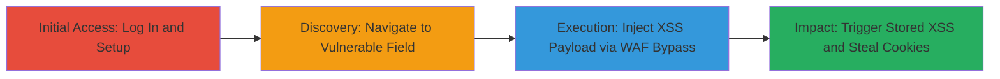

# Stored XSS in SEMrush Position Tracking Competitor Domain with WAF Bypass

Multi-stage attack chain demonstrating exploitation of a stored XSS vulnerability in the SEMrush Position Tracking section, combined with a WAF bypass, to inject and execute malicious JavaScript that steals user cookies and sessions.

## Chain Metrics Dashboard

| Metric | Value |
|--------|-------|
| Chain Status | Unverified |
| Total Steps | 4 |
| Execution Time | ~5 minutes |
| Skill Level | Intermediate |
| Complexity | Medium |
| Impact Level | High |

## Attack Flow Visualization

## Prerequisites & Requirements

### Required Tools

- [[tools/Burp-Suite]]

### Target Environment

- SEMrush web application (requires authenticated access)
- Web browser with proxy support (e.g., Firefox configured for Burp Suite)
- No specific ports or services beyond standard HTTPS (443)

### Initial Access Requirements

- Valid SEMrush account credentials
- Network access to semrush.com
- Burp Suite installed and running as a proxy

## Detailed Attack Procedures

### Step 1: Log In and Create Position Tracking Project
procedure: [[procedures/Log-In-and-Create-Position-Tracking-Project]]

**Objective**: Gain authenticated access and set up a new project to access the vulnerable Position Tracking feature.

**Instructions**: Access the SEMrush website, log in with credentials, and create a new position tracking project from the dashboard. This establishes the session needed for subsequent interactions.

**Expected Output**: Successful login and project creation confirmation on the dashboard.

**Success Indicators**:
- Dashboard loads with user account details
- New project appears in the project list

### Step 2: Navigate to Rankings Distribution Tab
procedure: [[procedures/Navigate-to-Rankings-Distribution-Tab]]

**Objective**: Reach the competitor domain input field where the XSS payload can be injected.

**Instructions**: From the project dashboard, go to Position Tracking > Rankings Distribution, select 'Add domains', and click 'Edit competitor's list' to open the input interface for new competitor domains.

**Expected Output**: Interface opens with a form field for entering competitor domains.

**Success Indicators**:
- Rankings Distribution tab visible
- 'Edit competitor's list' button functional

### Step 3: Intercept and Inject XSS Payload with Burp Suite
procedure: [[procedures/Intercept-and-Inject-XSS-Payload-with-Burp-Suite]]

**Objective**: Bypass client-side validation and WAF by modifying the HTTP request to inject a crafted XSS payload.

**Instructions**: Enter a valid domain like 'google.com' in the 'new competitor's domain' field, intercept the submission request using Burp Suite, replace the 'domain' parameter with the payload `""><u>XSS Vulnerability</u><marquee+onstart='alert(document.cookie)'>XSS`, then forward the request and add to the list.

**Expected Output**: Request forwarded successfully without WAF block; payload stored in the backend.

**Success Indicators**:
- No WAF error triggered
- Competitor added to the list without visible errors

### Step 4: Update Settings and Trigger Stored XSS
procedure: [[procedures/Update-Settings-and-Trigger-Stored-XSS]]

**Objective**: Submit the changes to store the payload and execute it upon page reload, demonstrating cookie theft.

**Instructions**: Click the 'Update' button to save changes, close the Position Tracking Settings page, and reload or return to the page to trigger execution.

**Expected Output**: Alert box pops up displaying document.cookie contents, confirming XSS execution.

**Success Indicators**:
- JavaScript alert with cookies
- Potential page defacement or session hijack simulation

## Attack Chain Summary

### Key Achievements

1. Successful WAF bypass using a non-standard HTML tag (marquee with onstart event)
2. Stored XSS injection leading to arbitrary JavaScript execution in victim sessions
3. Cookie theft capability, enabling session hijacking for authenticated users

## Technique & Tactic Coverage

### MITRE ATT&CK Techniques

- [[JavaScript]]
- [[Exploit Public-Facing Application]]

### MITRE ATT&CK Tactics

- [[Execution]]
- [[Collection]]

---
*Last updated: 2023-10-01T00:00:00Z*
