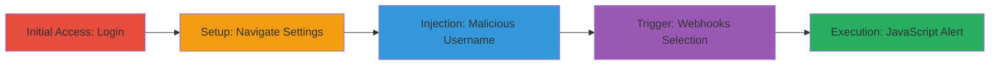

---
tags:
  - xss
  - stored-xss
  - web-vulnerability
  - session-hijacking
type: attack_chain
tools: []
tactics:
  - '[[Execution]]'
verified: false
platforms:
  - Web
submitted: true
complexity: medium
created_at: '2023-10-01T00:00:00Z'
procedures:
  - '[[procedures/Create-Account-and-Login-to-SMTP2GO]]'
  - '[[procedures/Navigate-to-SMTP-Users-Settings]]'
  - '[[procedures/Inject-Malicious-Payload-in-Username-Field]]'
  - '[[procedures/Trigger-XSS-via-Webhooks-User-Selection]]'
step_count: 4
techniques:
  - '[[JavaScript]]'
updated_at: '2025-12-13T23:52:25.361Z'
description: >-
  A multi-step attack exploiting a stored XSS vulnerability in the SMTP2GO web
  application's user creation feature to inject and trigger malicious
  JavaScript, enabling session hijacking or data theft.
skill_level: intermediate
impact_level: high
id: 97d34e9f-0f08-42b1-a95d-6cbb26b9bdee
validated: true
mitre_tactics:
  - '[[Execution]]'
mitre_techniques:
  - '[[JavaScript]]'
---
# Stored XSS in SMTP2GO Username Field Leading to JavaScript Execution

Multi-stage attack chain demonstrating a complete attack workflow exploiting a stored XSS vulnerability in the SMTP2GO web application.

## Chain Metrics Dashboard

| Metric | Value |
|--------|-------|
| Chain Status | Unverified |
| Total Steps | 4 |
| Execution Time | ~5 minutes |
| Skill Level | Intermediate |
| Complexity | Medium |
| Impact Level | High |

## Attack Flow Visualization

## Prerequisites & Requirements

### Required Tools

- Web browser (e.g., Chrome with developer tools for payload testing)

### Target Environment

- Web platform
- SMTP2GO application at https://app.smtp2go.com
- No specific ports required beyond standard HTTPS (443)

### Initial Access Requirements

- Valid email for account registration
- No prior credentials needed; attacker creates a new account
- Direct network access to the public-facing web application

## Detailed Attack Procedures

### Step 1: Create Account and Login
procedure: [[procedures/Create-Account-and-Login-to-SMTP2GO]]

**Objective**: Gain authenticated access to the SMTP2GO dashboard to prepare for user creation.

**Instructions**: Access the login/registration page and create a new account using a valid email and password. Then log in to reach the dashboard.

**Expected Output**: Successful login redirect to the dashboard.

**Success Indicators**:
- Dashboard loads without errors
- User profile shows as logged in

### Step 2: Navigate to SMTP Users Settings
procedure: [[procedures/Navigate-to-SMTP-Users-Settings]]

**Objective**: Reach the interface for managing SMTP users where the vulnerable username field is located.

**Instructions**: From the main dashboard, select the settings menu and navigate to the SMTP users section.

**Expected Output**: SMTP users management page loads, showing options to add or view users.

**Success Indicators**:
- "Add SMTP User" button visible
- Existing users list (if any) displayed

### Step 3: Inject Malicious Payload in Username Field
procedure: [[procedures/Inject-Malicious-Payload-in-Username-Field]]

**Objective**: Store a malicious JavaScript payload in the username field without sanitization, setting up the stored XSS.

**Instructions**: Click "Add SMTP User", enter the payload `<form><input type="date" onfocus="alert(1)">` in the username field (bypassing any basic filters with entity encoding if needed), and save the user.

**Expected Output**: New user added successfully without errors; payload stored in the backend.

**Success Indicators**:
- User appears in the SMTP users list
- No immediate execution or validation errors

### Step 4: Trigger XSS via Webhooks User Selection
procedure: [[procedures/Trigger-XSS-via-Webhooks-User-Selection]]

**Objective**: Execute the stored payload in a victim's browser context by selecting the malicious user in the webhooks configuration.

**Instructions**: Navigate to the webhooks section, proceed to add a webhook, and select the malicious user from the dropdown list, triggering the onfocus event and alert.

**Expected Output**: JavaScript alert popup with "1" or custom payload execution.

**Success Indicators**:
- Alert box appears in the browser
- Browser console shows script execution
- Potential for further payload to steal cookies or hijack session

## Attack Chain Summary

### Key Achievements

1. Successful injection of unsanitized JavaScript into a stored field
2. Triggering of XSS in an administrative or user interface context
3. Demonstration of impact including session theft or privileged actions

## Technique & Tactic Coverage

### MITRE ATT&CK Techniques

- [[JavaScript]]

### MITRE ATT&CK Tactics

- [[Execution]]

---

*Last updated: 2023-10-01T00:00:00Z*
