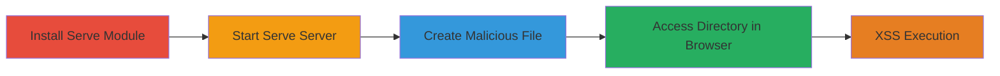

---
tags:
  - xss
  - stored-xss
  - node-js
  - directory-listing
type: attack_chain
tools:
  - '[[tools/npm]]'
  - '[[tools/serve]]'
  - '[[tools/touch]]'
  - '[[tools/Chrome]]'
tactics:
  - '[[Initial Access]]'
  - '[[Execution]]'
commands:
  - '[[commands/npm-install-serve]]'
  - '[[commands/serve-start-server]]'
  - '[[commands/touch-malicious-filename]]'
platforms:
  - Web
  - Node.js
complexity: low
procedures:
  - '[[procedures/Install-Serve-Module]]'
  - '[[procedures/Start-Serve-Server]]'
  - '[[procedures/Create-Malicious-Filename-File]]'
  - '[[procedures/Trigger-XSS-in-Browser]]'
step_count: 4
techniques:
  - '[[JavaScript]]'
  - '[[Drive-by Compromise]]'
description: >-
  A multi-step attack exploiting a stored XSS vulnerability in the serve Node.js
  module by creating a file with a malicious filename that injects JavaScript
  into the directory listing, leading to arbitrary code execution in the
  victim's browser.
skill_level: beginner
impact_level: medium
id: d63db67f-b53f-4775-8ab3-4170d41e28d7
created_at: '2025-12-14T03:15:42.005Z'
updated_at: '2025-12-14T03:15:42.005Z'
verified: false
validated: true
submitted: true
mitre_tactics:
  - '[[Initial Access]]'
  - '[[Execution]]'
mitre_techniques:
  - '[[JavaScript]]'
  - '[[Drive-by Compromise]]'
---
# Stored XSS in Serve Node.js Module via Malicious Filename in Directory Listing

## Overview

This attack chain demonstrates a stored cross-site scripting (XSS) vulnerability in the serve Node.js module (versions 7.0.1 to 10.0.1), where filenames are not sanitized during directory listing rendering. An attacker creates a file with a malicious filename containing JavaScript payload, such as an SVG onload alert. When a victim accesses the served directory via a browser, the payload executes, potentially enabling session hijacking, data theft, or other client-side attacks. The chain requires local setup but simulates a scenario where an attacker controls file uploads or naming in a served directory.

## Chain Metrics Dashboard

| Metric | Value |
|--------|-------|
| Chain Status | Unverified |
| Total Steps | 4 |
| Execution Time | ~5 minutes |
| Skill Level | Beginner |
| Complexity | Low |
| Impact Level | Medium |

## Attack Flow Visualization



## Prerequisites & Requirements

### Required Tools

- [[tools/npm]]
- [[tools/serve]]
- [[tools/touch]]
- [[tools/Chrome]]

### Target Environment

- Node.js runtime (any version compatible with serve 7.0.1-10.0.1)
- Local file system access
- Port 3000 available

### Initial Access Requirements

- Local machine with npm installed
- No network credentials needed; simulates local server exposure
- Browser access to localhost

## Detailed Attack Procedures

### Step 1: Install Serve Module
procedure: [[procedures/Install-Serve-Module]]

**Objective**: Set up the vulnerable serve module to host a static file server.

**Instructions**: Use [[commands/npm-install-serve]] to install the serve package from the npm registry:

```bash
npm i serve
```

**Expected Output**: Installation logs confirming serve@7.0.1 (or vulnerable version) added to node_modules.

**Success Indicators**:
- serve directory appears in node_modules
- No installation errors

### Step 2: Start Serve Server
procedure: [[procedures/Start-Serve-Server]]

**Objective**: Launch the static file server to expose the directory listing.

**Instructions**: Execute [[commands/serve-start-server]] from the serve binary:

```bash
./node_modules/serve/bin/serve.js
```

**Expected Output**: Server startup message: "Accepting connections at http://127.0.0.1:3000".

**Success Indicators**:
- Server listens on port 3000
- Directory listing accessible at http://127.0.0.1:3000/

### Step 3: Create Malicious Filename File
procedure: [[procedures/Create-Malicious-Filename-File]]

**Objective**: Inject a stored XSS payload via a specially crafted filename that breaks out of HTML attributes in the directory listing.

**Instructions**: Use [[commands/touch-malicious-filename]] to create an empty file with the payload:

```bash
touch '"><svg onload=alert(3333333);'
```

**Expected Output**: No output; file created in the current directory.

**Success Indicators**:
- File exists with the malicious name
- ls command shows the filename

### Step 4: Trigger XSS in Browser
procedure: [[procedures/Trigger-XSS-in-Browser]]

**Objective**: View the directory listing to execute the injected JavaScript, simulating victim interaction.

**Instructions**: Open [[tools/Chrome]] and navigate to http://127.0.0.1:3000/. The unsanitized filename renders the payload, triggering the alert.

**Expected Output**: JavaScript alert popup with "3333333".

**Success Indicators**:
- Alert box appears in browser
- Console shows no errors; payload executes

## Attack Chain Summary

### Key Achievements

1. Successful installation and execution of the vulnerable serve module.
2. Creation of a file with XSS payload that persists in directory listings.
3. Arbitrary JavaScript execution in the browser upon directory access.
4. Demonstration of potential for session hijacking or data exfiltration.

## Technique & Tactic Coverage

### MITRE ATT&CK Techniques

- [[JavaScript]]
- [[Drive-by Compromise]]

### MITRE ATT&CK Tactics

- [[Initial Access]]
- [[Execution]]

---

*Last updated: 2023-10-01*
