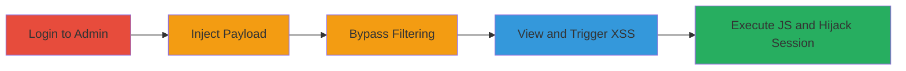

---
tags:
  - xss
  - stored-xss
  - shopify
  - session-hijacking
  - admin-panel
type: attack_chain
tools: []
tactics:
  - '[[Execution]]'
  - '[[Collection]]'
commands: []
platforms:
  - Web
complexity: medium
procedures:
  - '[[procedures/Access-Shopify-Admin-Customers-Page]]'
  - '[[procedures/Inject-Malicious-Payload-into-Customer-Notes]]'
  - '[[procedures/Trigger-Stored-XSS-by-Viewing-Notes]]'
  - '[[procedures/Bypass-Input-Filtering-Using-Link-Handling-Quirk]]'
step_count: 4
techniques:
  - '[[JavaScript]]'
description: >-
  A multi-step attack exploiting a stored XSS vulnerability in the Shopify admin
  panel's customer notes field to inject and execute malicious JavaScript,
  enabling cookie theft and session hijacking.
skill_level: intermediate
impact_level: high
id: bcab4e60-4448-42e7-a530-3e2c5066c7f2
created_at: '2025-12-13T23:55:06.666Z'
updated_at: '2025-12-13T23:55:06.666Z'
verified: false
validated: true
submitted: true
mitre_tactics:
  - '[[Execution]]'
  - '[[Collection]]'
mitre_techniques:
  - '[[JavaScript]]'
---
# Stored XSS in Shopify Admin Customer Notes for Session Hijacking

Multi-stage attack chain demonstrating a complete attack workflow exploiting insufficient input sanitization in the Shopify admin panel.

## Chain Metrics Dashboard

| Metric | Value |
|--------|-------|
| Chain Status | Unverified |
| Total Steps | 4 |
| Execution Time | ~5 minutes |
| Skill Level | Intermediate |
| Complexity | Medium |
| Impact Level | High |

## Attack Flow Visualization

## Prerequisites & Requirements

### Required Tools

- None (manual browser-based exploitation)

### Target Environment

- Shopify Admin Panel (Web platform)
- Authenticated access required
- No specific ports; standard HTTPS (443)

### Initial Access Requirements

- Valid Shopify admin credentials
- Direct network access to the Shopify instance
- No prior access beyond authentication

## Detailed Attack Procedures

### Step 1: Access Shopify Admin Customers Page
procedure: [[procedures/Access-Shopify-Admin-Customers-Page]]

**Objective**: Gain entry to the customer management section to prepare for payload injection.

**Instructions**: Log in to the Shopify admin dashboard using valid credentials, then navigate to the customers list by selecting "Customers" from the sidebar or directly accessing the /admin/customers endpoint.

**Expected Output**: A list of customer profiles loads, allowing selection for editing.

**Success Indicators**:
- Admin dashboard accessible without errors
- Customers page displays successfully

### Step 2: Inject Malicious Payload into Customer Notes
procedure: [[procedures/Inject-Malicious-Payload-into-Customer-Notes]]

**Objective**: Insert a stored XSS payload into a customer profile's notes field to persist malicious code.

**Instructions**: Select a target customer profile, click "Edit," and locate the notes field. Enter a payload such as `<a href="javascript:alert(document.cookie)">test</a>` or a redirect like ``. Save the changes.

**Expected Output**: Profile updates without errors, payload stored in the notes.

**Success Indicators**:
- Notes field accepts and saves the input
- No immediate validation errors

### Step 3: Trigger Stored XSS by Viewing Notes
procedure: [[procedures/Trigger-Stored-XSS-by-Viewing-Notes]]

**Objective**: Execute the injected JavaScript by rendering the notes, leading to arbitrary code execution.

**Instructions**: Return to the customer profile or customers list and view the notes section. The payload triggers on page load or interaction (e.g., mouseover), executing the script to alert cookies or redirect to a malicious site.

**Expected Output**: JavaScript executes, displaying an alert with cookies or initiating a redirect.

**Success Indicators**:
- Alert box shows document.cookie contents
- Browser redirects or network request to attacker server

### Step 4: Bypass Input Filtering Using Link Handling Quirk
procedure: [[procedures/Bypass-Input-Filtering-Using-Link-Handling-Quirk]]

**Objective**: Exploit automatic link tagging and repeated editing to evade sanitization and inject payloads.

**Instructions**: In the notes field, enter URL-like text (e.g., http://example.com) to trigger automatic <a> tag wrapping. Edit repeatedly, nesting tags or appending javascript: protocols, such as `<a href="http://example.com"><a href="javascript:alert(1)">link</a></a>`. Save after iterations to bypass filters.

**Expected Output**: Nested or modified tags persist, allowing XSS on view.

**Success Indicators**:
- Automatic <a> tags added without stripping
- Payload executes after multiple saves

## Attack Chain Summary

### Key Achievements

1. Successful injection of persistent XSS payload in authenticated admin context
2. Execution of arbitrary JavaScript to capture admin session cookies
3. Potential for session hijacking or further client-side attacks on viewing admins

## Technique & Tactic Coverage

### MITRE ATT&CK Techniques

- [[JavaScript]]

### MITRE ATT&CK Tactics

- [[Execution]]
- [[Collection]]

---
*Last updated: 2023-10-01T00:00:00Z*
