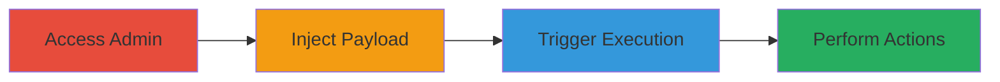

---
tags:
  - xss
  - stored-xss
  - shopify
  - admin-execution
type: attack_chain
tools: []
tactics:
  - '[[Execution]]'
verified: false
platforms:
  - Web
  - Shopify
submitted: true
complexity: medium
created_at: '2023-10-01T00:00:00Z'
procedures:
  - '[[procedures/Access-Shopify-Admin-Menu-Creation]]'
  - '[[procedures/Inject-Stored-XSS-Payload-in-Menu-Titles]]'
  - '[[procedures/Trigger-XSS-by-Viewing-Menu]]'
step_count: 3
techniques:
  - '[[JavaScript]]'
updated_at: '2025-12-14T17:29:57.152Z'
description: >-
  A multi-step attack exploiting stored XSS in Shopify Admin menu titles to
  inject and execute arbitrary JavaScript, enabling admin context actions like
  deleting menu links.
skill_level: intermediate
impact_level: high
id: e1116e4f-8824-4b87-902d-ab9e35ffe29a
validated: true
mitre_tactics:
  - '[[Execution]]'
mitre_techniques:
  - '[[JavaScript]]'
---
# Stored XSS in Shopify Admin Menu Titles Leading to Admin Script Execution

Multi-stage attack chain demonstrating a complete attack workflow exploiting stored XSS in Shopify's admin interface to execute JavaScript and perform unauthorized admin actions.

## Chain Metrics Dashboard

| Metric | Value |
|--------|-------|
| Chain Status | Unverified |
| Total Steps | 3 |
| Execution Time | ~5 minutes |
| Skill Level | Intermediate |
| Complexity | Medium |
| Impact Level | High |

## Attack Flow Visualization

## Prerequisites & Requirements

### Required Tools

- None (uses browser and admin access)

### Target Environment

- Shopify Admin platform
- Web browser with JavaScript enabled
- Authenticated access to Shopify Admin

### Initial Access Requirements

- Valid Shopify Admin credentials
- Network access to the Shopify instance
- No prior access beyond authentication needed

## Detailed Attack Procedures

### Step 1: Access Shopify Admin Menu Creation
procedure: [[procedures/Access-Shopify-Admin-Menu-Creation]]

**Objective**: Gain entry to the menu creation or editing interface to prepare for payload injection.

**Instructions**: Log in to the Shopify Admin dashboard and navigate to the navigation or menu management section. Locate the 'Add menu' or existing menu editing options.

**Expected Output**: Interface displaying title input fields for menus and menu items.

**Success Indicators**:
- Admin dashboard loaded successfully
- Menu creation/editing page accessible

### Step 2: Inject Stored XSS Payload in Menu Titles
procedure: [[procedures/Inject-Stored-XSS-Payload-in-Menu-Titles]]

**Objective**: Insert a malicious JavaScript payload into persistent title fields that will be stored and rendered unescaped.

**Instructions**: In the 'Title in Add menu' and 'Title in Menu Item' fields, enter the payload `// # "><svg/onload=prompt(1)>`. Save the menu configuration.

**Expected Output**: Menu saved without errors, payload stored in the backend.

**Success Indicators**:
- Menu saves successfully
- No immediate errors or sanitization warnings

### Step 3: Trigger XSS by Viewing Menu
procedure: [[procedures/Trigger-XSS-by-Viewing-Menu]]

**Objective**: Render the stored payload to execute JavaScript in the admin context, demonstrating control for actions like deleting links.

**Instructions**: Navigate back to the menu view in the admin interface. The unescaped title will render the SVG onload, triggering the prompt and allowing further script execution.

**Expected Output**: JavaScript alert (prompt(1)) appears, confirming execution; potential for extended actions like menu link deletion.

**Success Indicators**:
- Alert box pops up on menu view
- Ability to execute additional admin scripts observed

## Attack Chain Summary

### Key Achievements

1. Persistent storage of XSS payload in admin menu titles
2. Execution of arbitrary JavaScript in authenticated admin session
3. Demonstration of impact through admin manipulations like deleting menu links

## Technique & Tactic Coverage

### MITRE ATT&CK Techniques

- [[JavaScript]]

### MITRE ATT&CK Tactics

- [[Execution]]

---
*Last updated: 2023-10-01T00:00:00Z*
