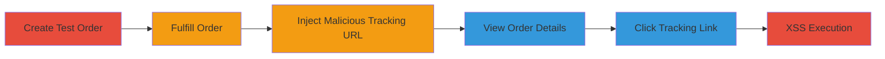

---
tags:
  - xss
  - stored-xss
  - shopify
  - javascript
  - admin-exploit
type: attack_chain
tools: []
tactics:
  - '[[Execution]]'
verified: false
platforms:
  - Web
submitted: true
complexity: medium
created_at: '2023-10-01T00:00:00Z'
procedures:
  - '[[procedures/Create-Test-Order-in-Shopify-Admin]]'
  - '[[procedures/Fulfill-Shopify-Order-to-Generate-ID]]'
  - '[[procedures/Update-Fulfillment-with-JavaScript-URI-for-Stored-XSS]]'
  - '[[procedures/Trigger-Stored-XSS-by-Clicking-Tracking-Link-in-Order-View]]'
step_count: 5
techniques:
  - '[[JavaScript]]'
updated_at: '2025-12-14T03:15:31.697Z'
description: >-
  A multi-step attack exploiting a stored XSS vulnerability in Shopify's admin
  fulfillment feature by injecting a javascript: URI into the tracking URL,
  leading to arbitrary JavaScript execution when admins view and click the link.
skill_level: intermediate
impact_level: high
id: a3b35279-267e-45db-a99e-9cef100044a3
validated: true
mitre_tactics:
  - '[[Execution]]'
mitre_techniques:
  - '[[JavaScript]]'
---
# Stored XSS in Shopify Admin Orders Fulfillment via Malicious Tracking URL

Multi-stage attack chain demonstrating exploitation of a stored XSS vulnerability in Shopify's admin orders fulfillment feature, allowing injection of malicious JavaScript via the tracking URL parameter, which executes in the context of any admin viewing the order.

## Chain Metrics Dashboard

| Metric | Value |
|--------|-------|
| Chain Status | Unverified |
| Total Steps | 5 |
| Execution Time | ~10 minutes |
| Skill Level | Intermediate |
| Complexity | Medium |
| Impact Level | High |

## Attack Flow Visualization



## Prerequisites & Requirements

### Required Tools

- None (uses browser and HTTP client like curl)

### Target Environment

- Shopify admin panel (web application)
- Authenticated access to Shopify store admin
- Required services/ports: HTTPS on port 443
- Network access requirements: Direct access to the store's admin URL

### Initial Access Requirements

- Valid admin credentials for the Shopify store
- Network position: Internal or authenticated session
- Prior access needed: None, but requires store ownership or admin privileges

## Detailed Attack Procedures

### Step 1: Create Test Order
procedure: [[procedures/Create-Test-Order-in-Shopify-Admin]]

**Objective**: Set up a test order with a shippable item to enable fulfillment workflow.

**Instructions**: Log in to the Shopify admin interface and create a new order using a product that requires shipping. Select a test customer or create one if needed.

**Expected Output**: Order created with ID, visible in the admin orders list.

**Success Indicators**:
- Order appears in https://<store>.myshopify.com/admin/orders
- Order status shows items pending fulfillment

### Step 2: Navigate to Order Details
**Objective**: Access the specific order to prepare for fulfillment.

**Instructions**: From the orders list, click on the newly created order to view its details page.

**Expected Output**: Order details page loads at https://<store>.myshopify.com/admin/orders/<order_id>.

**Success Indicators**:
- Page loads without errors
- Fulfillment section is visible

### Step 3: Fulfill Order Items
procedure: [[procedures/Fulfill-Shopify-Order-to-Generate-ID]]

**Objective**: Process the order fulfillment to generate a fulfillment ID for subsequent updates.

**Instructions**: On the order details page, click 'Fulfill items', select the items, and complete the fulfillment without adding tracking details yet.

**Expected Output**: Fulfillment created, new fulfillment ID generated, order status updated to fulfilled.

**Success Indicators**:
- Fulfillment section shows 'Successfully fulfilled' with ID
- No errors in fulfillment process

### Step 4: Update Fulfillment with Malicious URL
procedure: [[procedures/Update-Fulfillment-with-JavaScript-URI-for-Stored-XSS]]

**Objective**: Inject the XSS payload into the tracking URL field via API update.

**Instructions**: Use the extracted command to send a POST request updating the fulfillment with javascript:alert(1);// as the tracking URL. Ensure valid CSRF token and cookies.

Execute [[commands/shopify-update-fulfillment-malicious-url]]:

```bash
curl -X POST "https://<your-store>.myshopify.com/admin/orders/<order-id>/fulfillments/<fulfillment-id>" \
  -H "Accept: text/html, application/xhtml+xml, application/xml" \
  -H "Accept-Encoding: gzip, deflate" \
  -H "Accept-Language: en-US,en;q=0.8" \
  -H "Connection: keep-alive" \
  -H "Content-Type: application/x-www-form-urlencoded; charset=UTF-8" \
  -H "Cookie: <cookies>" \
  -H "X-CSRF-Token: <YOUR_TOKEN>" \
  -H "X-Requested-With: XMLHttpRequest" \
  -d "utf8=%E2%9C%93&_method=put&authenticity_token=<CSRF_TOKEN>&fulfillment[tracking_numbers][]=TrackingNumber&fulfillment[tracking_urls][]=javascript:alert(1);//&fulfillment[tracking_company]=Other&fulfillment[notify_customer]=false&fulfillment[notify_customer]=true"
```

**Expected Output**: HTTP 200 response or redirect, fulfillment updated successfully.

**Success Indicators**:
- No error response
- Payload stored without sanitization

### Step 5: Trigger XSS Execution
procedure: [[procedures/Trigger-Stored-XSS-by-Clicking-Tracking-Link-in-Order-View]]

**Objective**: Execute the stored JavaScript by simulating an admin viewing the order and interacting with the link.

**Instructions**: Return to the order details page, scroll to the fulfillment section, and click the 'TrackingNumber' link.

**Expected Output**: Alert box pops up with '1', confirming JavaScript execution in the browser context.

**Success Indicators**:
- JavaScript alert triggers
- Potential for session theft if payload is modified (e.g., to exfiltrate cookies)

## Attack Chain Summary

### Key Achievements

1. Successful creation and fulfillment of a test order in Shopify admin.
2. Injection of unsanitized javascript: URI into stored tracking URL.
3. Arbitrary JavaScript execution upon admin interaction, enabling session theft or phishing.

## Technique & Tactic Coverage

### MITRE ATT&CK Techniques

- [[JavaScript]]

### MITRE ATT&CK Tactics

- [[Execution]]

---
*Last updated: 2023-10-01T00:00:00Z*
