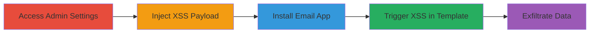

---
tags:
  - xss
  - stored-xss
  - shopify
  - email-app
  - csrf-theft
type: attack_chain
tools: []
tactics:
  - '[[Initial Access]]'
  - '[[Collection]]'
commands:
  - '[[commands/shopify-xss-payload-injection]]'
  - '[[commands/external-php-csrf-extractor]]'
platforms:
  - Web
complexity: medium
procedures:
  - '[[procedures/Access-Shopify-Admin-Settings]]'
  - '[[procedures/Inject-XSS-Payload-into-Store-Address]]'
  - '[[procedures/Install-Shopify-Email-App]]'
  - '[[procedures/Trigger-XSS-in-Email-App-Template]]'
step_count: 4
techniques:
  - '[[JavaScript]]'
description: >-
  A multi-stage attack exploiting a stored XSS vulnerability in Shopify's admin
  store address field to execute JavaScript in the Shopify Email App context,
  enabling data theft like CSRF tokens.
skill_level: intermediate
impact_level: high
id: acdeac70-b954-46a3-b314-6d9cbde6d582
created_at: '2025-12-14T17:30:18.203Z'
updated_at: '2025-12-14T17:30:18.203Z'
verified: false
validated: true
submitted: true
mitre_tactics:
  - '[[Initial Access]]'
  - '[[Collection]]'
mitre_techniques:
  - '[[JavaScript]]'
---
# Stored XSS in Shopify Admin Store Address Leading to Email App Compromise

## Overview

This attack chain demonstrates a stored cross-site scripting (XSS) vulnerability in Shopify's admin settings, where malicious HTML/JavaScript is injected into the 'Apartment, suite, etc. (optional)' field of the store address. The payload is stored and later rendered unsafely in the Shopify Email App's template editor, allowing arbitrary JavaScript execution in the app's context. This enables attackers to steal sensitive data, such as CSRF tokens from the page's head, and make unauthorized requests to internal endpoints like https://email.shopifyapps.com/graphql. The attack requires access to the Shopify admin and targets users installing the Email App.

## Chain Metrics Dashboard

| Metric | Value |
|--------|-------|
| Chain Status | Unverified |
| Total Steps | 4 |
| Execution Time | ~5 minutes |
| Skill Level | Intermediate |
| Complexity | Medium |
| Impact Level | High |

## Attack Flow Visualization



## Prerequisites & Requirements

### Required Tools

- Browser with developer tools (e.g., Chrome DevTools for payload testing)

### Target Environment

- Shopify admin panel (https://*.myshopify.com/admin)
- Shopify Email App installed from the app store
- Access to a store with admin privileges

### Initial Access Requirements

- Valid Shopify admin credentials for the target store
- No special network access beyond standard internet connectivity
- External server (e.g., https://fbs.ninja) to receive exfiltrated data

## Detailed Attack Procedures

### Step 1: Access Admin Settings
procedure: [[procedures/Access-Shopify-Admin-Settings]]

**Objective**: Navigate to the Shopify admin settings to prepare for payload injection.

**Instructions**: Log in to the Shopify admin dashboard and directly access the general settings page where the store address is configured.

**Expected Output**: The settings page loads at https://*.myshopify.com/admin/settings/general, displaying the store address fields.

**Success Indicators**:
- Admin dashboard accessible
- General settings page visible with store address section

### Step 2: Inject XSS Payload into Store Address
procedure: [[procedures/Inject-XSS-Payload-into-Store-Address]]

**Objective**: Insert a malicious HTML payload into the optional apartment field to store the XSS for later execution.

**Instructions**: In the 'Apartment, suite, etc. (optional)' field, inject the payload using [[commands/shopify-xss-payload-injection]]:

```html
 
```

Save the settings to store the payload.

**Expected Output**: Payload saved without errors; field accepts input up to 255 characters, bypassed by compact payload.

**Success Indicators**:
- Settings saved successfully
- No validation errors on injection

### Step 3: Install Shopify Email App
procedure: [[procedures/Install-Shopify-Email-App]]

**Objective**: Install the Email App to pull in the store data containing the injected payload.

**Instructions**: From the Shopify app store, search for and install the Shopify Email App. During installation, it retrieves store configuration including the address.

**Expected Output**: App installed and accessible in the Shopify dashboard.

**Success Indicators**:
- App listed in installed apps
- No installation errors

### Step 4: Trigger XSS in Email App Template
procedure: [[procedures/Trigger-XSS-in-Email-App-Template]]

**Objective**: Render a template that includes the store address to execute the stored XSS and exfiltrate data.

**Instructions**: Open the Email App, navigate to the template editor, and select a template that displays the store address (including the apartment field). The payload triggers on render, sending document.head.innerHTML to the external server via POST, where [[commands/external-php-csrf-extractor]] processes it to extract and return the CSRF token via eval.

**Expected Output**: JavaScript executes, alerting the CSRF token (e.g., alert('CSRF Token: abc123')) after a 2000ms delay.

**Success Indicators**:
- Payload onerror event fires
- Data posted to external server
- CSRF token extracted and alerted

## Attack Chain Summary

### Key Achievements

1. Successful storage of XSS payload in admin settings without sanitization.
2. Propagation of payload to the Email App via store data sync.
3. Execution of arbitrary JS in the app context to steal CSRF tokens.
4. Potential for unauthorized GraphQL requests using stolen tokens.

## Technique & Tactic Coverage

### MITRE ATT&CK Techniques

- [[JavaScript]]

### MITRE ATT&CK Tactics

- [[Initial Access]]
- [[Collection]]

---

*Last updated: 2023-10-01*
