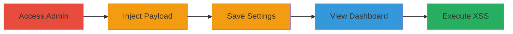

# Stored XSS in Shopify Admin via HTML Comment WAF Bypass

Multi-stage attack chain demonstrating a complete stored XSS workflow in Shopify's admin interface, bypassing the Web Application Firewall (WAF) using an HTML comment prefix to inject and execute malicious JavaScript.

## Chain Metrics Dashboard

| Metric | Value |
|--------|-------|
| Chain Status | Unverified |
| Total Steps | 5 |
| Execution Time | ~5 minutes |
| Skill Level | Intermediate |
| Complexity | Medium |
| Impact Level | High |

## Attack Flow Visualization

## Prerequisites & Requirements

### Required Tools

- Web browser (e.g., Chrome with developer tools)

### Target Environment

- Shopify admin interface
- Authenticated access to a Shopify store
- No specific ports or services beyond standard HTTPS (443)

### Initial Access Requirements

- Valid admin credentials for the Shopify store
- Direct network access to the internet
- No prior access needed beyond authentication

## Detailed Attack Procedures

### Step 1: Open the Store Account
procedure: [[procedures/Access-Shopify-Admin-Interface]]

**Objective**: Gain authenticated access to the Shopify admin interface to prepare for payload injection.

**Instructions**: Log in to the Shopify store admin using valid credentials. Ensure you are in an authenticated session.

**Expected Output**: Successful login to the admin dashboard at https://[store].myshopify.com/admin.

**Success Indicators**:
- Admin dashboard loads without errors
- User is authenticated as an admin

### Step 2: Navigate to the General Settings Page
procedure: [[procedures/Access-Shopify-Admin-Interface]]

**Objective**: Reach the settings page where the vulnerable street address field is located.

**Instructions**: From the admin dashboard, click on "Settings" in the sidebar and select "General" to load the general settings page.

**Expected Output**: Page loads at https://[store].myshopify.com/admin/settings/general.

**Success Indicators**:
- General settings form is visible
- Street address input field is accessible

### Step 3: Input the XSS Payload in the Street Address Field
procedure: [[procedures/Inject-XSS-Payload-in-Settings]]

**Objective**: Inject a malicious SVG-based payload prefixed with an HTML comment to bypass WAF filtering and store the XSS.

**Instructions**: In the "Store details" section, locate the "Address" subsection and enter the following payload into the "Street address" field:

`(xss)<!--><svg/onload=alert(document.domain)>)`

Then, click "Save" to persist the changes.

**Expected Output**: Settings save successfully without errors; no immediate alert triggers.

**Success Indicators**:
- Payload is accepted and saved
- No WAF block or validation error occurs

### Step 4: Navigate to the Live Dashboard
procedure: [[procedures/Trigger-XSS-in-Live-Dashboard]]

**Objective**: Access the page where the stored payload is rendered, setting up for execution.

**Instructions**: From the admin dashboard, navigate to the "Analytics" section and select "Live" or directly go to https://[store].myshopify.com/admin/dashboards/live.

**Expected Output**: Live dashboard page loads, rendering the stored address data.

**Success Indicators**:
- Dashboard displays without errors
- Address field content (including payload) is visible in the page source

### Step 5: Observe the XSS Execution
procedure: [[procedures/Trigger-XSS-in-Live-Dashboard]]

**Objective**: Trigger and verify JavaScript execution from the stored payload, demonstrating potential for session theft or further attacks.

**Instructions**: Upon loading the live dashboard, the onload attribute in the SVG will automatically execute. Observe the alert box popping up with the document domain.

**Expected Output**: JavaScript alert displays "[store].myshopify.com".

**Success Indicators**:
- Alert box appears on page load
- JavaScript executes in the context of the admin session
- Page source confirms SVG injection

## Attack Chain Summary

### Key Achievements

1. Bypassed WAF using HTML comment prefix to inject unsanitized SVG script
2. Stored malicious payload in admin settings without detection
3. Achieved JavaScript execution in the admin dashboard context, enabling potential cookie theft or DOM manipulation

## Technique & Tactic Coverage

### MITRE ATT&CK Techniques

- [[JavaScript]]

### MITRE ATT&CK Tactics

- [[Execution]]
- [[Collection]]

---
*Last updated: 2023-10-01T00:00:00Z*
