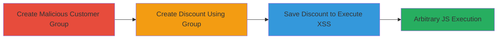

# Stored XSS in Shopify Admin via Malicious Customer Group in Discounts

Multi-stage attack chain demonstrating a complete attack workflow exploiting stored XSS in Shopify's admin interface.

## Chain Metrics Dashboard

| Metric | Value |
|--------|-------|
| Chain Status | Unverified |
| Total Steps | 3 |
| Execution Time | ~5 minutes |
| Skill Level | Intermediate |
| Complexity | Medium |
| Impact Level | High |

## Attack Flow Visualization

## Prerequisites & Requirements

### Required Tools

- Web browser (e.g., Chrome with developer tools for payload testing)

### Target Environment

- Shopify Myshopify Admin Site
- Authenticated admin access
- No specific services/ports beyond standard HTTPS (443)

### Initial Access Requirements

- Valid admin credentials for the Shopify store
- Direct access to the admin dashboard
- No prior network compromise needed

## Detailed Attack Procedures

### Step 1: Create Malicious Customer Search Group
procedure: [[procedures/Create-Malicious-Customer-Search-Group]]

**Objective**: Inject a JavaScript payload into a customer search group name to store the malicious input for later execution.

**Instructions**: Log in to the Shopify admin dashboard. Navigate to Customers > Filter Customers. Enter a benign search term like 'XSS' to simulate a filter, then click 'Save this search'. In the name field, input the payload `"><img src=x onerror=prompt('XSS')`. Save the group. This stores the unsanitized payload in the backend.

**Expected Output**: The group is created successfully without immediate errors, and the payload is saved.

**Success Indicators**:
- Group appears in the saved searches list with the malicious name visible but not executed yet
- No validation errors on save

### Step 2: Create Discount Code Using Malicious Group
procedure: [[procedures/Create-Discount-Code-Using-Malicious-Group]]

**Objective**: Associate the stored malicious payload with a discount code to set up reflection during the save process.

**Instructions**: From the admin dashboard, navigate to Discounts. Click 'Create discount' and select 'Discount code'. Configure basic discount details (e.g., percentage off). Under conditions, select 'Specific customer segments' and choose the malicious customer group created in Step 1. Do not save yet.

**Expected Output**: The malicious group name is displayed in the form without execution at this stage.

**Success Indicators**:
- Malicious group selectable and visible in the discount form
- Form loads without breaking

### Step 3: Save Discount to Trigger XSS
procedure: [[procedures/Save-Discount-to-Trigger-XSS]]

**Objective**: Trigger the execution of the stored XSS payload by saving the discount, leading to arbitrary JavaScript in the admin context.

**Instructions**: With the discount form open and the malicious group selected, click 'Save'. The group name is reflected unsanitized in the page, executing the payload (e.g., a prompt alert with '7' or 'XSS').

**Expected Output**: A JavaScript alert/prompt box appears in the browser, confirming execution.

**Success Indicators**:
- Alert box pops up executing the payload
- Browser console shows no errors; payload runs in admin context

## Attack Chain Summary

### Key Achievements

1. Successful storage of XSS payload in customer group without detection
2. Reflection and execution of payload during admin discount creation
3. Demonstration of arbitrary JS execution, enabling session theft or data exfiltration

## Technique & Tactic Coverage

### MITRE ATT&CK Techniques

- [[JavaScript]]

### MITRE ATT&CK Tactics

- [[Execution]]

---
*Last updated: 2024-10-01T00:00:00Z*
