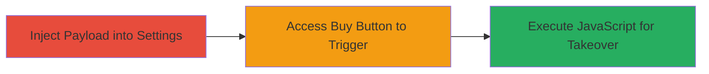

---
tags:
  - xss
  - stored-xss
  - shopify
  - javascript
  - account-takeover
type: attack_chain
tools: []
tactics:
  - '[[Execution]]'
verified: false
platforms:
  - Web
submitted: true
complexity: medium
created_at: '2023-10-01T00:00:00Z'
procedures:
  - '[[procedures/Inject-Malicious-Payload-into-Shopify-Currency-Settings]]'
  - '[[procedures/Trigger-Stored-XSS-via-Buy-Button-Access]]'
step_count: 2
techniques:
  - '[[JavaScript]]'
updated_at: '2025-12-13T23:52:34.179Z'
description: >-
  A multi-stage attack exploiting a stored XSS vulnerability in Shopify's store
  currency settings to inject and execute malicious JavaScript via the Buy
  Button sales channel, potentially enabling staff account takeover.
skill_level: intermediate
impact_level: high
id: fa4850fc-1377-4781-9584-4074011a9bb7
validated: true
mitre_tactics:
  - '[[Execution]]'
mitre_techniques:
  - '[[JavaScript]]'
---
# Stored XSS in Shopify Buy Button for Staff Account Takeover

Multi-stage attack chain demonstrating a complete attack workflow exploiting a stored cross-site scripting (XSS) vulnerability in Shopify's Buy Button sales channel.

## Chain Metrics Dashboard

| Metric | Value |
|--------|-------|
| Chain Status | Unverified |
| Total Steps | 2 |
| Execution Time | ~5 minutes |
| Skill Level | Intermediate |
| Complexity | Medium |
| Impact Level | High |

## Attack Flow Visualization

## Prerequisites & Requirements

### Required Tools

- Web browser (e.g., Chrome with developer tools for payload testing)

### Target Environment

- Shopify admin panel access (staff account with settings permissions)
- Buy Button sales channel enabled

### Initial Access Requirements

- Valid Shopify staff credentials
- No special network position required; standard web access

## Detailed Attack Procedures

### Step 1: Inject Payload into Currency Settings
procedure: [[procedures/Inject-Malicious-Payload-into-Shopify-Currency-Settings]]

**Objective**: Inject a malicious JavaScript payload into the store currency formatting field to store the XSS payload persistently.

**Instructions**: Log in to the Shopify admin panel, navigate to Settings > General > Store currency, and modify the 'HTML with currency' field by appending the payload to the existing format, such as `€{{amount}} ">`. Save the changes to store the payload.

**Expected Output**: The settings are updated without errors, and the payload is saved in the backend.

**Success Indicators**:
- Settings page saves successfully
- No immediate errors or sanitization warnings

### Step 2: Trigger XSS via Buy Button Access
procedure: [[procedures/Trigger-Stored-XSS-via-Buy-Button-Access]]

**Objective**: Access the Buy Button feature to render the injected payload, executing arbitrary JavaScript in the channel's context.

**Instructions**: Navigate to the Buy Button sales channel in the Shopify admin or embed it in a test page. The payload should render, executing the onerror handler to display an alert with the document domain, confirming XSS execution.

**Expected Output**: JavaScript alert pops up showing the document domain (e.g., 'shopify.com'), indicating successful payload execution.

**Success Indicators**:
- Alert or console output from the payload
- Ability to run further JS for session hijacking or takeover

## Attack Chain Summary

### Key Achievements

1. Persistent storage of XSS payload in currency settings without detection
2. Execution of arbitrary JavaScript in the Buy Button context
3. Potential for staff account takeover by stealing cookies or tokens

## Technique & Tactic Coverage

### MITRE ATT&CK Techniques

- [[JavaScript]]

### MITRE ATT&CK Tactics

- [[Execution]]

---
*Last updated: 2023-10-01T00:00:00Z*
