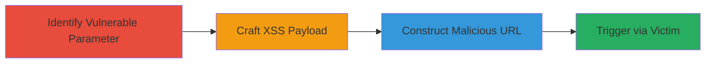

---
tags:
  - xss
  - stored-xss
  - shopify
  - javascript-injection
  - client-side-attack
type: attack_chain
tools: []
tactics:
  - '[[Execution]]'
  - '[[Collection]]'
verified: false
platforms:
  - Web
submitted: true
complexity: medium
created_at: '2023-10-01T00:00:00Z'
procedures:
  - '[[procedures/Identify-Vulnerable-Parameter-in-Shopify-Cart-Endpoint]]'
  - '[[procedures/Craft-Nested-Array-Payload-for-XSS-Injection]]'
  - '[[procedures/Construct-Malicious-Cart-Addition-URL]]'
  - '[[procedures/Trigger-Stored-XSS-via-Victim-Interaction]]'
step_count: 4
techniques:
  - '[[JavaScript]]'
  - '[[Exploit Public-Facing Application]]'
updated_at: '2025-12-14T03:16:07.964Z'
description: >-
  A multi-stage attack exploiting a stored XSS vulnerability in Shopify's cart
  addition endpoint by injecting malformed nested arrays into the
  properties[builder_id] parameter, leading to arbitrary JavaScript execution on
  victims viewing the cart.
skill_level: intermediate
impact_level: high
id: 4f2f6d89-df1e-402e-bf99-131d2a00ac3a
validated: true
mitre_tactics:
  - '[[Execution]]'
  - '[[Collection]]'
mitre_techniques:
  - '[[JavaScript]]'
  - '[[Exploit Public-Facing Application]]'
---
# Stored XSS in Shopify Cart via Malformed Nested Array Parameters

Multi-stage attack chain demonstrating exploitation of a stored XSS vulnerability in Shopify's cart addition endpoint, allowing arbitrary JavaScript execution on any user's browser when viewing the infected cart.

## Chain Metrics Dashboard

| Metric | Value |
|--------|-------|
| Chain Status | Unverified |
| Total Steps | 4 |
| Execution Time | ~5 minutes |
| Skill Level | Intermediate |
| Complexity | Medium |
| Impact Level | High |

## Attack Flow Visualization



## Prerequisites & Requirements

### Required Tools

- Browser developer tools for parameter inspection
- [[tools/curl]] (inferred for URL testing)

### Target Environment

- Shopify-hosted e-commerce site (e.g., *.shopify.com)
- Web platform with cart functionality
- No specific ports required; HTTP/HTTPS access

### Initial Access Requirements

- Public access to the cart/add endpoint
- No authentication needed
- Ability to craft and share URLs

## Detailed Attack Procedures

### Step 1: Identify Vulnerable Parameter
procedure: [[procedures/Identify-Vulnerable-Parameter-in-Shopify-Cart-Endpoint]]

**Objective**: Examine the cart addition endpoint to identify the properties[builder_id] parameter that accepts array inputs without proper validation, enabling nested array manipulation.

**Instructions**: Inspect the *.shopify.com/cart/add endpoint using browser dev tools or a proxy like Burp Suite. Test sending array inputs to properties[builder_id] to observe backend handling.

**Expected Output**: Confirmation that the parameter processes nested arrays, leading to unescaped output in cart.js.

**Success Indicators**:
- Parameter accepts arrays without rejection
- Backend echoes input in JSON-like format in cart.js

### Step 2: Craft XSS Payload
procedure: [[procedures/Craft-Nested-Array-Payload-for-XSS-Injection]]

**Objective**: Create a URL-encoded payload using nested arrays to inject HTML attributes like onmouseover into the output.

**Instructions**: Design the payload as properties[builder_id][%20onmouseover%3dalert(1)%20"]=value. This causes the backend to output malformed JSON such as 'builder_id":{"second_parameter ":"value"}', injecting attributes into HTML elements like <tr>, <div>, or <a>.

**Expected Output**: Payload that breaks JSON escaping and injects executable attributes.

**Success Indicators**:
- Payload URL-decodes to include event handlers
- Test injection results in attribute pollution in response

### Step 3: Construct Malicious Cart Addition URL
procedure: [[procedures/Construct-Malicious-Cart-Addition-URL]]

**Objective**: Build a full URL to add a product to the cart while embedding the XSS payload.

**Instructions**: Assemble the URL: http://hardware.shopify.com/cart/add?id=1106494145&...&properties[builder_id][%20onmouseover%3dalert(document.cookie)%20"]=shapp_options_421549285_1455208671885&.... Use [[commands/curl-shopify-cart-add]] to test:

```bash
curl -X GET "http://hardware.shopify.com/cart/add?id=1106494145&properties[builder_id][%20onmouseover%3dalert(document.cookie)%20\"]=shapp_options_421549285_1455208671885"
```

**Expected Output**: Successful addition to cart with payload stored.

**Success Indicators**:
- HTTP 200 or redirect indicating cart update
- Payload reflected in cart.js without sanitization

### Step 4: Trigger Stored XSS via Victim Interaction
procedure: [[procedures/Trigger-Stored-XSS-via-Victim-Interaction]]

**Objective**: Lure the victim to the malicious URL, injecting the payload into their cart and executing JS on interaction.

**Instructions**: Share the URL with the victim (e.g., via phishing). Upon visit, the product adds to cart, storing the payload. JS executes on mouseover of the carted product.

**Expected Output**: Alert box showing document.cookie or other JS execution.

**Success Indicators**:
- Victim's cart contains injected product
- JS alert fires on cart view interaction
- Potential cookie theft or session hijack

## Attack Chain Summary

### Key Achievements

1. Identified and exploited improper array handling in cart endpoint
2. Injected persistent XSS payload affecting all cart viewers
3. Demonstrated client-side JS execution for data exfiltration

## Technique & Tactic Coverage

### MITRE ATT&CK Techniques

- [[JavaScript]]
- [[Exploit Public-Facing Application]]

### MITRE ATT&CK Tactics

- [[Execution]]
- [[Collection]]

---
*Last updated: 2023-10-01T00:00:00Z*
