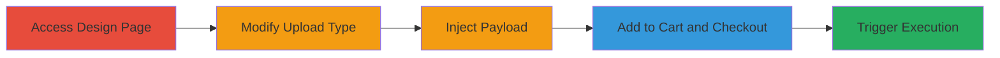

# Stored XSS in Shopify Custom Gift Card via Malicious URL Upload

Multi-stage attack chain demonstrating a complete stored XSS workflow in Shopify's hardware store custom gift card feature.

## Chain Metrics Dashboard

| Metric | Value |
|--------|-------|
| Chain Status | Unverified |
| Total Steps | 5 |
| Execution Time | ~5 minutes |
| Skill Level | Intermediate |
| Complexity | Medium |
| Impact Level | High |

## Attack Flow Visualization

## Prerequisites & Requirements

### Required Tools

- Web browser (e.g., Chrome with developer tools)

### Target Environment

- Web platform
- Access to https://hardware.shopify.com/
- No special services or ports required

### Initial Access Requirements

- Public access to Shopify's hardware store
- No credentials needed for anonymous browsing and checkout simulation

## Detailed Attack Procedures

### Step 1: Access Custom Gift Card Design Page
procedure: [[procedures/Access-Shopify-Custom-Gift-Card-Design]]

**Objective**: Navigate to the vulnerable custom gift card design interface to begin the upload process.

**Instructions**: Open a web browser and visit the custom gift card product page to initiate the design workflow.

**Expected Output**: The design interface loads, allowing file uploads for artwork.

**Success Indicators**:
- Page loads successfully at http://hardware.shopify.com/products/custom-gift-card?variant=976094353
- Upload field is visible

### Step 2: Modify Upload to URL Type
procedure: [[procedures/Modify-Upload-Field-to-URL-Type]]

**Objective**: Alter the file upload mechanism to accept URL inputs instead of direct file uploads, enabling payload injection.

**Instructions**: In the upload field, change the input type selector from file to URL to bypass standard file validation.

**Expected Output**: The interface now prompts for a URL input rather than file selection.

**Success Indicators**:
- URL input field is active
- No errors on type change

### Step 3: Inject Malicious Payload
procedure: [[procedures/Inject-Malicious-JavaScript-Payload]]

**Objective**: Insert a javascript: scheme payload disguised as a legitimate URL to store the XSS vector.

**Instructions**: Enter the payload into the URL field, combining a javascript alert with a comment and a fake SVG URL for obfuscation.

**Expected Output**: The payload is accepted and associated with the gift card design.

**Success Indicators**:
- Payload input is saved without validation errors
- Design preview shows the URL link

### Step 4: Add to Cart and Proceed to Checkout
procedure: [[procedures/Add-Custom-Gift-Card-to-Cart-and-Checkout]]

**Objective**: Store the malicious design in the cart and navigate to the checkout page where it will be rendered.

**Instructions**: Finalize the design, add the item to the shopping cart, and proceed to the checkout process.

**Expected Output**: The custom gift card appears in the cart, and checkout loads at https://checkout.shopify.com/.

**Success Indicators**:
- Item added to cart successfully
- Checkout page displays the artwork link

### Step 5: Trigger XSS Execution
procedure: [[procedures/Trigger-Stored-XSS-on-Checkout-Page]]

**Objective**: Execute the stored payload by interacting with the rendered artwork link, leading to arbitrary JavaScript execution.

**Instructions**: On the checkout page, click the "Artwork File" link associated with the custom gift card to trigger the javascript: payload.

**Expected Output**: An alert box pops up displaying the document domain, confirming XSS execution.

**Success Indicators**:
- Alert fires with document.domain
- Browser console shows JavaScript execution in the checkout context

## Attack Chain Summary

### Key Achievements

1. Successful injection and storage of a javascript: payload via URL upload
2. Rendering of the malicious link on the checkout page for any victim
3. Arbitrary JavaScript execution, enabling potential session hijacking or data theft

## Technique & Tactic Coverage

### MITRE ATT&CK Techniques

- [[JavaScript]]
- [[Exploit Public-Facing Application]]

### MITRE ATT&CK Tactics

- [[Execution]]
- [[Initial Access]]

---

*Last updated: 2023-10-01T00:00:00Z*
