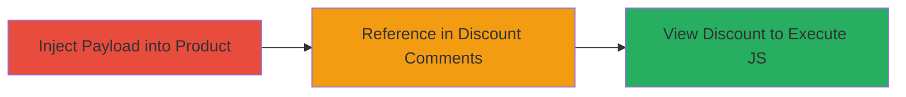

---
tags:
  - xss
  - stored-xss
  - shopify
  - web-vulnerability
type: attack_chain
tools: []
tactics:
  - '[[Execution]]'
verified: false
platforms:
  - Web
submitted: true
complexity: medium
created_at: '2023-10-01T00:00:00Z'
procedures:
  - '[[procedures/Inject-XSS-Payload-into-Product-Name]]'
  - '[[procedures/Reference-Malicious-Product-in-Discount-Comments]]'
  - '[[procedures/Trigger-XSS-by-Viewing-Discount]]'
step_count: 3
techniques:
  - '[[JavaScript]]'
updated_at: '2025-12-13T23:55:06.680Z'
description: >-
  A multi-step attack exploiting a stored XSS vulnerability in Shopify's
  Discounts section by injecting malicious JavaScript into a product name and
  referencing it in discount comments, leading to arbitrary code execution in
  the admin panel.
skill_level: intermediate
impact_level: high
id: b0308f66-4575-4965-bfdc-1993dbec6af7
validated: true
mitre_tactics:
  - '[[Execution]]'
mitre_techniques:
  - '[[JavaScript]]'
---
# Stored XSS in Shopify Discounts via Product Name Injection

Multi-stage attack chain demonstrating a complete stored XSS exploit in Shopify's admin panel, allowing arbitrary JavaScript execution when viewing discounts.

## Chain Metrics Dashboard

| Metric | Value |
|--------|-------|
| Chain Status | Unverified |
| Total Steps | 3 |
| Execution Time | ~5 minutes |
| Skill Level | Intermediate |
| Complexity | Medium |
| Impact Level | High |

## Attack Flow Visualization

## Prerequisites & Requirements

### Required Tools

- None (UI-based actions in Shopify admin)

### Target Environment

- Shopify admin panel
- Access to staff account with discounts and products permissions
- No specific services/ports beyond web access

### Initial Access Requirements

- Valid Shopify staff credentials with permissions to create products and discounts
- Network access to the Shopify store admin (e.g., https://store.myshopify.com/admin)
- No prior access beyond authenticated session

## Detailed Attack Procedures

### Step 1: Inject XSS Payload into Product Name
procedure: [[procedures/Inject-XSS-Payload-into-Product-Name]]

**Objective**: Create a product with a malicious JavaScript payload in its name to store the XSS for later injection.

**Instructions**: In the Shopify admin, navigate to Products > Add product. Set the product title to the XSS payload string. Save the product.

**Expected Output**: Product created successfully with the injected payload in its name field.

**Success Indicators**:
- Product appears in the products list with the exact payload as title
- No errors during creation

### Step 2: Reference Malicious Product in Discount Comments
procedure: [[procedures/Reference-Malicious-Product-in-Discount-Comments]]

**Objective**: Create or edit a discount code and include a reference to the infected product in the comments section to embed the payload.

**Instructions**: Navigate to Discounts in the admin panel. Select or create a discount code. In the comments or notes field, reference the product by name or ID (e.g., mention the product title). Save the discount.

**Expected Output**: Discount saved with the product reference in comments.

**Success Indicators**:
- Discount details show the reference without sanitization errors
- Product name (with payload) is stored in the discount comments

### Step 3: Trigger XSS by Viewing Discount
procedure: [[procedures/Trigger-XSS-by-Viewing-Discount]]

**Objective**: View the discount details to render the unsanitized product name, executing the stored JavaScript payload.

**Instructions**: Return to the Discounts section and open the affected discount code. The payload should execute automatically upon rendering the comments.

**Expected Output**: JavaScript alert (or other payload) fires in the browser context of the admin panel.

**Success Indicators**:
- Alert box displays (e.g., alert(domain.domain))
- Browser console shows JS execution without errors

## Attack Chain Summary

### Key Achievements

1. Successful storage of XSS payload in product name due to improper escaping post-discount timeline changes
2. Injection of payload into discount comments via product reference
3. Arbitrary JS execution in admin panel, demonstrating potential for session theft or further escalation

## Technique & Tactic Coverage

### MITRE ATT&CK Techniques

- [[JavaScript]]

### MITRE ATT&CK Tactics

- [[Execution]]

---
*Last updated: 2023-10-01T00:00:00Z*
