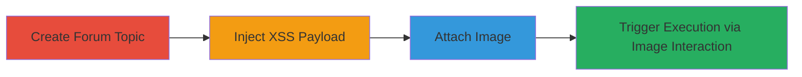

---
tags:
  - xss
  - stored-xss
  - shopify
  - javascript-injection
type: attack_chain
tools: []
tactics:
  - '[[Execution]]'
  - '[[Collection]]'
commands: []
platforms:
  - Web
complexity: medium
procedures:
  - '[[procedures/Create-New-Forum-Topic]]'
  - '[[procedures/Inject-XSS-Payload-in-Title]]'
  - '[[procedures/Attach-Image-to-Topic]]'
  - '[[procedures/Trigger-XSS-via-Image-Enlargement]]'
step_count: 4
techniques:
  - '[[JavaScript]]'
description: >-
  A multi-stage attack exploiting stored XSS in Shopify Discussion Forums by
  injecting malicious JavaScript into topic titles, which executes when users
  enlarge attached images, enabling arbitrary code execution and potential
  session theft.
skill_level: intermediate
impact_level: high
id: 39645410-b311-4f2d-a3b7-ad7818504a18
created_at: '2025-12-14T03:16:08.163Z'
updated_at: '2025-12-14T03:16:08.163Z'
verified: false
validated: true
submitted: true
mitre_tactics:
  - '[[Execution]]'
  - '[[Collection]]'
mitre_techniques:
  - '[[JavaScript]]'
---
# Stored XSS in Shopify Discussion Forums via Unsanitized Topic Title

Multi-stage attack chain demonstrating a complete attack workflow exploiting a stored XSS vulnerability in Shopify's Discussion Forums.

## Chain Metrics Dashboard

| Metric | Value |
|--------|-------|
| Chain Status | Unverified |
| Total Steps | 4 |
| Execution Time | ~5 minutes |
| Skill Level | Intermediate |
| Complexity | Medium |
| Impact Level | High |

## Attack Flow Visualization

## Prerequisites & Requirements

### Required Tools

- Web browser (e.g., Chrome, Firefox)

### Target Environment

- Shopify Discussion Forums at ecommerce.shopify.com/shopify-discussion
- Requires user account for topic creation (free signup possible)

### Initial Access Requirements

- Valid Shopify account or ability to create one
- Network access to the internet
- No prior privileged access needed

## Detailed Attack Procedures

### Step 1: Create New Forum Topic
procedure: [[procedures/Create-New-Forum-Topic]]

**Objective**: Gain access to the topic creation interface to prepare for payload injection.

**Instructions**: Navigate to the Shopify Discussion Forums and initiate the new topic form. This sets up the environment for injecting the XSS payload.

**Expected Output**: The new topic creation form loads successfully.

**Success Indicators**:
- Topic creation page is accessible
- Form fields (title, message) are visible and editable

### Step 2: Inject XSS Payload in Title
procedure: [[procedures/Inject-XSS-Payload-in-Title]]

**Objective**: Store malicious JavaScript in the topic title without immediate detection.

**Instructions**: Enter the XSS payload into the title field and add neutral content to the message body, then submit the form to store the payload.

**Expected Output**: Topic is created and visible in the forums with the injected title.

**Success Indicators**:
- Topic appears in the forum list
- Title displays the payload string (though it may render harmlessly until triggered)

### Step 3: Attach Image to Topic
procedure: [[procedures/Attach-Image-to-Topic]]

**Objective**: Add an image to the topic to enable the trigger mechanism for the stored XSS.

**Instructions**: On the newly created topic page, use the attach image feature to upload a benign image file.

**Expected Output**: Image is successfully attached and visible in the topic.

**Success Indicators**:
- Image upload completes without errors
- Attached image is displayed in the topic body

### Step 4: Trigger XSS via Image Enlargement
procedure: [[procedures/Trigger-XSS-via-Image-Enlargement]]

**Objective**: Execute the stored JavaScript by interacting with the attached image, demonstrating arbitrary code execution.

**Instructions**: Click on the attached image to enlarge it, causing the browser to re-render the unsanitized title and execute the payload.

**Expected Output**: Alert box or prompt (e.g., prompt(1)) appears, confirming JavaScript execution.

**Success Indicators**:
- JavaScript payload executes (e.g., alert/prompt triggers)
- No errors in browser console related to rendering

## Attack Chain Summary

### Key Achievements

1. Successful storage of XSS payload in a public forum topic
2. Triggering of arbitrary JavaScript execution via user interaction
3. Potential for session cookie theft or phishing against viewers

## Technique & Tactic Coverage

### MITRE ATT&CK Techniques

- [[JavaScript]]

### MITRE ATT&CK Tactics

- [[Execution]]
- [[Collection]]

---
*Last updated: 2023-10-01*
