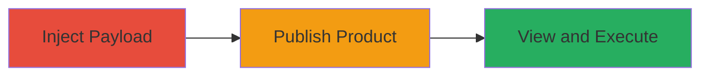

---
tags:
  - xss
  - stored-xss
  - shopify
  - graphql
  - web
type: attack_chain
tools: []
tactics:
  - '[[Execution]]'
verified: false
platforms:
  - Web
submitted: true
complexity: medium
created_at: '2023-10-01T00:00:00Z'
procedures:
  - '[[procedures/Inject-Malicious-Payload-into-Shopify-Product-Description]]'
  - '[[procedures/Publish-Product-via-Handshake-Portal]]'
  - '[[procedures/Trigger-XSS-by-Viewing-Product-Page]]'
step_count: 3
techniques:
  - '[[JavaScript]]'
updated_at: '2025-12-14T03:16:25.611Z'
description: >-
  A multi-step attack exploiting a stored XSS vulnerability in Shopify's
  Handshake plugin by injecting malicious HTML into a product description,
  publishing it, and triggering execution on a shared domain.
skill_level: intermediate
impact_level: high
id: 400f14ca-be80-4ffa-b1d3-83580e316f7e
validated: true
mitre_tactics:
  - '[[Execution]]'
mitre_techniques:
  - '[[JavaScript]]'
---
# Stored XSS in Shopify Handshake Product Description via GraphQL Query

Multi-stage attack chain demonstrating a complete stored XSS exploitation in Shopify's Handshake plugin, leading to arbitrary JavaScript execution on a shared internal domain.

## Chain Metrics Dashboard

| Metric | Value |
|--------|-------|
| Chain Status | Unverified |
| Total Steps | 3 |
| Execution Time | ~5 minutes |
| Skill Level | Intermediate |
| Complexity | Medium |
| Impact Level | High |

## Attack Flow Visualization

## Prerequisites & Requirements

### Required Tools

- Web browser (e.g., Chrome)
- Access to a Shopify store admin panel
- Handshake portal access

### Target Environment

- Shopify platform with Handshake plugin enabled
- GraphQL API access for product updates
- Internal Handshake site: handshake-web-internal.shopifycloud.com

### Initial Access Requirements

- Valid Shopify merchant account with product creation privileges
- Authentication to Handshake portal
- No special network access beyond standard web connectivity

## Detailed Attack Procedures

### Step 1: Inject Malicious Payload
procedure: [[procedures/Inject-Malicious-Payload-into-Shopify-Product-Description]]

**Objective**: Introduce a malicious JavaScript payload into the product description field to store XSS code in the backend.

**Instructions**: Log in to the Shopify admin panel, navigate to Products, and create or edit a product. Switch to HTML mode using the < > button, then insert the payload `` into the description field. Save the product and set its status to Active.

**Expected Output**: Product saved with the malicious HTML in the description, ready for publishing.

**Success Indicators**:
- Product status updated to Active without errors
- Payload visible in the HTML source of the description field

### Step 2: Publish Product
procedure: [[procedures/Publish-Product-via-Handshake-Portal]]

**Objective**: Sync the product to the Handshake portal using the productUpdate GraphQL query, making the malicious description available for rendering.

**Instructions**: Access the Handshake portal, select the product, assign a price and category, then publish it. This triggers the GraphQL mutation to update and sync the product data.

**Expected Output**: Product published successfully in the Handshake catalog.

**Success Indicators**:
- Confirmation message in the portal indicating successful publish
- Product appears in the Handshake product list

### Step 3: Trigger XSS Execution
procedure: [[procedures/Trigger-XSS-by-Viewing-Product-Page]]

**Objective**: Render the product page on the internal Handshake site to execute the stored XSS payload.

**Instructions**: Navigate to the product page at `handshake-web-internal.shopifycloud.com/products/[PRODUCT-ID]`. Wait approximately 3 seconds for the description to load and the onerror handler to fire.

**Expected Output**: Alert box displaying the domain name (e.g., prompt with 'handshake-web-internal.shopifycloud.com').

**Success Indicators**:
- JavaScript alert pops up after ~3 seconds
- Arbitrary code execution confirmed on the shared domain

## Attack Chain Summary

### Key Achievements

1. Successful injection and storage of XSS payload via Shopify's product description
2. Publishing through Handshake plugin without sanitization
3. Arbitrary JavaScript execution on an internal shared domain, enabling potential session theft or actions on behalf of viewers

## Technique & Tactic Coverage

### MITRE ATT&CK Techniques

- [[JavaScript]]

### MITRE ATT&CK Tactics

- [[Execution]]

---
*Last updated: 2023-10-01T00:00:00Z*
