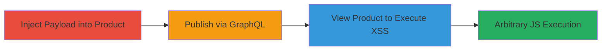

# Stored XSS in Shopify Handshake Product Description via productUpdate GraphQL Query

Multi-stage attack chain demonstrating a complete stored XSS exploit in Shopify's Handshake plugin, allowing arbitrary JavaScript execution on a shared domain.

## Chain Metrics Dashboard

| Metric | Value |
|--------|-------|
| Chain Status | Unverified |
| Total Steps | 3 |
| Execution Time | ~5 minutes |
| Skill Level | Intermediate |
| Complexity | Medium |
| Impact Level | High |

## Attack Flow Visualization

## Prerequisites & Requirements

### Required Tools

- None (UI-based exploit via Shopify admin)

### Target Environment

- Shopify store with Handshake plugin enabled
- Access to Shopify admin interface
- Handshake portal access

### Initial Access Requirements

- Authenticated Shopify merchant account
- No special network position required (web-based)
- Prior access to product management features

## Detailed Attack Procedures

### Step 1: Inject Malicious Payload
procedure: [[procedures/Inject-Malicious-Payload-into-Shopify-Product-Description]]

**Objective**: Insert a malicious HTML payload into a product's description field to store the XSS script.

**Instructions**: Log into the Shopify admin, create a new product, enable HTML mode in the description editor, and insert the payload ``. Set the product status to Active and save.

**Expected Output**: Product saved with the malicious description embedded.

**Success Indicators**:
- Product appears in the admin list with the description intact
- No immediate errors during save

### Step 2: Publish via Handshake Portal
procedure: [[procedures/Publish-Product-via-Handshake-Portal]]

**Objective**: Propagate the malicious description to the Handshake site via the productUpdate GraphQL query.

**Instructions**: Access the Handshake portal, select the product, choose a price and category, and publish it to trigger the GraphQL update.

**Expected Output**: Product published successfully to Handshake without sanitization errors.

**Success Indicators**:
- Confirmation of publication in the portal
- Product visible in Handshake listings

### Step 3: Trigger Stored XSS
procedure: [[procedures/Trigger-Stored-XSS-by-Viewing-Product-Page]]

**Objective**: Execute the stored script by viewing the product page on the shared domain.

**Instructions**: Navigate to `handshake-web-internal.shopifycloud.com/products/[ID]` in a browser. Wait approximately 3 seconds for the script to execute.

**Expected Output**: A prompt dialog appears displaying the document domain (e.g., `handshake-web-internal.shopifycloud.com`).

**Success Indicators**:
- JavaScript alert/prompt fires
- Arbitrary code execution confirmed (e.g., via alert or console actions)

## Attack Chain Summary

### Key Achievements

1. Successful injection and storage of XSS payload in product description
2. Propagation via GraphQL without sanitization, exposing it on shared domain
3. Arbitrary JavaScript execution, enabling session hijacking or data theft for viewers

## Technique & Tactic Coverage

### MITRE ATT&CK Techniques

- [[JavaScript]]

### MITRE ATT&CK Tactics

- [[Execution]]

---
*Last updated: 2023-10-01T00:00:00Z*
