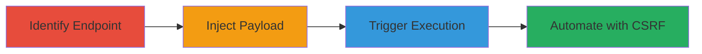

# Stored XSS in Shopify Hardware Cart via Custom Product Properties

Multi-stage attack chain demonstrating a stored Cross-Site Scripting (XSS) vulnerability in the Shopify hardware subdomain's cart addition functionality. User-supplied input in custom product properties, such as 'Artwork file', is not sanitized, allowing JavaScript injection. The payload is stored and executed when affected pages like the cart are viewed, enabling session hijacking, data theft, or other client-side attacks across multiple Shopify shops.

## Chain Metrics Dashboard

| Metric | Value |
|--------|-------|
| Chain Status | Unverified |
| Total Steps | 4 |
| Execution Time | ~5 minutes |
| Skill Level | Intermediate |
| Complexity | Medium |
| Impact Level | High |

## Attack Flow Visualization



## Prerequisites & Requirements

### Required Tools

- Browser developer tools for inspection
- [[commands/curl-shopify-cart-injection]]

### Target Environment

- Web platform
- Access to Shopify hardware subdomain (e.g., http://hardware.shopify.com)
- No authentication required for public cart addition

### Initial Access Requirements

- Public network access to the target
- No credentials needed
- Ability to submit forms or use curl for POST requests

## Detailed Attack Procedures

### Step 1: Identify Cart Add Endpoint and Custom Properties
procedure: [[procedures/Identify-Cart-Add-Endpoint-and-Properties]]

**Objective**: Locate the cart addition endpoint and identify injectable custom property fields to prepare for payload injection.

**Instructions**: Examine the add-to-cart form at http://hardware.shopify.com/cart/add using browser developer tools. Focus on multipart/form-data fields like properties[Artwork file] and properties[Custom text line 1].

**Expected Output**: Confirmation of endpoint URL and parameter names supporting user input.

**Success Indicators**:
- Endpoint identified as /cart/add with POST method
- Custom properties fields located for injection

### Step 2: Inject Malicious JavaScript Payload via Cart Form
procedure: [[procedures/Inject-Malicious-JavaScript-Payload-via-Cart-Form]]

**Objective**: Submit a form with a JavaScript payload in a custom property to store the malicious code server-side.

**Instructions**: Use [[commands/curl-shopify-cart-injection]] to POST the payload to /cart/add:

```bash
curl -X POST http://hardware.shopify.com/cart/add \
  -F "id=976094353" \
  -F "properties[Artwork file]=javascript:alert(document.domain) //http://google.com/uploads/pwned.jpg" \
  -F "production-time=standard"
```

**Expected Output**: Successful response indicating item added to cart, with payload stored.

**Success Indicators**:
- HTTP 200 or redirect to cart page
- No validation errors on submission

### Step 3: Trigger Stored XSS by Viewing Cart Page
procedure: [[procedures/Trigger-Stored-XSS-by-Viewing-Cart-Page]]

**Objective**: Load the cart or product page to render the stored properties and execute the injected JavaScript.

**Instructions**: Navigate to the cart page (e.g., http://hardware.shopify.com/cart) in a browser after injection. The payload executes automatically in the page context.

**Expected Output**: Browser alert displaying the document domain (e.g., hardware.shopify.com).

**Success Indicators**:
- JavaScript alert pops up
- Console logs confirm execution in victim context

### Step 4: Automate Injection with CSRF Form
procedure: [[procedures/Automate-Injection-with-CSRF-Form]]

**Objective**: Create a cross-site request forgery (CSRF) page to inject the payload without direct user interaction on the target site.

**Instructions**: Host an HTML page with an auto-submitting form targeting /cart/add, including the malicious payload in properties[Artwork file]. Load this page in a victim's browser to trigger submission.

**Expected Output**: Automatic POST submission and storage of payload, leading to XSS on subsequent cart views.

**Success Indicators**:
- Form submits without user input
- Payload stored as in Step 2

## Attack Chain Summary

### Key Achievements

1. Identified unsanitized custom property fields in Shopify cart addition
2. Injected and stored JavaScript payload for persistent execution
3. Triggered client-side code execution confirming XSS
4. Demonstrated automation via CSRF for broader impact

## Technique & Tactic Coverage

### MITRE ATT&CK Techniques

- [[JavaScript]]

### MITRE ATT&CK Tactics

- [[Execution]]
- [[Collection]]

---
*Last updated: 2023-10-01T00:00:00Z*
