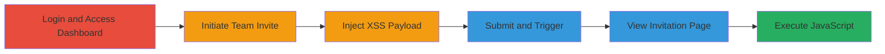

# Stored XSS in Shopify Partner Dashboard via Malicious Team Member Invite Email

Multi-stage attack chain demonstrating exploitation of a stored XSS vulnerability in Shopify's partner dashboard during team member invitations.

## Chain Metrics Dashboard

| Metric | Value |
|--------|-------|
| Chain Status | Unverified |
| Total Steps | 8 |
| Execution Time | ~5 minutes |
| Skill Level | Intermediate |
| Complexity | Medium |
| Impact Level | Medium |

## Attack Flow Visualization

## Prerequisites & Requirements

### Required Tools

- Web browser (e.g., Chrome with developer tools for payload testing)

### Target Environment

- Shopify Partner Dashboard (partners.shopify.com)
- User account with 'manage members' permissions

### Initial Access Requirements

- Valid Shopify partner credentials
- No special network access beyond standard internet
- Permissions to invite team members

## Detailed Attack Procedures

### Step 1: Login to the Shopify Partners Dashboard
procedure: [[procedures/Inject-Malicious-Payload-in-Shopify-Team-Invite]]

**Objective**: Gain authenticated access to the partner dashboard to initiate the invitation process.

**Instructions**: Navigate to partners.shopify.com and log in using credentials with 'manage members' permissions. This establishes the session required for the exploit.

**Expected Output**: Successful login, redirecting to the dashboard home.

**Success Indicators**:
- Dashboard loads without errors
- User profile shows 'manage members' access

### Step 2: Navigate to the Team Section
procedure: [[procedures/Inject-Malicious-Payload-in-Shopify-Team-Invite]]

**Objective**: Access the memberships page where team invitations are managed.

**Instructions**: From the dashboard, click on the 'Team' or 'Memberships' section to load the team management interface, such as https://partners.shopify.com/{account_id}/memberships.

**Expected Output**: Team members list and invite options visible.

**Success Indicators**:
- Memberships page loads
- 'Invite owner' or similar button present

### Step 3: Click on Invite Owner
procedure: [[procedures/Inject-Malicious-Payload-in-Shopify-Team-Invite]]

**Objective**: Start the invitation form to expose the vulnerable email input field.

**Instructions**: Select the 'Invite owner' option to open the invitation dialog or form.

**Expected Output**: Invitation form appears with fields for email and other details.

**Success Indicators**:
- Form fields, including email, are editable
- Submit button available

### Step 4: Enter Malicious Payload as Email Address
procedure: [[procedures/Inject-Malicious-Payload-in-Shopify-Team-Invite]]

**Objective**: Inject the XSS payload into the unsanitized email field for storage.

**Instructions**: In the email field, enter the payload `<svg/onload=alert(document.cookie)>abcdef@test.com`. This SVG-based script will be stored and later rendered without escaping.

**Expected Output**: Payload accepted in the form without validation errors.

**Success Indicators**:
- No input rejection or sanitization warning
- Payload visible in the form

### Step 5: Click on Send Invite
procedure: [[procedures/Inject-Malicious-Payload-in-Shopify-Team-Invite]]

**Objective**: Submit the form to store the malicious payload in the backend.

**Instructions**: Complete any required fields and click 'Send invite' to process the invitation.

**Expected Output**: A warning message may appear, such as 'There was a problem connecting to Shopify', but the payload is still stored.

**Success Indicators**:
- Form submits despite warning
- Invitation ID generated (visible in URL or logs)

### Step 6: Observe Warning Message
procedure: [[procedures/Inject-Malicious-Payload-in-Shopify-Team-Invite]]

**Objective**: Confirm submission while noting any non-blocking errors.

**Instructions**: Note the warning but proceed, as it does not prevent storage.

**Expected Output**: Warning displayed, but dashboard remains accessible.

**Success Indicators**:
- No session termination
- Ability to continue navigation

### Step 7: Navigate Back to Team Section
procedure: [[procedures/Inject-Malicious-Payload-in-Shopify-Team-Invite]]

**Objective**: Return to the memberships page to access the stored invitation.

**Instructions**: Refresh or navigate back to the team memberships page, e.g., https://partners.shopify.com/{account_id}/memberships.

**Expected Output**: List of invitations, including the new one.

**Success Indicators**:
- Invitation appears in the pending list
- Link to invitation details available

### Step 8: Open the Invited User Page
procedure: [[procedures/Inject-Malicious-Payload-in-Shopify-Team-Invite]]

**Objective**: Trigger the stored XSS by viewing the invitation page, executing the payload.

**Instructions**: Click on the invitation link, e.g., https://partners.shopify.com/{account_id}/invitations/{id}, to load the page where the email is rendered.

**Expected Output**: Alert box pops up displaying document.cookie, confirming XSS execution.

**Success Indicators**:
- JavaScript alert triggers
- Potential for cookie theft or further exploitation

## Attack Chain Summary

### Key Achievements

1. Successful injection and storage of XSS payload in the email field.
2. Arbitrary JavaScript execution on the invitation page for any viewing team member.
3. Potential session hijacking via cookie theft, limited by 'manage members' permissions.

## Technique & Tactic Coverage

### MITRE ATT&CK Techniques

- [[JavaScript]]

### MITRE ATT&CK Tactics

- [[Execution]]
- [[Collection]]

---
*Last updated: 2023-10-01T12:00:00Z*
