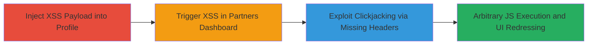

# Stored XSS in Shopify Partners Dashboard Enabling Clickjacking Attacks

Multi-stage attack chain demonstrating a complete attack workflow exploiting stored cross-site scripting (XSS) in Shopify's account settings, which reflects unsanitized user names in the partners dashboard, combined with the absence of X-Frame-Options headers to facilitate clickjacking.

## Chain Metrics Dashboard

| Metric | Value |
|--------|-------|
| Chain Status | Unverified |
| Total Steps | 3 |
| Execution Time | ~5 minutes |
| Skill Level | Intermediate |
| Complexity | Medium |
| Impact Level | High |

## Attack Flow Visualization

## Prerequisites & Requirements

### Required Tools

- Browser developer tools for payload testing
- No specialized tools required; manual browser-based exploitation

### Target Environment

- Web platform
- Access to Shopify account settings at https://accounts.shopify.com/account
- Ability to create or access a Shopify Partners account at https://partners.shopify.com/

### Initial Access Requirements

- Valid Shopify user account with access to account settings
- Network access to Shopify domains
- No prior elevated privileges needed; authenticated user context sufficient

## Detailed Attack Procedures

### Step 1: Inject XSS Payload into User Profile

procedure: [[procedures/Inject-Stored-XSS-Payload-into-Shopify-User-Profile]]

**Objective**: Introduce a malicious JavaScript payload into the First Name and Last Name fields to store it for later reflection.

**Instructions**: Navigate to the account settings page and modify the profile fields with an XSS payload such as `` or a more advanced payload like ``. Save the changes to persist the payload.

**Expected Output**: Profile updates successfully without errors, storing the payload server-side.

**Success Indicators**:
- Profile fields accept and save the payload without sanitization errors
- No immediate execution, as it's stored

### Step 2: Trigger Stored XSS in Partners Dashboard

procedure: [[procedures/Trigger-Stored-XSS-in-Partners-Dashboard]]

**Objective**: Access the partners dashboard to reflect and execute the stored payload in the context of authenticated users.

**Instructions**: Create a new partner account or navigate to an existing one at https://partners.shopify.com/. Proceed to confirmation or completion pages like https://partners.shopify.com/[partnerID]/confirm or https://partners.shopify.com/[partnerID]/complete. The unsanitized user name will render the payload, triggering JavaScript execution.

**Expected Output**: Alert or payload execution in the browser, confirming XSS success.

**Success Indicators**:
- JavaScript alert or console output from the payload
- Potential session data access if payload is designed for theft

### Step 3: Exploit Missing X-Frame-Options for Clickjacking

procedure: [[procedures/Exploit-Missing-X-Frame-Options-for-Clickjacking]]

**Objective**: Leverage the lack of frame protection to embed the vulnerable pages in iframes for UI redressing attacks.

**Instructions**: Inspect the HTTP headers of the affected pages using browser dev tools or curl. Confirm absence of X-Frame-Options. Create an attacker-controlled page with an invisible iframe embedding https://partners.shopify.com/[partnerID]/confirm, overlaying deceptive elements to trick users into clicking hidden actions like form submissions or approvals.

**Expected Output**: Pages load in iframes without restrictions; users can be phished into unintended interactions.

**Success Indicators**:
- No X-Frame-Options header present in response
- Successful iframe embedding and overlay functionality

## Attack Chain Summary

### Key Achievements

1. Persistent storage of XSS payload in user profiles without sanitization
2. Reflection and execution of arbitrary JavaScript in authenticated partner sessions
3. Enablement of clickjacking to manipulate user interactions for unauthorized actions

## Technique & Tactic Coverage

### MITRE ATT&CK Techniques

- [[JavaScript]]
- [[Exploit Public-Facing Application]]

### MITRE ATT&CK Tactics

- [[Execution]]
- [[Initial Access]]

---
*Last updated: 2023-10-01T00:00:00Z*
