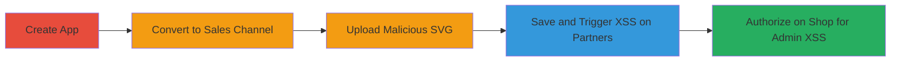

---
tags:
  - xss
  - stored-xss
  - shopify
  - svg-upload
  - xml-entity
  - whitelist-bypass
type: attack_chain
tools: []
tactics:
  - '[[Initial Access]]'
  - '[[Execution]]'
commands:
  - '[[commands/shopify-oauth-authorize-malicious-app]]'
verified: false
platforms:
  - Web
submitted: true
complexity: medium
procedures:
  - '[[procedures/Create-New-Application-in-Partners-Dashboard]]'
  - '[[procedures/Convert-Application-to-Sales-Channel]]'
  - '[[procedures/Upload-Malicious-SVG-Icon]]'
  - '[[procedures/Save-Changes-to-Trigger-XSS-on-Partners-Dashboard]]'
  - '[[procedures/Authorize-App-to-Trigger-XSS-on-Admin-Panel]]'
step_count: 5
techniques:
  - '[[Exploit Public-Facing Application]]'
  - '[[JavaScript]]'
description: >-
  A multi-stage attack exploiting a whitelist bypass in Shopify's SVG icon
  upload for sales channel applications, leading to stored XSS on
  partners.shopify.com and shop admin panels through malicious SVG with XML
  entities.
skill_level: intermediate
impact_level: high
id: 9c463a96-630c-4134-8597-d2b16358f7dd
created_at: '2025-12-13T23:55:20.850Z'
updated_at: '2025-12-13T23:55:20.850Z'
validated: true
mitre_tactics:
  - '[[Initial Access]]'
  - '[[Execution]]'
mitre_techniques:
  - '[[Exploit Public-Facing Application]]'
  - '[[JavaScript]]'
---
# Stored XSS in Shopify Sales Channel App Icons via XML Entity Whitelist Bypass

Multi-stage attack chain demonstrating a complete attack workflow exploiting SVG sanitization failure in Shopify's sales channel app icon uploads, enabling stored XSS across multiple domains.

## Chain Metrics Dashboard

| Metric | Value |
|--------|-------|
| Chain Status | Unverified |
| Total Steps | 5 |
| Execution Time | ~10 minutes |
| Skill Level | Intermediate |
| Complexity | Medium |
| Impact Level | High |

## Attack Flow Visualization

## Prerequisites & Requirements

### Required Tools

- Web browser (e.g., Chrome with developer tools for payload testing)

### Target Environment

- Shopify Partners Dashboard (https://partners.shopify.com/)
- Shopify Admin Panel (e.g., $shop.myshopify.com/admin/)
- Access to a Shopify partner account with app creation permissions

### Initial Access Requirements

- Valid Shopify partner credentials
- No special network position required; public web access suffices
- Prior access to create and manage sales channel apps

## Detailed Attack Procedures

### Step 1: Create a New Application

procedure: [[procedures/Create-New-Application-in-Partners-Dashboard]]

**Objective**: Establish a new sales channel application in the Shopify Partners dashboard to serve as the vector for the malicious SVG upload.

**Instructions**: Log in to the Partners dashboard and navigate to the app creation section to set up the initial application structure.

**Expected Output**: A new application is created and listed in the dashboard.

**Success Indicators**:
- Application appears in the Partners dashboard
- App details page is accessible

### Step 2: Convert the Application to a Sales Channel

procedure: [[procedures/Convert-Application-to-Sales-Channel]]

**Objective**: Transform the standard application into a sales channel type, enabling the icon upload feature that is vulnerable to SVG manipulation.

**Instructions**: Access the Extensions section within the app settings and select the sales channel option to reconfigure the app type.

**Expected Output**: The application is updated to sales channel status, unlocking the icon upload functionality.

**Success Indicators**:
- App type changes to "Sales channel" in the dashboard
- Icon upload field becomes available in App info

### Step 3: Upload the Malicious SVG Icon

procedure: [[procedures/Upload-Malicious-SVG-Icon]]

**Objective**: Introduce a malicious SVG file containing an XML entity and onload JavaScript payload to bypass sanitization and embed XSS.

**Instructions**: In the App info section, upload an SVG file crafted with an XML entity declaration that causes parsing failure, allowing the onload attribute to persist.

**Expected Output**: The SVG is accepted and associated with the app without immediate rejection.

**Success Indicators**:
- Upload completes successfully
- No sanitization errors are displayed

### Step 4: Save Changes to Trigger XSS on Partners Dashboard

procedure: [[procedures/Save-Changes-to-Trigger-XSS-on-Partners-Dashboard]]

**Objective**: Persist the malicious SVG in the app configuration, causing it to render on the Partners dashboard and execute the XSS payload.

**Instructions**: Submit the app info changes, which triggers rendering of the icon SVG and activation of the onload JavaScript.

**Expected Output**: Alert or payload execution on partners.shopify.com, confirming XSS in the partner context.

**Success Indicators**:
- JavaScript alert fires (e.g., alert(document.domain))
- Payload executes in the browser console

### Step 5: Authorize the Application on a Shop to Trigger XSS on Admin Panel

procedure: [[procedures/Authorize-App-to-Trigger-XSS-on-Admin-Panel]]

**Objective**: Install the compromised app on a target shop, leading to XSS execution within the shop's admin panel upon rendering the icon.

**Instructions**: Use the OAuth authorization URL to install the app on a shop, which integrates the malicious SVG into the admin interface.

**Expected Output**: Upon admin panel load post-authorization, the XSS payload executes in the shop admin context.

**Success Indicators**:
- App installation succeeds
- XSS triggers on $shop.myshopify.com/admin/, potentially allowing data exfiltration

## Attack Chain Summary

### Key Achievements

1. Bypassed SVG sanitization using XML entities to include arbitrary JavaScript attributes
2. Achieved stored XSS on high-privilege domains like partners.shopify.com and shop admin panels
3. Enabled potential session hijacking or data theft from merchants and Shopify employees

## Technique & Tactic Coverage

### MITRE ATT&CK Techniques

- [[Exploit Public-Facing Application]]
- [[JavaScript]]

### MITRE ATT&CK Tactics

- [[Initial Access]]
- [[Execution]]

---
*Last updated: 2023-10-01T00:00:00Z*
